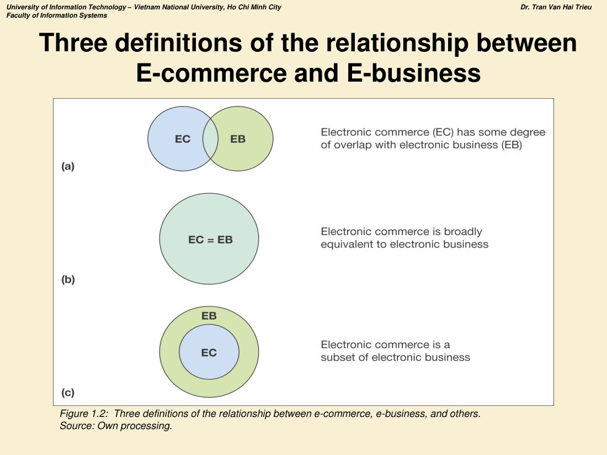
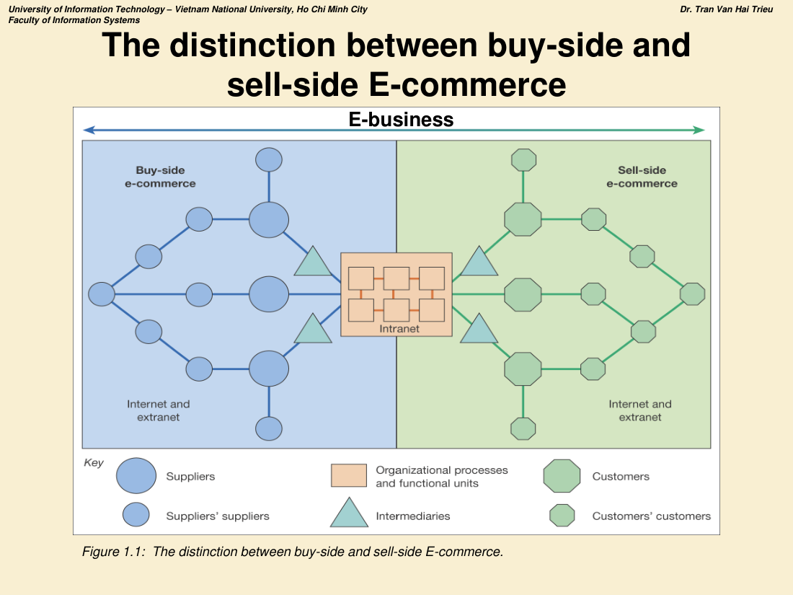
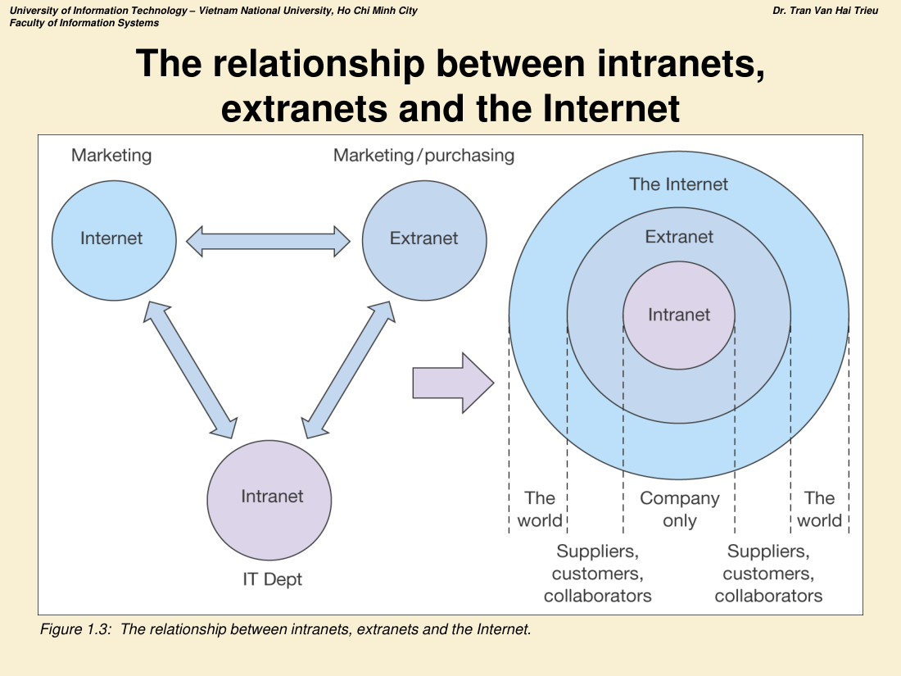
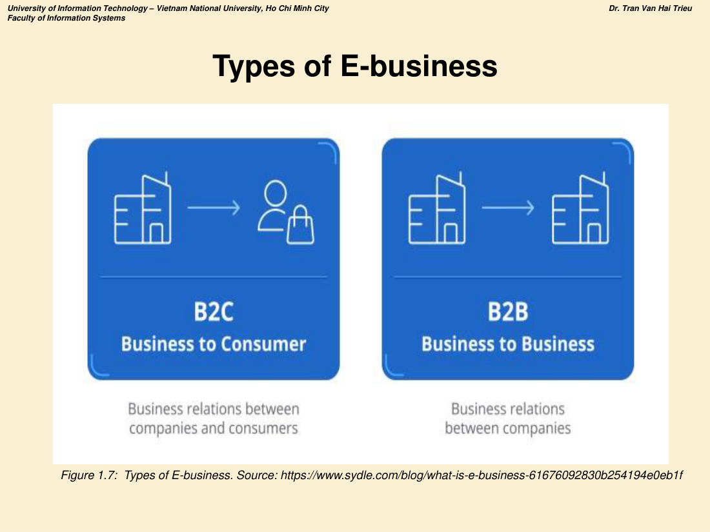
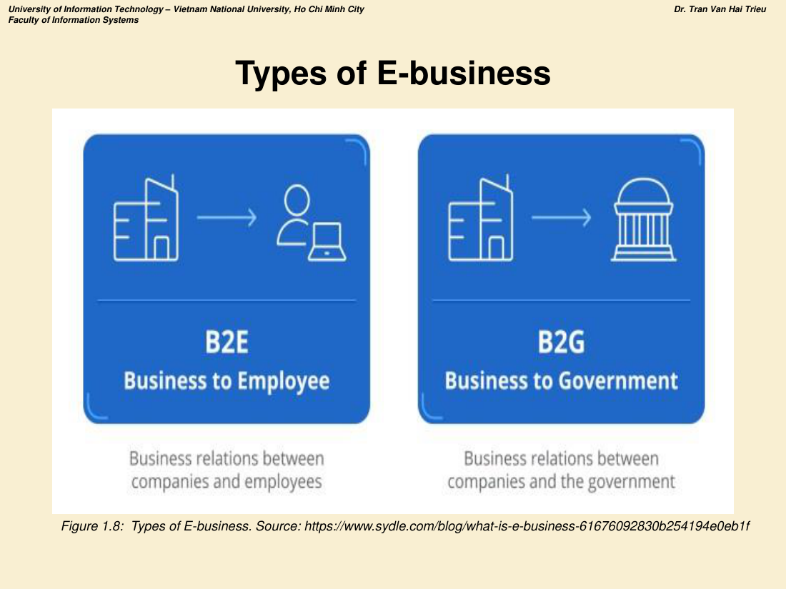
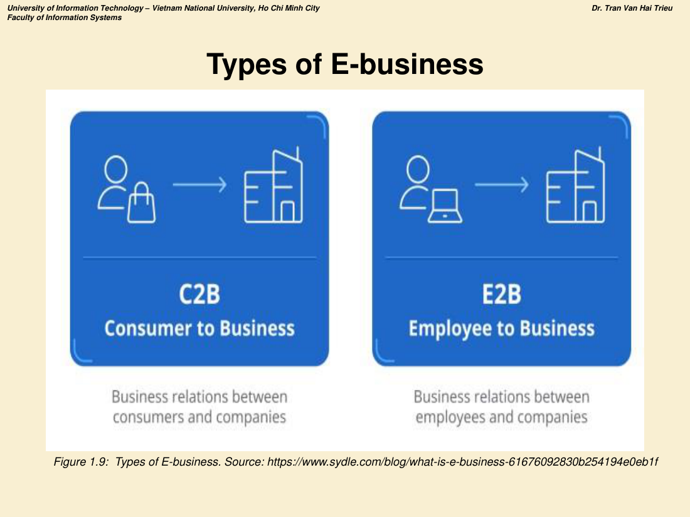
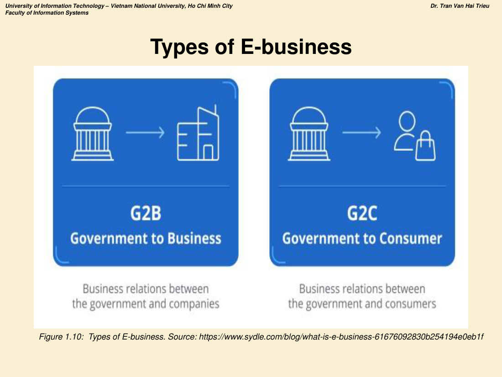
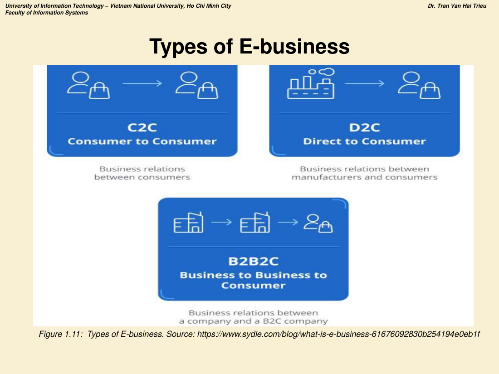
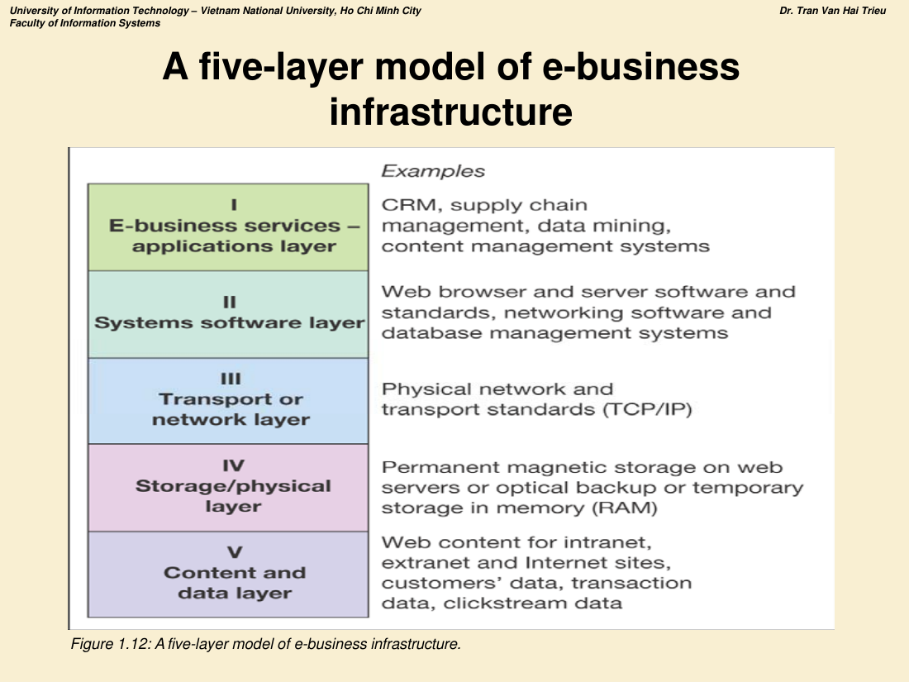

# CHƯƠNG 1 — TỔNG QUAN VỀ E-BUSINESS

> **Mục tiêu chương:** Định nghĩa E-business; phân biệt E-commerce và E-business; các loại hình E-business; ứng dụng của E-business; công nghệ nền tảng dùng trong E-business.

---

## PHẦN 1. CÁC KHÁI NIỆM CỦA E-BUSINESS

### 1.1. Bối cảnh ra đời

- Trong khoảng mười năm gần đây, **Internet và World Wide Web** đã làm thay đổi cách con người giao tiếp, kinh doanh và sinh hoạt hằng ngày.
- Sự tăng trưởng của Internet/Web là **kết quả của tiến bộ phần cứng và phần mềm**.
- Thế giới bước vào **Kỷ nguyên Tri thức (Knowledge Age)** hay **Kỷ nguyên Số (Digital Age)**. Hai câu nói thường được dùng khi bàn về kinh doanh trực tuyến: *"Knowledge is power"* (Tri thức là sức mạnh) và *"Content is king"* (Nội dung là vua).

**Những thay đổi mà E-business/E-commerce mang lại:**

| Khía cạnh | Thay đổi |
|---|---|
| Giao dịch | Hoàn tất **nhanh hơn và dễ hơn** |
| Công nghệ | Doanh nghiệp phải **liên tục thích nghi**, tích hợp hệ thống nhanh và hiệu quả hơn, đáp ứng nhu cầu khách hàng toàn cầu |
| Sản xuất | Sản phẩm được **chuẩn bị riêng theo khách hàng (build-to-order)** thay vì tồn kho chờ đơn hàng |
| Nhân sự | **Khó tìm và giữ** nhân sự giỏi |
| Cạnh tranh | Khách hàng chỉ cần "đi một quãng rất ngắn" để mua của nhà cung cấp khác ⇒ các doanh nghiệp cạnh tranh **buộc phải hợp tác** để tồn tại |
| Năng lực | Vận hành một E-business (nhất là khối lượng giao dịch lớn) đòi hỏi đồng thời năng lực **kỹ thuật + marketing + quảng cáo** |
| Hệ sinh thái | Nhờ tiến bộ ICT, xuất hiện **E-service, E-business, E-commerce, E-government**… |

### 1.2. E-business là gì?

> **Định nghĩa:** *Electronic business (E-business)* là **việc sử dụng Internet để kết nối (network) và thực hiện các quy trình nghiệp vụ, thương mại điện tử, truyền thông và cộng tác trong tổ chức cũng như với khách hàng, nhà cung cấp và các bên liên quan khác.**

- Các E-business sử dụng **Internet, intranet, extranet** và các mạng khác để hỗ trợ quy trình kinh doanh của mình.

### 1.3. Phân biệt E-commerce và E-business ⭐

**E-commerce (Thương mại điện tử):**
- Mọi hoạt động **trao đổi thông tin qua trung gian điện tử giữa tổ chức và các bên liên quan BÊN NGOÀI**.
- Là việc **mua – bán, marketing và phục vụ** sản phẩm/dịch vụ qua mạng máy tính.
- Là các **giao dịch thương mại được số hóa** giữa các tổ chức với nhau và giữa tổ chức với cá nhân.

**E-business (Kinh doanh điện tử):**
- Mọi hoạt động trao đổi thông tin qua trung gian điện tử **cả BÊN TRONG tổ chức lẫn với bên ngoài**, được hỗ trợ bởi **phạm vi quy trình nghiệp vụ rộng hơn**.
- Là việc **số hóa các giao dịch và quy trình nội bộ doanh nghiệp**, dựa trên các hệ thống thông tin do doanh nghiệp kiểm soát.
- Theo cách hiểu hẹp này, E-business **không bao gồm** các giao dịch thương mại có trao đổi giá trị vượt ranh giới tổ chức.

**Bảng 1.1 — So sánh (dạng dễ nhớ để đi thi):**

| Tiêu chí | **E-commerce** | **E-business** |
|---|---|---|
| Phạm vi trao đổi thông tin điện tử | Giữa tổ chức **và các bên liên quan bên ngoài** | **Cả nội bộ tổ chức lẫn bên ngoài**, dựa trên dải quy trình nghiệp vụ rộng hơn |
| Ứng dụng số | Cho phép thương mại số giữa các tổ chức và giữa DN với cá nhân | Hệ thống thông tin do DN kiểm soát cho phép số hóa giao dịch & quy trình **bên trong** DN |
| Khác | — | **Loại trừ** các giao dịch thương mại xuyên ranh giới tổ chức |
| Quan hệ bao hàm | Thường được xem là **tập con** | Tập lớn hơn |

### 1.4. Ba cách hiểu về quan hệ E-commerce ↔ E-business ⭐

*Hình 1.2 — Ba định nghĩa về mối quan hệ giữa E-commerce (EC) và E-business (EB):*

- **(a)** EC **giao nhau một phần** với EB (có phần chồng lấn).
- **(b)** EC **tương đương** EB (EC = EB).
- **(c)** EC là **tập con** của EB (cách hiểu phổ biến nhất và thường được chọn khi trả lời thi).

### 1.5. Phân biệt Buy-side và Sell-side E-commerce ⭐⭐

*Hình 1.1 — Phân biệt buy-side và sell-side E-commerce.*

**Cách đọc hình:**
- Ở **trung tâm** là **Intranet** — các quy trình tổ chức và đơn vị chức năng của doanh nghiệp.
- **Bên trái (buy-side e-commerce — phía mua):** Suppliers' suppliers → Suppliers → Intermediaries → doanh nghiệp. Kết nối qua **Internet và extranet**. Đây là **thượng nguồn (upstream)**, gắn với **quản trị chuỗi cung ứng điện tử (e-SCM)** và **e-Procurement**.
- **Bên phải (sell-side e-commerce — phía bán):** doanh nghiệp → Intermediaries → Customers → Customers' customers. Cũng qua **Internet và extranet**. Đây là **hạ nguồn (downstream)**, gắn với **e-Marketing / CRM**.
- **Toàn bộ hai phía cộng với intranet nội bộ = E-business.**

> 📌 **Câu chốt đi thi:** *E-business = Buy-side e-commerce + Nội bộ (intranet) + Sell-side e-commerce.*

### 1.6. Quan hệ giữa Intranet, Extranet và Internet ⭐

*Hình 1.3 — Quan hệ giữa intranet, extranet và Internet.*

| Mạng | Ai truy cập được | Bộ phận sử dụng điển hình |
|---|---|---|
| **Intranet** | **Chỉ trong công ty** (company only) | Phòng CNTT; truyền thông nội bộ |
| **Extranet** | **Nhà cung cấp, khách hàng, đối tác cộng tác** được cấp quyền | Marketing / Mua hàng (purchasing) |
| **Internet** | **Toàn thế giới (the world)** | Marketing |

Mô hình vòng tròn đồng tâm: **Intranet ⊂ Extranet ⊂ Internet**.

### 1.7. Các loại hình E-business (11 loại) ⭐⭐

**Bảng tổng hợp (Hình 1.7 – 1.11):**

| Ký hiệu | Tên đầy đủ | Quan hệ | Ví dụ minh họa |
|---|---|---|---|
| **B2C** | Business to Consumer | Doanh nghiệp → Người tiêu dùng | Tiki, Shopee Mall, Amazon bán lẻ |
| **B2B** | Business to Business | Doanh nghiệp → Doanh nghiệp | Alibaba, SupplyOn, Grainger |
| **B2E** | Business to Employee | Doanh nghiệp → Nhân viên | Cổng nhân sự nội bộ, e-learning nội bộ |
| **B2G** | Business to Government | Doanh nghiệp → Chính phủ | Đấu thầu qua mạng, nộp thuế điện tử |
| **C2B** | Consumer to Business | Người tiêu dùng → Doanh nghiệp | Freelancer chào giá, KOL bán dịch vụ cho DN |
| **E2B** | Employee to Business | Nhân viên → Doanh nghiệp | Nhân viên đề xuất/khiếu nại qua hệ thống |
| **G2B** | Government to Business | Chính phủ → Doanh nghiệp | Cổng dịch vụ công cho DN, cấp phép online |
| **G2C** | Government to Consumer | Chính phủ → Người dân | Cổng dịch vụ công quốc gia, VNeID |
| **C2C** | Consumer to Consumer | Người tiêu dùng ↔ Người tiêu dùng | Chợ Tốt, eBay, Facebook Marketplace |
| **D2C** | Direct to Consumer | Nhà sản xuất → Người tiêu dùng | Hãng bán thẳng không qua đại lý |
| **B2B2C** | Business to Business to Consumer | DN → DN (B2C) → Người tiêu dùng | Nhà sản xuất bán qua sàn TMĐT tới người dùng |

### 1.8. Các ứng dụng của E-business (Bảng 1.2)

| # | Ứng dụng |
|---|---|
| 1 | **ERP** — Enterprise Resource Planning (Hoạch định nguồn lực doanh nghiệp) |
| 2 | **CRM** — Customer Relationship Management (Quản trị quan hệ khách hàng) |
| 3 | **SCM** — Supply Chain Management (Quản trị chuỗi cung ứng) |
| 4 | **IEMS** — Integrated Enterprise Management System (Hệ thống quản trị doanh nghiệp tích hợp) |
| 5 | **EDI** — Electronic Data Interchange (Trao đổi dữ liệu điện tử) |
| 6 | Quản lý kho / tồn kho & mua hàng |
| 7 | Mạng xã hội / Quảng cáo trực tuyến |
| 8 | E-procurement / E-banking / E-commerce / E-marketplace |
| 9 | Quản trị nguồn nhân lực (HRM) |
| 10 | Hệ thống đặt chỗ (Booking system) |

*(Nguồn: Hadi Putra & Santoso, Heliyon, 2020)*

---

## PHẦN 2. CÔNG NGHỆ SỬ DỤNG TRONG E-BUSINESS

### 2.1. Mô hình 5 lớp hạ tầng E-business ⭐⭐

*Hình 1.12 — A five-layer model of e-business infrastructure.*

| Lớp | Tên lớp | Ví dụ |
|---|---|---|
| **I** | **E-business services — applications layer** (Dịch vụ E-business — lớp ứng dụng) | CRM, SCM, khai phá dữ liệu (data mining), hệ quản trị nội dung (CMS) |
| **II** | **Systems software layer** (Lớp phần mềm hệ thống) | Trình duyệt & phần mềm máy chủ web và chuẩn của chúng, phần mềm mạng, hệ quản trị CSDL |
| **III** | **Transport or network layer** (Lớp truyền tải/mạng) | Mạng vật lý và chuẩn truyền tải (**TCP/IP**) |
| **IV** | **Storage/physical layer** (Lớp lưu trữ/vật lý) | Lưu trữ từ tính vĩnh viễn trên web server, sao lưu quang học, lưu tạm trên RAM |
| **V** | **Content and data layer** (Lớp nội dung & dữ liệu) | Nội dung web cho intranet/extranet/Internet, dữ liệu khách hàng, dữ liệu giao dịch, dữ liệu clickstream |

> 💡 **Mẹo nhớ:** đi từ trên xuống là **Ứng dụng → Phần mềm hệ thống → Mạng → Lưu trữ → Nội dung/Dữ liệu**.

### 2.2. Internet: nền tảng công nghệ

- **Internet:** mạng liên kết của hàng nghìn mạng và hàng triệu máy tính; kết nối doanh nghiệp, cơ sở giáo dục, cơ quan chính phủ và cá nhân.
- **World Wide Web (Web):** một trong những dịch vụ phổ biến nhất của Internet; cho phép truy cập hàng tỷ (có thể hàng nghìn tỷ) trang web.

**Ba giai đoạn tiến hóa của Internet (1961 – nay):**

| Giai đoạn | Thời gian | Nội dung |
|---|---|---|
| **Innovation Phase** (Đổi mới) | 1961–1974 | Tạo ra các khối xây dựng nền tảng |
| **Institutionalization Phase** (Thể chế hóa) | 1975–1995 | Các định chế lớn cấp kinh phí và hợp thức hóa |
| **Commercialization Phase** (Thương mại hóa) | 1995–nay | Các tập đoàn tư nhân tiếp quản, mở rộng đường trục và dịch vụ nội vùng |

**Ba khái niệm công nghệ then chốt:**
1. **Packet switching** (chuyển mạch gói)
2. **Giao thức TCP/IP**
3. **Client/server computing**

Internet được định nghĩa là mạng: dùng **địa chỉ IP**, hỗ trợ **TCP/IP**, cung cấp dịch vụ cho người dùng theo cách tương tự hệ thống điện thoại.

### 2.3. Packet Switching (Chuyển mạch gói)

- Cắt thông điệp số thành các **gói (packets)**.
- Gửi các gói theo **các đường truyền khác nhau** khi đường đó sẵn sàng.
- **Ghép lại (reassemble)** các gói khi tới đích.
- Sử dụng **router**.
- **Rẻ hơn và ít lãng phí hơn** chuyển mạch kênh (circuit switching).

### 2.4. TCP/IP

- **TCP (Transmission Control Protocol):** thiết lập kết nối giữa máy gửi và máy nhận; xử lý việc **đóng gói** tại điểm truyền và **ghép gói** tại điểm nhận.
- **IP (Internet Protocol):** định tuyến/địa chỉ.
- **Bốn lớp TCP/IP:** Network interface layer → Internet layer → Transport layer → **Application layer**.

**Địa chỉ IP:**

| | IPv4 | IPv6 |
|---|---|---|
| Độ dài | **32 bit** | **128 bit** |
| Dạng | 4 nhóm số cách nhau bởi dấu chấm, ví dụ `201.61.186.227` | — |
| Không gian địa chỉ | ~4 tỷ | tới ~1 triệu tỷ (1 quadrillion) |
| Ghi chú | Địa chỉ lớp C: 3 nhóm đầu xác định mạng, nhóm cuối xác định máy | — |

**Domain Name, DNS và URL:**
- **Domain name:** địa chỉ IP được biểu diễn bằng ngôn ngữ tự nhiên.
- **DNS (Domain Name System):** cho phép chuyển địa chỉ IP số sang ngôn ngữ tự nhiên.
- **URL (Uniform Resource Locator):** địa chỉ trình duyệt dùng để xác định vị trí nội dung trên Web. Ví dụ: `https://vnexpress.net/`.

### 2.5. Client/Server Computing & nền tảng di động

- **Client/Server:** các máy tính cá nhân mạnh (client) nối mạng với một hoặc nhiều **server**; server thực hiện các chức năng chung: lưu trữ tệp, chạy ứng dụng, chia sẻ máy in…
- **Mobile platform:** truy cập Internet chủ yếu hiện nay qua **máy tính bảng và smartphone**; smartphone là **công nghệ đột phá (disruptive technology)**; hơn **3,3 tỷ** người truy cập Internet bằng smartphone.

### 2.6. Điện toán đám mây (Cloud Computing) ⭐⭐⭐

> ⚠️ **CHỦ ĐỀ ĐÃ RA TRONG ĐỀ THI THẬT HK2/2024–2025 (Câu 1 — 2 điểm).** Xem bài giải mẫu đầy đủ tại **TL3 – Câu 1**.

**Khái niệm:** Doanh nghiệp và cá nhân **thuê năng lực tính toán và phần mềm qua Internet** thay vì tự đầu tư hạ tầng.

- **Ba loại dịch vụ:** **IaaS** (hạ tầng), **PaaS** (nền tảng), **SaaS** (phần mềm).
- **Ba mô hình triển khai:** **public** (dùng chung, rẻ nhất), **private** (riêng, kiểm soát cao — phù hợp ngân hàng, y tế), **hybrid** (kết hợp — dữ liệu nhạy cảm để private, tải cao điểm đẩy sang public).
- **Ưu điểm:** **giảm mạnh chi phí** xây dựng và vận hành website, hạ tầng, hỗ trợ CNTT, phần cứng, phần mềm.
- **Nhược điểm:** **rủi ro bảo mật**; **chuyển trách nhiệm lưu trữ và kiểm soát dữ liệu sang nhà cung cấp**.

#### a) Bảng phân biệt IaaS – PaaS – SaaS ⭐⭐⭐

| Tiêu chí | **IaaS** Infrastructure as a Service | **PaaS** Platform as a Service | **SaaS** Software as a Service |
|---|---|---|---|
| **Nhà cung cấp cung cấp** | Hạ tầng ảo hóa: máy chủ ảo, lưu trữ, mạng, tường lửa | Hạ tầng **+ hệ điều hành, runtime, middleware, CSDL, công cụ triển khai** | **Toàn bộ ứng dụng hoàn chỉnh** chạy sẵn |
| **Khách hàng tự quản lý** | Hệ điều hành, middleware, runtime, ứng dụng, dữ liệu | **Chỉ ứng dụng và dữ liệu** | **Chỉ dữ liệu và cấu hình người dùng** |
| **Đối tượng sử dụng chính** | Quản trị hệ thống, kỹ sư hạ tầng | **Lập trình viên** | **Người dùng cuối / nhân viên nghiệp vụ** |
| **Mức kiểm soát** | **Cao nhất** | Trung bình | **Thấp nhất** |
| **Mức tùy biến** | Rất cao | Trung bình (bị ràng buộc bởi nền tảng) | Thấp (chỉ cấu hình theo tham số cho sẵn) |
| **Tốc độ triển khai** | Chậm nhất | Nhanh | **Nhanh nhất — dùng ngay** |
| **Cách tính phí** | Theo tài nguyên (giờ CPU, GB lưu trữ, băng thông) | Theo tài nguyên ứng dụng / số instance | **Theo thuê bao, số người dùng/tháng** |
| **Rủi ro vendor lock-in** | Thấp | **Cao** | Trung bình – cao |
| **Ai lo vá lỗi, nâng cấp** | Khách hàng chịu từ OS trở lên | Nhà cung cấp lo tới runtime | **Nhà cung cấp lo toàn bộ** |

**Mẹo nhớ:** IaaS = *thuê đất và móng, tự xây nhà* · PaaS = *thuê nhà thô có sẵn điện nước, chỉ việc bài trí* · SaaS = *thuê phòng khách sạn, vào ở ngay*.

#### b) Mô hình trách nhiệm phân chia — "ai quản lý tầng nào"

| Tầng công nghệ | On-premise | IaaS | PaaS | SaaS |
|---|---|---|---|---|
| Applications | KH | KH | KH | **NCC** |
| Data | KH | KH | KH | KH* |
| Runtime | KH | KH | **NCC** | **NCC** |
| Middleware | KH | KH | **NCC** | **NCC** |
| Operating System | KH | KH | **NCC** | **NCC** |
| Virtualization | KH | **NCC** | **NCC** | **NCC** |
| Servers | KH | **NCC** | **NCC** | **NCC** |
| Storage | KH | **NCC** | **NCC** | **NCC** |
| Networking | KH | **NCC** | **NCC** | **NCC** |

*(KH = khách hàng tự quản lý · NCC = nhà cung cấp lo. Dữ liệu ở SaaS vẫn thuộc sở hữu khách hàng nhưng do NCC lưu trữ.)*

#### c) Ví dụ minh họa thực tế ⭐⭐

| Loại hình | Ví dụ quốc tế | Ví dụ Việt Nam | Tình huống sử dụng |
|---|---|---|---|
| **IaaS** | **Amazon EC2, Google Compute Engine, Azure Virtual Machines** | **Viettel Cloud, VNPT Cloud, FPT Cloud, CMC Cloud** | Sàn TMĐT thuê 20 máy chủ ảo dịp Tết để chịu tải, hết cao điểm trả lại — không phải mua máy chủ vật lý |
| **PaaS** | **Google App Engine, Heroku, AWS Elastic Beanstalk, Azure App Service** | Nền tảng low-code trong nước (Base.vn, akaBot — một phần) | Nhóm 3 lập trình viên của startup đẩy code Node.js lên Heroku là chạy được, không cần cài đặt và vá lỗi hệ điều hành |
| **SaaS** | **Gmail/Google Workspace, Microsoft 365, Salesforce, Shopify, Zoom** | **MISA AMIS, KiotViet, Base.vn, Haravan** | Cửa hàng FMCG trả 300.000đ/tháng dùng KiotViet quản lý bán hàng — không cần lập trình viên, không cần máy chủ |

#### d) Liên hệ với E-business

**ERP cung cấp online chính là SaaS**: thay vì cài đặt và tùy biến ERP trên mạng nội bộ, doanh nghiệp **dùng trình duyệt truy cập ERP trên site của nhà cung cấp** (ví dụ **NetSuite**) — xem Chương 3 §2.12c. Đây là lý do cloud đặc biệt quan trọng với **doanh nghiệp vừa và nhỏ** và **startup**: cho phép khởi động nhanh với chi phí đầu tư ban đầu gần bằng 0.

### 2.7. Các giao thức & tiện ích khác

- **Giao thức:** HTTP; Email: **SMTP, POP3, IMAP**; **FTP, Telnet, SSL/TLS**.
- **Tiện ích:** Ping, Tracert…

### 2.8. Kiến trúc hạ tầng Internet

Internet tăng trưởng mà không đổ vỡ là nhờ:
1. **Mô hình client/server**
2. **Kiến trúc phân lớp hình đồng hồ cát (hourglass)** gồm 4 tầng:
   - Network Technology Substrates
   - Transport Services and Representation Standards
   - Middleware Services
   - Applications

**Internet Backbone:** cáp quang (hàng trăm sợi thủy tinh dùng ánh sáng truyền dữ liệu) → tốc độ nhanh hơn, băng thông lớn hơn, cáp mỏng nhẹ hơn, ít nhiễu hơn, an toàn dữ liệu hơn. Do **Tier 1 ISP (transit ISP)** vận hành; cáp quang biển và liên kết vệ tinh.

**IXP (Internet Exchange Points):** trung tâm vùng nơi các Tier 1 ISP kết nối vật lý với nhau và với Tier 2 ISP. Tier 2 cung cấp truy cập cho **Tier 3 ISP**. Trước đây gọi là NAP hoặc MAE.

**Tier 3 ISP:** nhà cung cấp bán lẻ (Comcast, AT&T, Verizon…) — dịch vụ: **Narrowband, Broadband, DSL, Cable Internet, Satellite Internet**.

**Truy cập Internet di động:** hai loại — dựa trên điện thoại (4G, **5G** tốc độ tới 10 Gbps+, 6G…) và dựa trên mạng máy tính không dây (**Wi-Fi 802.11, WiMax, Bluetooth**).

**IoT (Internet of Things):** vật thể kết nối Internet qua cảm biến/RFID; "smart things"; các vấn đề về chuẩn tương tác; mối lo **bảo mật và quyền riêng tư**.

### 2.9. Ai quản trị Internet?

**ICANN, IETF, IRTF, IESG, IAB, ISOC, IGF, W3C, NOGs.**

### 2.10. Web, HTML/XML, Web server & browser

**Lịch sử Web:**
- **1989–1991:** Tim Berners-Lee tại CERN phát minh Web (HTML, HTTP, web server, web browser).
- **1993:** Mosaic — trình duyệt có GUI (Andreessen, NCSA).
- **1994:** Netscape Navigator — trình duyệt thương mại đầu tiên.
- **1995:** Microsoft Internet Explorer.
- **Hiện nay:** Chrome, Firefox, Microsoft Edge, Opera…

**Hypertext:** văn bản có nhúng liên kết; dùng **HTTP** và **URL** để định vị tài nguyên.

**Ngôn ngữ đánh dấu:**

| | **HTML** | **XML** |
|---|---|---|
| Bản chất | Tập thẻ (tag) **định sẵn** để định dạng văn bản | Ngôn ngữ mô tả **dữ liệu và thông tin** |
| Thẻ | Cố định | **Do người dùng tự định nghĩa** |
| Vai trò | Điều khiển giao diện trang web, dùng chung với **CSS**; HTML5 là bản mới nhất | Mô tả cấu trúc dữ liệu |

**Web server software:** cho phép máy tính phân phát trang web tới client theo yêu cầu HTTP. Năng lực cơ bản: dịch vụ bảo mật, FTP, công cụ tìm kiếm, thu thập dữ liệu.
**Web client:** bất kỳ thiết bị nào nối Internet có thể gửi yêu cầu HTTP và hiển thị trang HTML.

### 2.11. Các tính năng nền tảng của Internet và Web

Communication tools · Search engines · Downloadable & streaming media · Web 2.0 · VR/AR · Intelligent digital assistants…

**Công cụ truyền thông:** E-mail (ứng dụng được dùng nhiều nhất), Messaging/Instant messaging, Online message boards, **Internet telephony (VOIP)**, Video conferencing/telepresence.

**Cách hoạt động của Search Engine — 3 tác vụ liên tục:**

| Bước | Tên | Mô tả |
|---|---|---|
| 1 | **Crawling** (Thu thập) | Dùng "crawler" — chương trình truy cập **mọi trang của mọi site** để xác định nội dung |
| 2 | **Indexing** (Lập chỉ mục) | Tạo **chỉ mục** cho toàn bộ nội dung lưu trên mạng |
| 3 | **Ranking** (Xếp hạng) | Xếp hạng kết quả dựa trên **mức liên quan (relevancy) và uy tín/độ phổ biến (authority)** |

Search engine còn đóng vai trò: công cụ mua sắm, phương tiện quảng cáo (search engine marketing), công cụ bên trong site TMĐT. Nhà cung cấp hàng đầu: Google, Bing.

**Web 2.0:** Online social networks; Blogs; **Wikis** (viết tài liệu tập thể — Wikipedia).

**VR & AR:**
- **VR (Virtual Reality):** đưa người dùng vào thế giới ảo, thường qua kính **HMD** (VD: PlayStation VR).
- **AR (Augmented Reality):** phủ vật thể ảo lên thế giới thực qua thiết bị di động hoặc HMD.

**Intelligent Digital Assistants:** dùng ngôn ngữ tự nhiên, giao diện hội thoại, lệnh bằng giọng nói, nhận biết ngữ cảnh. VD: **Siri, Google Now, Google Assistant, ChatGPT**.

**Mobile Apps:** bùng nổ; là phương tiện giải trí phổ biến nhất, vượt TV; công cụ mua sắm luôn hiện diện; hầu hết 100 thương hiệu hàng đầu đều có app. Nền tảng: **iOS, Android**. Chợ ứng dụng: Google Play, App Store, Amazon Appstore.

---

## ❖ CHECKLIST ÔN CHƯƠNG 1

- [ ] Định nghĩa E-business (học thuộc câu định nghĩa)
- [ ] Bảng so sánh E-commerce vs E-business (3 tiêu chí)
- [ ] Ba cách hiểu quan hệ EC–EB (vẽ được 3 vòng tròn)
- [ ] **Vẽ và giải thích được hình buy-side / sell-side**
- [ ] Intranet ⊂ Extranet ⊂ Internet — ai truy cập được
- [ ] 11 loại hình E-business + ví dụ Việt Nam
- [ ] 10 ứng dụng E-business
- [ ] **Mô hình 5 lớp hạ tầng** (kể đủ 5 lớp + ví dụ)
- [ ] 3 khái niệm công nghệ then chốt; 4 lớp TCP/IP
- [ ] 3 giai đoạn tiến hóa Internet
- [ ] Cloud: IaaS/SaaS/PaaS + ưu nhược điểm
- [ ] Crawling – Indexing – Ranking
