# CHƯƠNG 2 — CHIẾN LƯỢC E-BUSINESS

> **Nội dung chương (6 phần):**
> 1. Giới thiệu về chiến lược E-business
> 2. Công nghệ Web server và E-mail
> 3. Các mô hình doanh thu của E-business
> 4. Mua sắm trực tuyến (Online shopping)
> 5. Cộng đồng ảo (Virtual communities)
> 6. Chiến lược và lập kế hoạch E-marketing

---

# PHẦN 1. GIỚI THIỆU VỀ CHIẾN LƯỢC E-BUSINESS

## 1.1. Ba vấn đề quản trị cốt lõi

1. Chiến lược E-business **khác gì** chiến lược kinh doanh truyền thống?
2. Làm sao **tích hợp** chiến lược E-business với chiến lược kinh doanh và chiến lược HTTT hiện có?
3. Làm sao **đánh giá ưu tiên đầu tư và lợi nhuận** từ E-business?

**Michael Porter (2001):** *"Vấn đề then chốt không phải là CÓ triển khai công nghệ Internet hay không — doanh nghiệp không có lựa chọn nào khác nếu muốn giữ tính cạnh tranh — mà là TRIỂN KHAI NHƯ THẾ NÀO."*

## 1.2. Chiến lược là gì?

> **Chiến lược** là một **kế hoạch hành động được thiết kế để đạt một mục tiêu cụ thể.**

Bốn cách diễn đạt:
- *Xác định cách chúng ta sẽ đạt mục tiêu.*
- *Ấn định việc phân bổ nguồn lực để đạt mục tiêu.*
- *Lựa chọn phương án chiến lược ưu tiên để cạnh tranh trong một thị trường.*
- *Cung cấp kế hoạch dài hạn cho sự phát triển của tổ chức.*

## 1.3. Quan hệ giữa chiến lược E-business và các chiến lược khác ⭐⭐

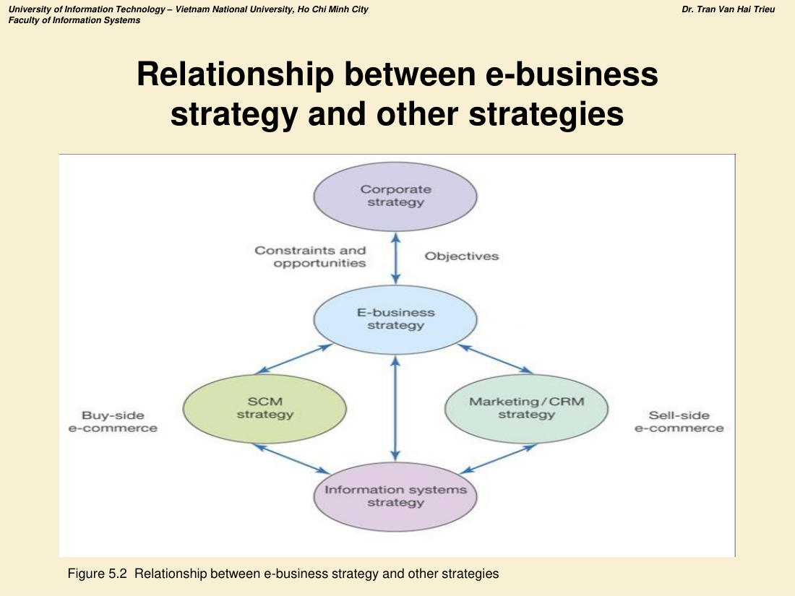

*Hình 5.2 — Relationship between e-business strategy and other strategies.*

**Cách đọc hình:**
- **Corporate strategy** (chiến lược công ty) ở trên cùng: đưa xuống **Objectives** (mục tiêu) và nhận lại **Constraints and opportunities** (ràng buộc & cơ hội).
- **E-business strategy** ở trung tâm.
- **Bên trái: SCM strategy** ⇒ tương ứng **Buy-side e-commerce**.
- **Bên phải: Marketing/CRM strategy** ⇒ tương ứng **Sell-side e-commerce**.
- **Bên dưới: Information systems strategy** — kết nối hai bên và nối thẳng lên E-business strategy.

> 📌 **Ý chốt:** Chiến lược E-business nằm giữa, vừa **chịu định hướng của chiến lược công ty**, vừa **tích hợp** chiến lược SCM (mua), Marketing/CRM (bán) và chiến lược HTTT.

## 1.4. Chiến lược Sell-side E-commerce

- Sell-side e-commerce là **chiến lược kênh (channel strategy)**.
- Mục tiêu về **tỷ lệ đóng góp doanh thu trực tuyến (online contribution %)** phải dẫn dắt chiến lược.
- Chiến lược kênh mở rộng dựa trên các **điểm khác biệt**.
- **NHƯNG** phải quản trị được **tích hợp kênh (channel integration)**.

**Chiến lược e-commerce xác định cách chúng ta:**
- Đạt chỉ tiêu **leads và doanh số** của kênh: **Acquisition (thu hút), Retention (giữ chân), Conversion (chuyển đổi), Service (dịch vụ), Profitability (lợi nhuận)**
- Truyền thông lợi ích của việc dùng kênh
- **Ưu tiên sản phẩm** bán qua kênh
- **Ưu tiên nhóm khách hàng** nhắm tới qua kênh
- **Chọn đối tác** cho kênh này

## 1.5. Chiến lược Buy-side E-commerce (e-SCM)

- Mục tiêu: **tối đa hóa hiệu quả vận hành đồng thời nâng chất lượng dịch vụ khách hàng**.
- **KPI hiệu quả vận hành** phải dẫn dắt chiến lược.
- Bao gồm việc **lựa chọn đối tác chiến lược phù hợp**.

**Xác định cách chúng ta:**
- **Tự động hóa quy trình nội bộ**
- **Liên kết hệ thống quản trị nguồn lực nội bộ với hệ thống mua hàng bên ngoài**
- **Ưu tiên nhà cung cấp/đối tác** cộng tác qua kênh này
- **Ưu tiên các ứng dụng e-SCM** — xây dựng lộ trình (roadmap)

## 1.6. Nếu KHÔNG có chiến lược E-business thì sao? ⭐

1. **Bỏ lỡ cơ hội** bán thêm ở phía bán (sell-side) và mua hiệu quả hơn ở phía mua (buy-side).
2. **Tụt lại sau đối thủ** trong cung cấp dịch vụ trực tuyến — có thể **rất khó đuổi kịp** (ví dụ: Tesco, Dell).
3. **Trải nghiệm khách hàng kém** do các kênh tích hợp rời rạc.

## 1.7. Mô hình quy trình chiến lược tổng quát ⭐⭐⭐

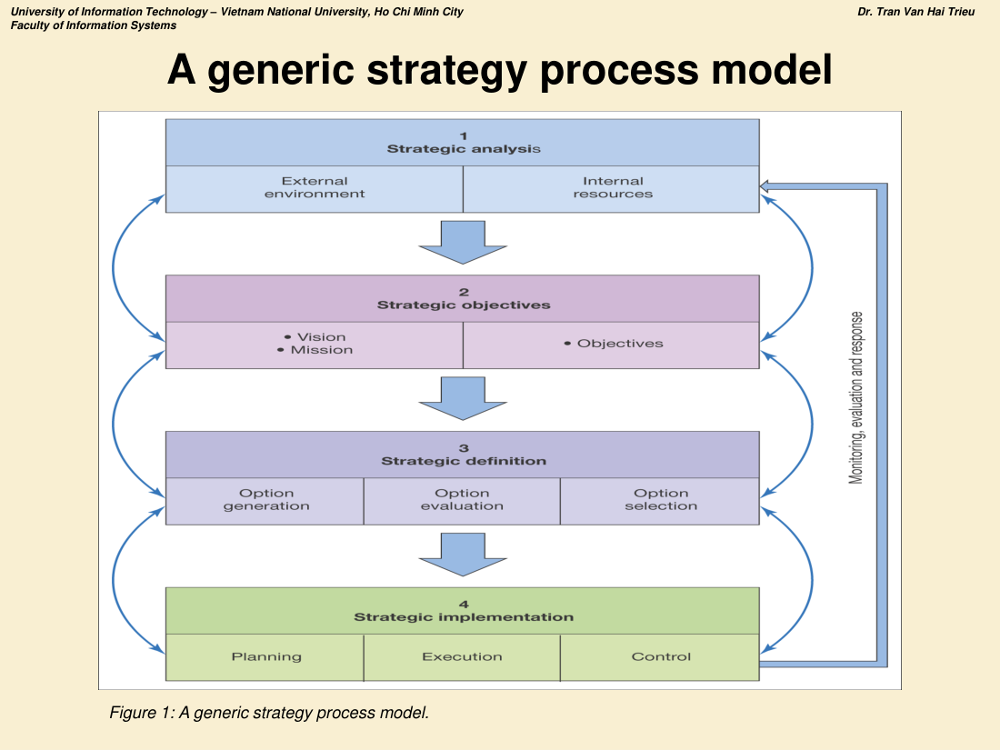

*Hình 1 — A generic strategy process model.*

**4 giai đoạn (học thuộc!):**

| # | Giai đoạn | Thành phần |
|---|---|---|
| **1** | **Strategic analysis** (Phân tích chiến lược) | External environment · Internal resources |
| **2** | **Strategic objectives** (Mục tiêu chiến lược) | Vision · Mission · Objectives |
| **3** | **Strategic definition** (Định nghĩa chiến lược) | Option generation · Option evaluation · Option selection |
| **4** | **Strategic implementation** (Triển khai chiến lược) | Planning · Execution · Control |

Bên phải toàn mô hình là vòng lặp **"Monitoring, evaluation and response"** (Giám sát – đánh giá – phản hồi) quay ngược về cả 4 giai đoạn; giữa các giai đoạn cũng có mũi tên hai chiều ⇒ **quy trình lặp, không tuyến tính cứng**.

## 1.8. Mô hình chiến lược E-business động (Dynamic model) ⭐

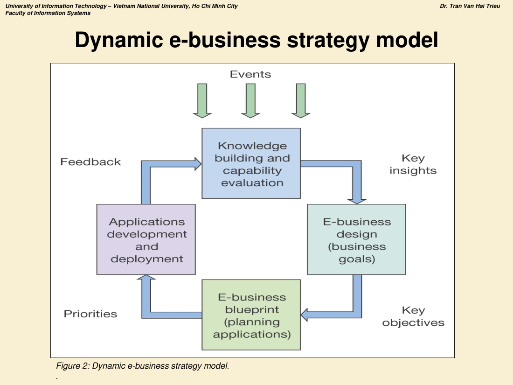

*Hình 2 — Dynamic e-business strategy model.*

**Vòng lặp 4 bước, chịu tác động từ "Events" (sự kiện) bên ngoài:**

1. **Knowledge building and capability evaluation** (Xây dựng tri thức & đánh giá năng lực) → tạo ra **Key insights**
2. **E-business design (business goals)** (Thiết kế e-business — mục tiêu kinh doanh) → tạo ra **Key objectives**
3. **E-business blueprint (planning applications)** (Bản thiết kế e-business — lập kế hoạch ứng dụng) → tạo ra **Priorities**
4. **Applications development and deployment** (Phát triển & triển khai ứng dụng) → tạo ra **Feedback** quay về bước 1

> 📌 **So sánh với mô hình tổng quát:** Mô hình động nhấn mạnh **tính liên tục, phản hồi nhanh và đáp ứng sự kiện**, phù hợp môi trường số thay đổi nhanh; mô hình tổng quát nhấn mạnh **trình tự phân tích → mục tiêu → định nghĩa → triển khai**.

---

## 1.9. GIAI ĐOẠN 1 — PHÂN TÍCH TÌNH HUỐNG CHIẾN LƯỢC (Situation Analysis)

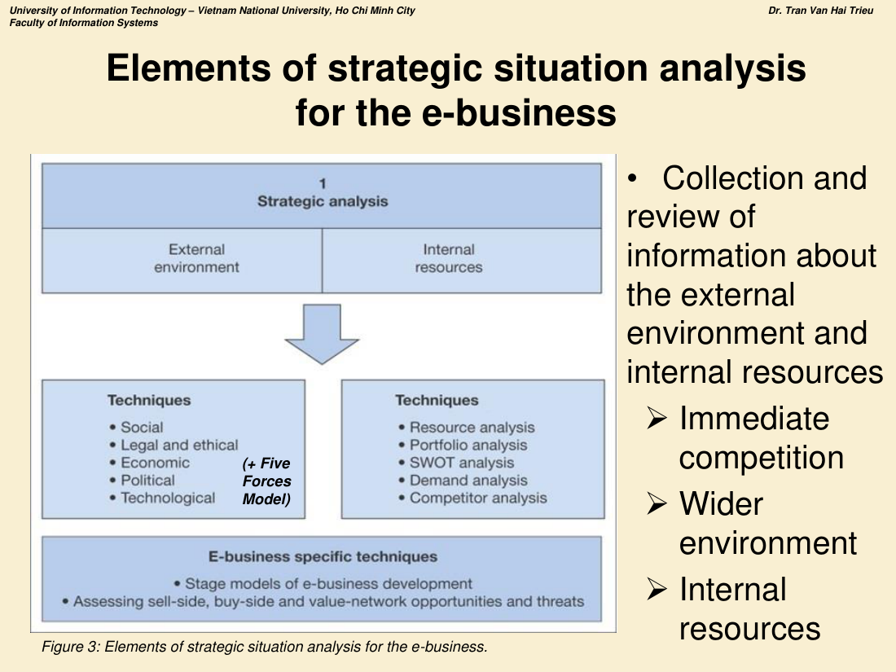

*Hình 3 — Elements of strategic situation analysis for the e-business.*

> **Bản chất:** Thu thập và rà soát thông tin về **môi trường bên ngoài** và **nguồn lực bên trong**, gồm 3 nhóm: **cạnh tranh trực tiếp (immediate competition) · môi trường rộng (wider environment) · nguồn lực nội bộ (internal resources)**.

| Nhóm | Kỹ thuật |
|---|---|
| **External environment** | Social · Legal and ethical · Economic · Political · Technological (**SLEPT/PEST**) **+ Five Forces Model** |
| **Internal resources** | Resource analysis · Portfolio analysis · SWOT analysis · Demand analysis · Competitor analysis |
| **E-business specific** | **Stage models** of e-business development · Đánh giá cơ hội & nguy cơ ở sell-side, buy-side và value-network |

### a) Stage models — Mô hình giai đoạn phát triển E-business ⭐⭐

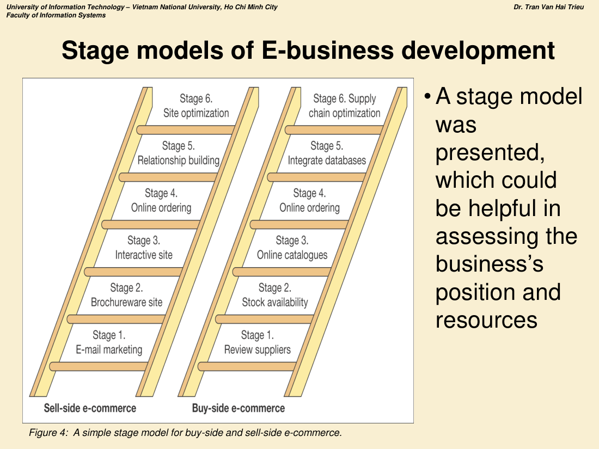

*Hình 4 — A simple stage model for buy-side and sell-side e-commerce.*

| Giai đoạn | **Sell-side e-commerce** | **Buy-side e-commerce** |
|---|---|---|
| **Stage 1** | E-mail marketing | Review suppliers (rà soát nhà cung cấp) |
| **Stage 2** | Brochureware site (web giới thiệu) | Stock availability (tra cứu tồn kho) |
| **Stage 3** | Interactive site (web tương tác) | Online catalogues (catalogue trực tuyến) |
| **Stage 4** | **Online ordering** (đặt hàng trực tuyến) | **Online ordering** |
| **Stage 5** | Relationship building (xây dựng quan hệ) | Integrate databases (tích hợp CSDL) |
| **Stage 6** | Site optimization (tối ưu website) | Supply chain optimization (tối ưu chuỗi cung ứng) |

**Công dụng:** đánh giá **vị trí hiện tại và nguồn lực** của doanh nghiệp, từ đó xác định bước tiếp theo.

### b) Portfolio analysis (Phân tích danh mục) ⭐

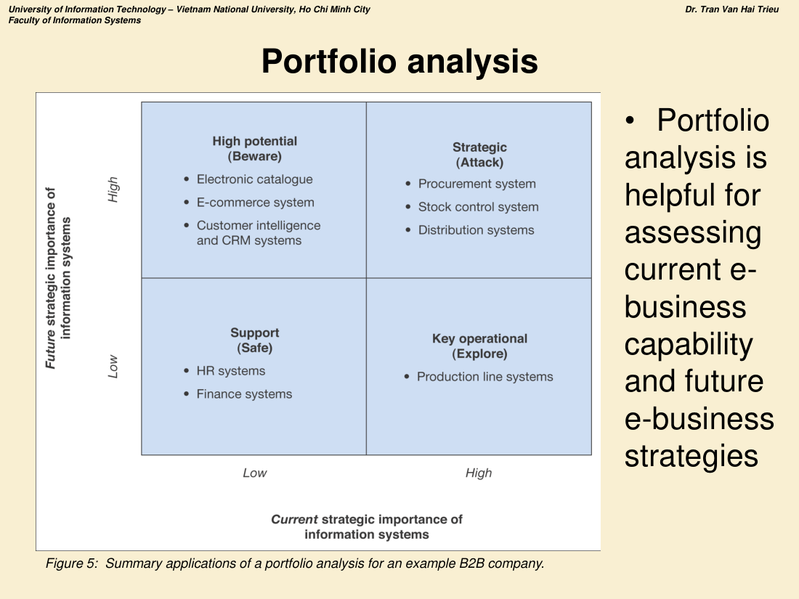

*Hình 5 — Summary applications of a portfolio analysis for an example B2B company.*

Ma trận 2 chiều: **Tầm quan trọng chiến lược HIỆN TẠI** (trục ngang) × **Tầm quan trọng chiến lược TƯƠNG LAI** (trục dọc).

| | **Current: Low** | **Current: High** |
|---|---|---|
| **Future: High** | **HIGH POTENTIAL (Beware — Thận trọng)** Electronic catalogue · E-commerce system · Customer intelligence & CRM | **STRATEGIC (Attack — Tấn công)** Procurement system · Stock control system · Distribution systems |
| **Future: Low** | **SUPPORT (Safe — An toàn)** HR systems · Finance systems | **KEY OPERATIONAL (Explore — Khai thác)** Production line systems |

### c) SWOT Analysis cho E-business ⭐⭐

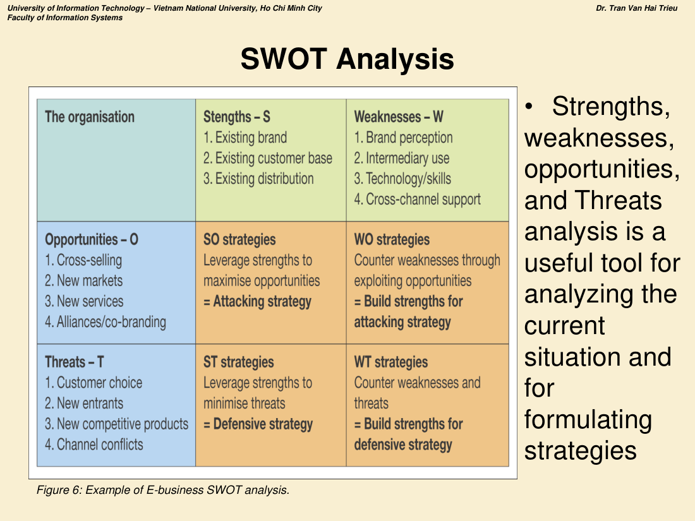

*Hình 6 — Example of E-business SWOT analysis.*

| | **Strengths (S)** 1. Thương hiệu sẵn có 2. Tập khách hàng sẵn có 3. Hệ thống phân phối sẵn có | **Weaknesses (W)** 1. Nhận thức thương hiệu 2. Phụ thuộc trung gian 3. Công nghệ/kỹ năng 4. Hỗ trợ đa kênh |
|---|---|---|
| **Opportunities (O)** 1. Bán chéo 2. Thị trường mới 3. Dịch vụ mới 4. Liên minh/đồng thương hiệu | **SO strategies:** Tận dụng điểm mạnh để tối đa hóa cơ hội = **Chiến lược tấn công (Attacking)** | **WO strategies:** Khắc phục điểm yếu bằng cách khai thác cơ hội = **Xây điểm mạnh để tấn công** |
| **Threats (T)** 1. Khách hàng có nhiều lựa chọn 2. Đối thủ mới gia nhập 3. Sản phẩm cạnh tranh mới 4. **Xung đột kênh** | **ST strategies:** Tận dụng điểm mạnh để giảm thiểu nguy cơ = **Chiến lược phòng thủ (Defensive)** | **WT strategies:** Khắc phục điểm yếu và nguy cơ = **Xây điểm mạnh để phòng thủ** |

### d) Cân bằng nội lực và ngoại lực (Early vs Later adopter)

Việc chọn chiến lược E-business dựa trên **cân bằng giữa năng lực nội bộ và các lực lượng bên ngoài**. Ma trận đánh giá năng lực bên ngoài vs năng lực bên trong cho phép doanh nghiệp xác định mình nên là **early adopter** (người tiên phong) hay **later adopter** (người theo sau).

### e) Phân tích môi trường cạnh tranh — Mô hình 5 lực lượng của Porter ⭐⭐

*Hình 8 — Competitive Environment Analysis: Porter's five forces.*

Xoay quanh **"The business"** ở trung tâm:

1. **Bargaining power of customers** — Quyền thương lượng của khách hàng
2. **Power of suppliers** — Quyền lực của nhà cung cấp
3. **Threat of substitutes** — Nguy cơ sản phẩm thay thế
4. **Threat of new entrants** — Nguy cơ đối thủ mới gia nhập
5. **Extent of rivalry between competitors** — Mức độ cạnh tranh giữa các đối thủ hiện hữu

> 📌 **Tác động của Internet lên 5 lực lượng:** Internet thường **làm tăng** quyền lực khách hàng (dễ so sánh giá), **hạ rào cản gia nhập**, **tăng cạnh tranh** và **tăng nguy cơ thay thế** — đây là lập luận trung tâm của Porter (2001).

---

## 1.10. GIAI ĐOẠN 2 — THIẾT LẬP MỤC TIÊU CHIẾN LƯỢC ⭐⭐

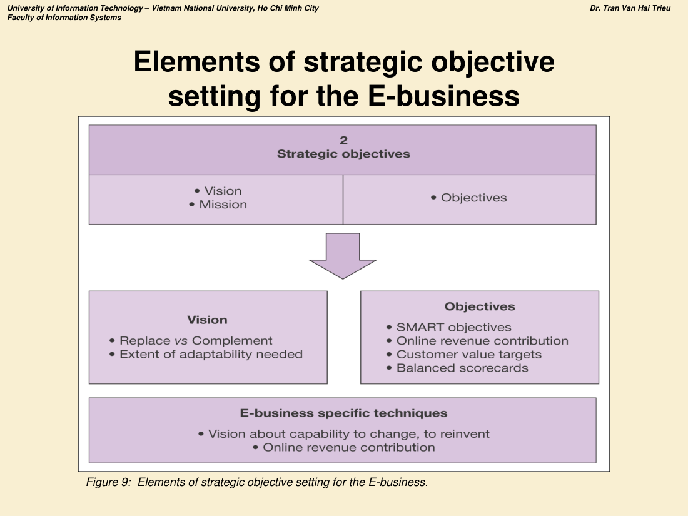

*Hình 9 — Elements of strategic objective setting for the E-business.*

| Khối | Nội dung |
|---|---|
| **Vision** | **Replace vs Complement** (Thay thế hay bổ trợ kênh truyền thống) · Mức độ thích ứng cần thiết |
| **Objectives** | **SMART objectives** · **Online revenue contribution** · Customer value targets · **Balanced scorecards** |
| **E-business specific techniques** | Tầm nhìn về năng lực **thay đổi, tái tạo (reinvent)** doanh nghiệp · **Online revenue contribution** |

### a) E-business tạo giá trị bằng cách nào?

| Cách | Nội dung |
|---|---|
| **Adding value** (Gia tăng giá trị) | Sản phẩm, dịch vụ chất lượng tốt hơn |
| **Reducing cost** (Giảm chi phí) | Làm quy trình kinh doanh hiệu quả hơn |
| **Managing risks** (Quản trị rủi ro) | Cải thiện luồng thông tin và tính sẵn có của thông tin |
| **Creating new reality** (Tạo thực tại mới) | Tạo cách thức mới cho sản phẩm/dịch vụ |

### b) Mục tiêu SMART ⭐⭐

| Chữ | Nghĩa | Câu hỏi kiểm tra |
|---|---|---|
| **S**pecific | Cụ thể | Mục tiêu đủ chi tiết để đo lường được vấn đề/cơ hội thực tế chưa? |
| **M**easurable | Đo lường được | Có gán được thuộc tính định lượng hoặc định tính để tạo chỉ số không? |
| **A**ctionable (Achievable) | Hành động được / Khả thi | Thông tin có dùng để cải thiện hiệu quả không? Nếu mục tiêu không làm thay đổi hành vi nhân viên để cải thiện hiệu suất thì gần như vô nghĩa! |
| **R**elevant | Phù hợp | Thông tin có áp dụng được cho đúng vấn đề nhà quản lý đang gặp không? |
| **T**ime-related | Gắn thời gian | Chỉ số/mục tiêu có gắn với khung thời gian xác định không? |

**Online Revenue Contribution:** % doanh thu công ty được tạo ra **trực tiếp** qua giao dịch trực tuyến. Với **B2B**, cần tính thêm **doanh thu gián tiếp** (web ảnh hưởng đến quyết định mua offline).

### c) Bảng ví dụ: Mục tiêu – Chiến lược – KPI cho công ty B2B ⭐⭐⭐

**(Bảng này cực kỳ hay ra thi dạng "hãy đề xuất mục tiêu, chiến lược và KPI")**

| # | **Objectives (Mục tiêu)** | **Strategies (Chiến lược đạt mục tiêu)** | **KPI / Critical success factors** |
|---|---|---|---|
| 1 | Phát triển doanh thu từ **thị trường địa lý mới** | Tạo **hệ thống e-commerce** cho sản phẩm chuẩn và chỉ định đại lý cho các thị trường này | Đạt doanh thu hợp nhất **£1 triệu** vào cuối năm. **Online revenue contribution 70%** |
| 2 | Tăng doanh thu từ **các đơn mua nhỏ lẻ của nhà bán lẻ** | Tạo hệ thống e-commerce cho sản phẩm chuẩn | Tăng doanh số qua nhà bán lẻ từ **15% lên 25%** tổng doanh thu trong **năm 2**. Online revenue contribution 30% |
| 3 | Cải thiện **hiệu quả tìm nguồn nguyên vật liệu** | Phát triển **hệ thống e-procurement** | **Giảm chi phí mua hàng 5%** cuối năm 1, **10%** năm 2 |
| 4 | Rút ngắn **thời gian ra thị trường** và giảm chi phí phát triển sản phẩm mới | Dùng **công cụ cộng tác và quản lý dự án** | Giảm chi phí và thời gian ra thị trường trung bình **10%** vào năm 3 |
| 5 | Bảo vệ & tăng hiệu quả **mạng lưới nhà phân phối và đối tác** | Tạo **extranet cho đối tác**, hướng tới hỗ trợ **không giấy tờ (paperless)** | **Giảm chi phí bán hàng 30%** tại từng thị trường trong 5 thị trường địa lý chính |

### d) Balanced Scorecard (Thẻ điểm cân bằng)

> **Scorecard** là khung toàn diện để **thiết lập và giám sát hiệu quả kinh doanh**.

**4 nhóm chỉ số:**
1. **Customer issues** (Khách hàng)
2. **Internal efficiency** (Hiệu quả nội bộ)
3. **Financial** (Tài chính)
4. **Innovation** (Đổi mới / học hỏi & phát triển)

---

## 1.11. GIAI ĐOẠN 3 — ĐỊNH NGHĨA CHIẾN LƯỢC: 8 QUYẾT ĐỊNH ⭐⭐⭐

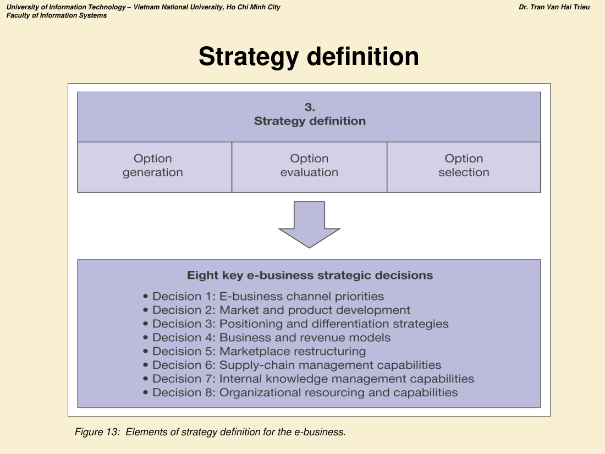

*Hình 13 — Elements of strategy definition for the e-business.*

**Quy trình:** Option generation → Option evaluation → Option selection, dẫn tới **8 quyết định chiến lược E-business then chốt**:

| # | Quyết định |
|---|---|
| **1** | **E-business channel priorities** — Ưu tiên kênh |
| **2** | **Market and product development** — Phát triển thị trường và sản phẩm |
| **3** | **Positioning and differentiation strategies** — Định vị và khác biệt hóa |
| **4** | **Business and revenue models** — Mô hình kinh doanh và doanh thu |
| **5** | **Marketplace restructuring** — Tái cấu trúc thị trường |
| **6** | **Supply-chain management capabilities** — Năng lực quản trị chuỗi cung ứng |
| **7** | **Internal knowledge management capabilities** — Năng lực quản trị tri thức nội bộ |
| **8** | **Organizational resourcing and capabilities** — Nguồn lực và năng lực tổ chức |

### Quyết định 1 — Ưu tiên kênh E-business ⭐⭐

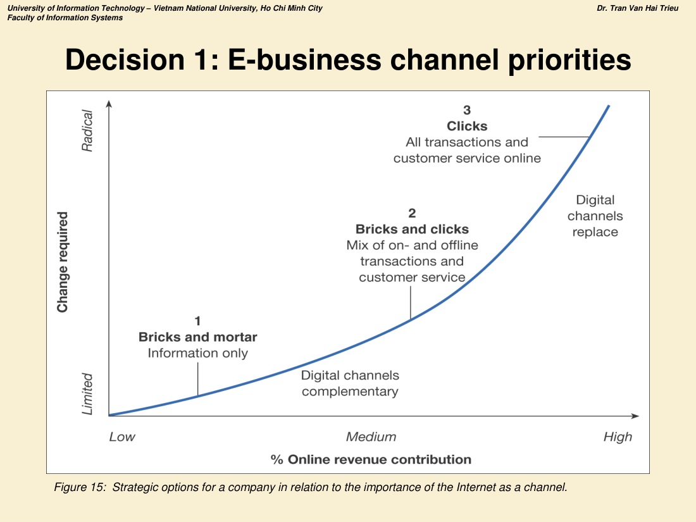

*Hình 15 — Strategic options for a company in relation to the importance of the Internet as a channel.*

Đồ thị: trục ngang = **% Online revenue contribution** (Low → High); trục dọc = **Change required** (Limited → Radical).

| # | Phương án | Đặc điểm | Vị trí |
|---|---|---|---|
| **1** | **Bricks and mortar** | **Information only** — web chỉ cung cấp thông tin | Online revenue thấp, thay đổi hạn chế. *Digital channels complementary* (kênh số bổ trợ) |
| **2** | **Bricks and clicks** | **Kết hợp** giao dịch và dịch vụ khách hàng on- và offline | Mức trung bình |
| **3** | **Clicks (pure play)** | **Toàn bộ** giao dịch và dịch vụ khách hàng trực tuyến | Online revenue cao, thay đổi **triệt để (radical)**. *Digital channels replace* (kênh số thay thế) |

**Right-channeling (Điều hướng kênh đúng):** xây dựng chiến lược và chiến thuật tiếp xúc **tích hợp nhiều kênh**, được công nghệ hỗ trợ, để tiếp cận:
- **Đúng người** (the right person)
- **Đúng thời điểm** (at the right time)
- **Đúng kênh truyền thông** (using the right communications channel)
- **Với chào hàng/sản phẩm/thông điệp phù hợp** (with a relevant offer, product or message)

### Quyết định 2 — Phát triển thị trường và sản phẩm (Ma trận Ansoff) ⭐⭐⭐

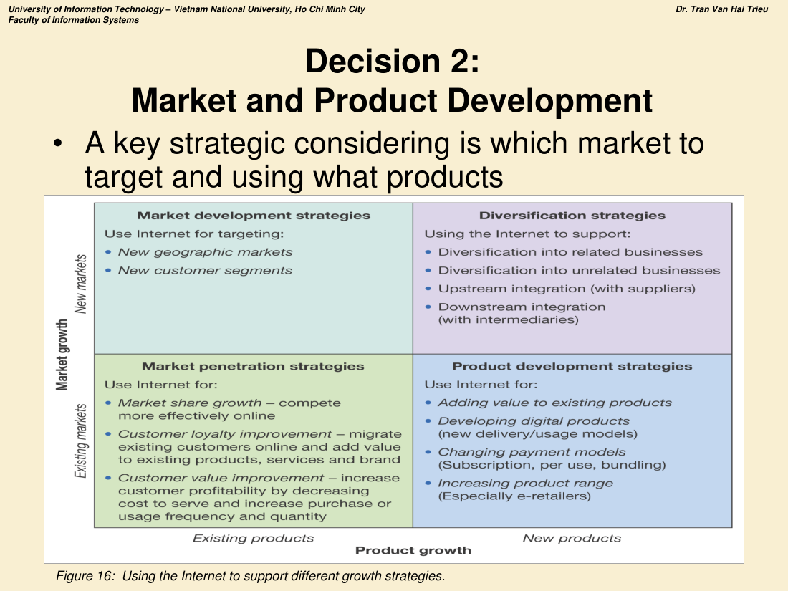

*Hình 16 — Using the Internet to support different growth strategies.*

|  | **Existing products (SP hiện có)** | **New products (SP mới)** |
|---|---|---|
| **New markets (Thị trường mới)** | **MARKET DEVELOPMENT** Dùng Internet nhắm tới: • Thị trường địa lý mới • Phân khúc khách hàng mới | **DIVERSIFICATION** Dùng Internet hỗ trợ: • Đa dạng hóa vào ngành **liên quan** • Đa dạng hóa vào ngành **không liên quan** • **Tích hợp ngược (upstream)** với nhà cung cấp • **Tích hợp xuôi (downstream)** với trung gian |
| **Existing markets (Thị trường hiện có)** | **MARKET PENETRATION** Dùng Internet để: • **Tăng thị phần** — cạnh tranh hiệu quả hơn trên mạng • **Tăng lòng trung thành** — chuyển KH hiện hữu lên online, gia tăng giá trị cho SP/DV/thương hiệu • **Tăng giá trị khách hàng** — tăng lợi nhuận/KH bằng cách giảm chi phí phục vụ và tăng tần suất, số lượng mua | **PRODUCT DEVELOPMENT** Dùng Internet để: • **Gia tăng giá trị** cho sản phẩm hiện có • Phát triển **sản phẩm số** (mô hình phân phối/sử dụng mới) • **Thay đổi mô hình thanh toán** (thuê bao, trả theo lần dùng, bán gói) • **Mở rộng danh mục sản phẩm** (đặc biệt với e-retailer) |

### Quyết định 3 — Định vị và khác biệt hóa ⭐

Sau khi xác định thị trường, cần định vị dịch vụ e-commerce so với đối thủ.

> **Công thức cảm nhận thương hiệu của khách hàng:**
> **Customer Value = (Product quality × Service quality) ÷ (Price × Fulfillment time)**

**Ý nghĩa:** muốn tăng giá trị cảm nhận thì hoặc **tăng tử số** (chất lượng SP × chất lượng DV) hoặc **giảm mẫu số** (giá × thời gian giao hàng). Chiến lược cần rà soát xem mức tăng chất lượng SP và DV có được **bù lại bằng việc giảm giá và giảm thời gian** hay không.

### Quyết định 4 — Mô hình kinh doanh, dịch vụ và doanh thu

- **Business model:** bản tóm lược **cách doanh nghiệp tạo ra doanh thu**, xác định sản phẩm chào bán, dịch vụ giá trị gia tăng, nguồn doanh thu và khách hàng mục tiêu.
- **Revenue model:** mô tả **các phương thức tạo thu nhập** cho tổ chức.
- Quyết định này gần với Quyết định 3 nhưng nhấn mạnh **mô hình mới** (ví dụ Amazon). *"Only the paranoid will survive"* (Andy Grove).
- Lưu ý: nhiều công ty thành công nhờ **kiên trì một mô hình duy nhất** không xa tầm nhìn ban đầu.

### Quyết định 5 — Tái cấu trúc thị trường ⭐⭐

| Khái niệm | Định nghĩa |
|---|---|
| **Disintermediation** (Phi trung gian hóa) | **Loại bỏ trung gian** như nhà phân phối, môi giới — những bên trước đây nối doanh nghiệp với khách hàng |
| **Re-intermediation** (Tái trung gian hóa) | **Tạo trung gian mới** giữa khách hàng và nhà cung cấp, cung cấp dịch vụ như tìm kiếm nhà cung cấp và đánh giá sản phẩm |
| **Counter-mediation** (Đối trung gian hóa) | Một **doanh nghiệp đã có vị thế tự tạo ra một trung gian mới** (để cạnh tranh với các trung gian độc lập) |

### Quyết định 6 — Năng lực quản trị chuỗi cung ứng

Ba câu hỏi rà soát:
1. Làm sao **tích hợp chặt hơn với nhà cung cấp**, ví dụ tạo **extranet** để giảm chi phí và rút ngắn thời gian ra thị trường?
2. **Loại vật tư và loại tương tác nào** với nhà cung cấp nên hỗ trợ qua **e-procurement**?
3. Có thể **tham gia sàn giao dịch trực tuyến** để giảm chi phí không?

### Quyết định 7 — Năng lực quản trị tri thức nội bộ

- **Knowledge (Tri thức):** các **mẫu hình (patterns), quy tắc (rules) và ngữ cảnh (contexts)** tạo khung để **tạo lập, đánh giá và sử dụng thông tin**. Gồm **tacit knowledge** (ẩn, chưa tài liệu hóa) và **explicit knowledge** (hiện, đã tài liệu hóa).
- **Knowledge management:** tập hợp quy trình để **tạo lập (create), lưu trữ (store), chuyển giao (transfer) và áp dụng (apply)** tri thức.

### Quyết định 8 — Nguồn lực và năng lực tổ chức

**Bốn phương án tổ chức:**

| Phương án | Mức độ |
|---|---|
| **In-house division** (Bộ phận nội bộ) | **Integration** — tích hợp |
| **Joint venture** (Liên doanh) | Mixed — hỗn hợp |
| **Strategic partnership** (Đối tác chiến lược) | Mixed — hỗn hợp |
| **Spin-off** (Tách công ty riêng) | **Separation** — tách biệt |

**Các thay đổi khác cần xem xét:** cải tiến quy trình chiến lược & hiệu suất; hạ tầng e-commerce; **sự ủng hộ của lãnh đạo cấp cao**; tích hợp thị trường; mức tập trung vào thị trường trực tuyến.

---

## 1.12. GIAI ĐOẠN 4 — TRIỂN KHAI CHIẾN LƯỢC ⭐

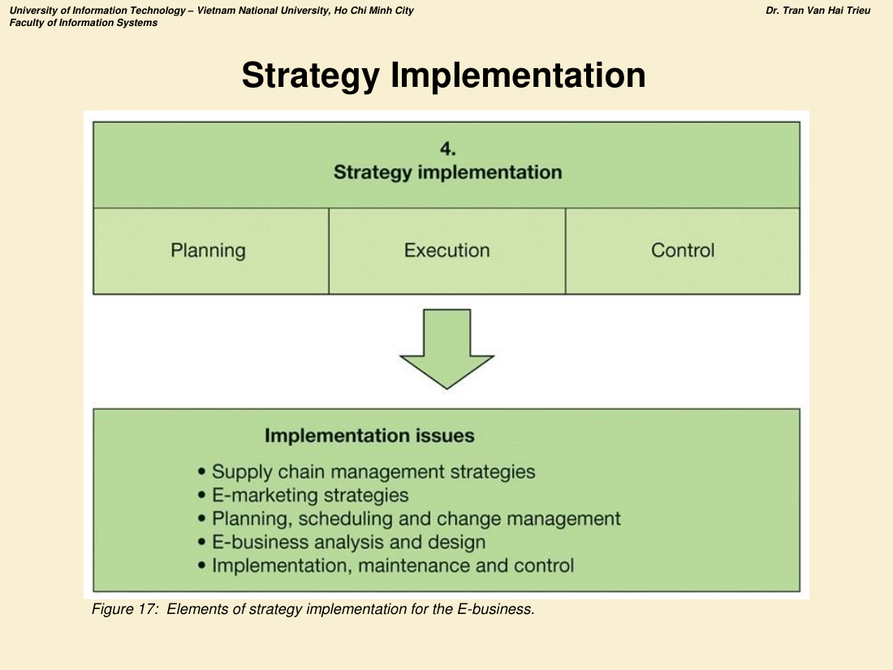

*Hình 17 — Elements of strategy implementation for the E-business.*

**Ba thành phần:** Planning · Execution · Control

**Năm nhóm vấn đề triển khai (Implementation issues):**
1. Supply chain management strategies
2. E-marketing strategies
3. Planning, scheduling and change management
4. E-business analysis and design
5. Implementation, maintenance and control

## 1.13. Vì sao các chiến lược E-business THẤT BẠI? ⭐⭐

**Nguyên nhân bề mặt:**
- **Đánh giá quá cao tốc độ** thị trường chấp nhận đổi mới dot.com
- **Sai thời điểm (timing errors)**
- **Thiếu sáng tạo**
- **Dịch vụ miễn phí** (không có mô hình doanh thu)
- **Quá tham vọng (over ambition)**

**Nguyên nhân sâu xa — theo từng giai đoạn của quy trình chiến lược:**

| Giai đoạn | Vấn đề |
|---|---|
| **Situation Analysis** | **Nghiên cứu nhu cầu không đầy đủ** |
| **Objective setting** | **Không có mục tiêu hoặc mục tiêu phi thực tế** |
| **Strategy definition** | **Mô hình kinh doanh kém** |
| **Implementation** | Vấn đề **dịch vụ khách hàng và chất lượng sản phẩm** |

**Yếu tố thành công khi triển khai cho SME:** Effective (hiệu quả) · Convenience (tiện lợi) · Manageable and under control (quản lý được, trong tầm kiểm soát) · Brand image (hình ảnh thương hiệu) · Commitment (cam kết) · Partnership (đối tác) · Process Improvement (cải tiến quy trình).

## 1.14. Chiến lược HTTT và chiến lược E-business

| Cách tiếp cận | Hướng | Nội dung |
|---|---|---|
| **Business-alignment approach** | **Top-down** | Bắt đầu từ **chiến lược kinh doanh**, xây chiến lược HTTT **khớp với** chiến lược kinh doanh |
| **Business-impact approach** | **Bottom-up** | **Khảo sát các cơ hội HTTT mới** xem chúng có mang tác động tích cực tới chiến lược kinh doanh không |

## 1.15. Nghịch lý năng suất (The Productivity Paradox) ⭐

- Nghiên cứu cho thấy **mối tương quan yếu/kém** giữa đầu tư HTTT và hiệu quả kinh doanh.
- Đầu tư CNTT có quan hệ **tích cực mạnh** với **doanh thu, tài sản và vốn chủ sở hữu**, **NHƯNG không** với **lợi nhuận ròng (net income)**.
- **Đầu tư vào nhân sự CNTT và đào tạo người dùng** thì **CÓ** quan hệ tích cực với thu nhập.
- ⇒ **Khuyến nghị mạnh:** phải chú ý nhiều hơn tới **THAY ĐỔI QUY TRÌNH KINH DOANH (business process change)** khi triển khai chiến lược E-business.

> 📌 **Đây là luận điểm rất hay dùng để mở hoặc kết cho câu hỏi "đề xuất cải tiến quy trình kinh doanh": chỉ đầu tư công nghệ mà không thay đổi quy trình thì không tạo ra lợi nhuận.**

---

# PHẦN 2. CÔNG NGHỆ WEB SERVER VÀ E-MAIL

## 2.1. Phần mềm Web Server

- Là phần mềm **chạy trên máy chủ lưu trữ website**.
- Khi người dùng nhấp vào một hyperlink, **yêu cầu được gửi tới Web server** cho trang tương ứng.
- **Giao thức HTTP** đáp ứng yêu cầu và gửi kết quả về máy client.
- Việc chọn phần mềm web server **không dễ** vì có rất nhiều sản phẩm với đặc tính khác nhau.

## 2.2. Tám phần mềm Web Server cho Windows và Linux ⭐

| # | Phần mềm | Đặc điểm chính | Tính năng then chốt | Phù hợp với ai |
|---|---|---|---|---|
| **1** | **Apache** | Mã nguồn mở, **~31,5%** website; chạy đa hệ điều hành (Windows, Linux) | IPv6; Session tracking; FTP và HTTP/2; module tùy biến | Người mới; cần phần mềm mở & tùy biến; site WordPress lưu lượng thấp–trung bình |
| **2** | **Microsoft IIS** | Thiết kế riêng cho **Windows**; **không tương thích Linux**; có sẵn tính năng bảo mật Windows (Azure AD) | Tích hợp nhiều sản phẩm Microsoft; thân thiện lập trình viên; giao diện đơn giản; bảo mật tích hợp phong phú; hỗ trợ ASP.NET, CSS, JS, HTML | Dùng Windows; là developer; muốn chạy nhiều site trên một server |
| **3** | **Tomcat** | Tốt nhất cho **ứng dụng Java**; mã nguồn mở, tối ưu tốc độ | Module tùy biến; nhiều công nghệ Java (Jakarta WebSocket); xử lý dữ liệu tăng cường; mã nguồn mở | Làm việc chủ yếu với Java và nội dung động; cần phần mềm nhẹ |
| **4** | **NGINX** | Đã **vượt Apache**, **>33%** website; tương thích cả Linux & Windows | Tương thích nhiều ứng dụng web; **tiêu thụ tài nguyên tối thiểu**; **cân bằng tải (load balancing)**; mã nguồn mở | Website lưu lượng cao; cần tối ưu hiệu năng; giải pháp tiết kiệm tài nguyên |
| **5** | **LiteSpeed** | Nhẹ, **tập trung bảo mật**; hiệu năng & khả năng mở rộng cao; **chống DDoS tích hợp** | Kiến trúc hướng sự kiện; tương thích nhiều hosting panel; bảo mật điều chỉnh được; tối ưu PHP | Ưu tiên tốc độ & hiệu năng; site lưu lượng cao hoặc e-commerce; dùng Linux |
| **6** | **CentOS Stream** | Bản phân phối Linux có nền tảng phát triển tích hợp để **thử nghiệm ứng dụng**; **chỉ dùng với Linux** | Mã nguồn mở & miễn phí; xem trước bản cập nhật RHEL; thân thiện developer | Developer làm với RHEL; chỉ dùng Linux; cần phần mềm server miễn phí |
| **7** | **Caddy** | Thân thiện & an toàn; **mặc định dùng HTTPS**; hỗ trợ Linux, Windows, macOS, Solaris, BSD | Hỗ trợ nội dung tĩnh & động; cân bằng tải; tập trung bảo mật | Cần giải pháp dễ dùng; ưu tiên bảo mật; quản trị nhiều site |
| **8** | **Lighttpd** | Tốt nhất cho **môi trường ít tài nguyên**; dùng bộ nhớ tối thiểu; thiết kế cho Linux (dùng được trên Windows nhưng không hỗ trợ gốc); hỗ trợ PHP, Python, Lua, Ruby | Cân bằng tải & HTTP proxy; tập trung hiệu quả & tốc độ; thiết kế nhẹ; HTTP/2 | Quan tâm tốc độ & mức tiêu thụ tài nguyên; làm nhiều ngôn ngữ lập trình; cần phần mềm an toàn & linh hoạt |

## 2.3. Phần cứng Web Server

- Là **máy tính dùng để lưu trữ (host) website**; chứa toàn bộ file HTML, CSDL, hình ảnh.
- Chạy trên **Windows/Linux hoặc HĐH khác**, dùng phần mềm web server để quản lý các yêu cầu truy cập.
- Là **một trong những thành phần chính của hạ tầng TMĐT** — hiệu năng toàn ứng dụng phụ thuộc vào nó.
- Vì quản lý & bảo trì server rất quan trọng nên **đa số SME chọn thuê hosting** thay vì tự vận hành server.

**Ba yếu tố quyết định yêu cầu phần cứng/phần mềm web server:**
1. **Size of the web site** — quy mô website
2. **Purpose of the web site** — mục đích website
3. **Traffic on the web site** — lưu lượng truy cập

**Yêu cầu phần cứng cho site B2B và B2C:**
- Sẵn sàng **24/7**
- **Server đáng tin cậy**
- **Server dự phòng (backup)** để đảm bảo tính sẵn sàng cao
- Phần mềm hiệu quả và **dễ nâng cấp**
- **Phần mềm bảo mật**
- **Kết nối cơ sở dữ liệu**

**Bộ phận phần cứng ảnh hưởng lớn tới hiệu năng TMĐT:** Network card · Server Processor · Server Memory · Hard Drives.

## 2.4. Chức năng cơ bản do Web Server cung cấp ⭐

| Chức năng | Mô tả |
|---|---|
| **Processing of HTTP requests** | Nhận và đáp ứng yêu cầu của client về trang HTML |
| **Security services (SSL/TLS)** | Xác thực username & password; xử lý chứng thư số và thông tin khóa công khai/riêng tư cần cho xử lý thẻ tín dụng và thông tin bảo mật khác |
| **File Transfer Protocol (FTP)** | Cho phép truyền các tệp rất lớn giữa các server |
| **Search engine** | Lập chỉ mục nội dung site; khả năng tìm kiếm theo từ khóa |
| **Data capture** | Tệp nhật ký (log) mọi lượt truy cập, thời điểm, thời lượng và nguồn giới thiệu (referral) |
| **E-mail** | Gửi, nhận và lưu trữ thư điện tử |
| **Site management tools** | Tính toán và hiển thị thống kê site quan trọng: khách truy cập duy nhất, số yêu cầu trang, nguồn gốc yêu cầu; kiểm tra liên kết trên trang |

## 2.5. Máy chủ và phần mềm E-mail

- **E-mail** là ứng dụng trên máy tính để **trao đổi thông điệp giữa người dùng**; tương đương lá thư nhưng **ưu thế về tính kịp thời và linh hoạt**.
- **Email server** là hệ thống máy tính gửi và nhận email. **Mỗi email gửi đi đều phải đi qua một chuỗi mail server** trên đường tới người nhận.

**Ba giao thức email chuẩn:**

| Giao thức | Tên đầy đủ | Chức năng |
|---|---|---|
| **SMTP** | Simple Mail Transfer Protocol | **Gửi, nhận và chuyển tiếp (relay)** email đi giữa người gửi và người nhận |
| **IMAP** | Internet Message Access Protocol | Cho phép **truy cập email ở bất cứ đâu, từ bất kỳ thiết bị nào** (thư vẫn nằm trên server) |
| **POP3** | Post Office Protocol version 3 | **Kết nối tới dịch vụ email và tải toàn bộ thư mới về máy** |

**Tự vận hành hay thuê ngoài mail server?**

| | **Third-party hosting** (Thuê ngoài) | **Self-hosting** (Tự vận hành) |
|---|---|---|
| Trách nhiệm | Nhà cung cấp **chịu trách nhiệm quản lý & bảo trì** server | Doanh nghiệp tự quản lý |
| Chi phí | **Hợp lý (affordable)** | Cao hơn |
| Tính năng bổ sung | Lọc spam, lưu trữ trực tuyến, sao lưu email… | Tự xây |
| Lý do chọn | Tiện, rẻ | **Tránh các vấn đề về quyền riêng tư, bảo mật và kiểm soát** máy chủ thư |

**E-mail client — hai cách truy cập thư:**

| | **Email service (Webmail)** | **Email client** |
|---|---|---|
| Bản chất | Nền tảng gửi/nhận email qua **giao diện web và trình duyệt** | **Phần mềm cài trên máy tính**, gửi/nhận qua giao diện của phần mềm |
| Ví dụ | Gmail, Yahoo | Outlook |

---

# PHẦN 3. MÔ HÌNH KINH DOANH VÀ DOANH THU CỦA E-BUSINESS

## 3.1. Mô hình kinh doanh là gì?

> **Business model** là **tập hợp các hoạt động đã hoạch định (đôi khi gọi là các quy trình kinh doanh) được thiết kế để tạo ra lợi nhuận trên thị trường.**

- Mô hình kinh doanh **không phải lúc nào cũng giống** chiến lược kinh doanh, dù đôi khi rất gần vì mô hình kinh doanh có tính tới môi trường cạnh tranh.
- Mô hình kinh doanh **nằm ở trung tâm của kế hoạch kinh doanh**.
- **Business plan** là tài liệu **mô tả mô hình kinh doanh** của một doanh nghiệp.

## 3.2. Tám yếu tố then chốt của một mô hình kinh doanh ⭐⭐⭐

| # | Yếu tố | Câu hỏi cốt lõi | Nội dung |
|---|---|---|---|
| **1** | **Value Proposition** (Tuyên bố giá trị) | *"Tại sao khách hàng nên mua của bạn?"* | Các value proposition TMĐT thành công: **Personalization/customization**; **Giảm chi phí tìm kiếm sản phẩm và khám phá giá**; **Tạo thuận lợi cho giao dịch bằng cách quản lý việc giao hàng** |
| **2** | **Revenue Model** (Mô hình doanh thu) | *"Bạn kiếm tiền bằng cách nào?"* | **Advertising** (quảng cáo); **Subscription** (thuê bao — kèm chiến lược **Freemium**); **Transaction fee** (phí giao dịch); **Sales** (bán hàng); **Affiliate** (tiếp thị liên kết) |
| **3** | **Market Opportunity** (Cơ hội thị trường) | *"Bạn định phục vụ marketspace nào và quy mô bao nhiêu?"* | **Marketspace**: khu vực có giá trị thương mại thực tế/tiềm năng mà công ty định hoạt động. **Realistic market opportunity**: xác định bởi tiềm năng doanh thu ở từng ngách. Thường chia nhỏ thành nhiều **niche** |
| **4** | **Competitive Environment** (Môi trường cạnh tranh) | *"Ai khác đang chiếm marketspace bạn nhắm tới?"* | Gồm **đối thủ trực tiếp và gián tiếp**. Chịu ảnh hưởng bởi: **số lượng & quy mô đối thủ**, **thị phần từng đối thủ**, **khả năng sinh lời**, **chính sách giá** của đối thủ |
| **5** | **Competitive Advantage** (Lợi thế cạnh tranh) | *"Doanh nghiệp mang lợi thế đặc biệt gì vào marketspace?"* | Sản phẩm có ưu việt hơn hoặc rẻ hơn đối thủ không? Khái niệm quan trọng: **First-mover advantage**, **Complementary resources**, **Unfair competitive advantage**, **Leverage**, **Perfect markets** |
| **6** | **Market Strategy** (Chiến lược thị trường) | *"Bạn quảng bá sản phẩm/dịch vụ thế nào để thu hút khách hàng mục tiêu?"* | Chi tiết cách công ty thâm nhập thị trường và thu hút khách hàng. **Ý tưởng hay nhất cũng thất bại nếu không được marketing đúng cách** |
| **7** | **Organizational Development** (Phát triển tổ chức) | *"Cần cấu trúc tổ chức nào để thực hiện kế hoạch kinh doanh?"* | Mô tả cách công ty tổ chức công việc — thường chia theo **phòng ban chức năng**; khi công ty lớn lên, tuyển dụng chuyển từ **generalist sang specialist** |
| **8** | **Management Team** (Đội ngũ quản lý) | *"Lãnh đạo công ty cần nền tảng gì?"* | Đội ngũ mạnh: **làm cho mô hình kinh doanh vận hành được**, **tạo uy tín với nhà đầu tư bên ngoài**, có **kiến thức chuyên biệt về thị trường** và **kinh nghiệm triển khai kế hoạch kinh doanh** |

## 3.3. Các mô hình kinh doanh B2C ⭐⭐

| Mô hình | Mô tả | Revenue model | Biến thể / Ví dụ |
|---|---|---|---|
| **E-tailer** (Nhà bán lẻ điện tử) | Phiên bản trực tuyến của nhà bán lẻ truyền thống | **Sales** | **Virtual merchant** (thuần online), **Bricks-and-clicks**, **Catalog merchant**, **Manufacturer-direct**. **Rào cản gia nhập thấp** |
| **Community provider** (Mạng xã hội) | Môi trường trực tuyến cho người cùng sở thích giao dịch, chia sẻ nội dung, giao tiếp | **Hybrid**: quảng cáo + thuê bao + bán hàng + phí giao dịch | Facebook, LinkedIn, Twitter, Pinterest, TikTok |
| **Content provider** | Nội dung số trên Web: tin tức, nhạc, video, văn bản, tác phẩm nghệ thuật | Quảng cáo, thuê bao, bán hàng hóa số. **Chìa khóa thành công là SỞ HỮU nội dung** | Biến thể: **Syndication**, **Aggregators** |
| **Portal** | Tìm kiếm + gói tích hợp nội dung và dịch vụ | Quảng cáo, phí giới thiệu, phí giao dịch, thuê bao dịch vụ cao cấp | **General** (AOL, MSN); **Specialized** (Sailnet); **Search** (Google, Bing) |
| **Transaction broker** | Xử lý giao dịch trực tuyến thay người tiêu dùng; giá trị cốt lõi là **tiết kiệm thời gian và tiền bạc** | **Transaction fees** | Dịch vụ tài chính, du lịch, tuyển dụng |
| **Market creator** | Tạo môi trường số nơi người mua và người bán gặp nhau và giao dịch | Phí giao dịch, phí truy cập cho người bán | eBay, Amazon. **On-demand service / sharing economy**: Uber, Airbnb, Grab |
| **Service provider** | Cung cấp dịch vụ trực tuyến; giá trị: **tiện lợi, tiết kiệm thời gian, chi phí thấp** so với nhà cung cấp truyền thống | Bán dịch vụ, phí thuê bao, quảng cáo, bán dữ liệu marketing | Google Maps, Gmail, Office 365 |

## 3.4. Các mô hình kinh doanh B2B ⭐⭐

**Hai nhóm lớn: Net marketplaces và Private industrial network.**

| Mô hình | Mô tả | Revenue model | Ví dụ |
|---|---|---|---|
| **E-Distributor** | Phiên bản của cửa hàng bán lẻ/bán sỉ; hàng **MRO** (maintenance-repair-operation) và **hàng gián tiếp**; **do MỘT công ty sở hữu** phục vụ nhiều khách hàng | **Sales of goods** | **Grainger** |
| **E-Procurement** | Tạo **thị trường số** nơi các bên giao dịch **hàng gián tiếp**; nhà cung cấp dịch vụ B2B, SaaS và PaaS; **lợi thế quy mô (scale economies)** | **Service fees**, quản lý chuỗi cung ứng, dịch vụ hoàn tất đơn | **Amazon (AWS)** |
| **Exchange** (Sàn giao dịch) | Thị trường số **theo ngành dọc (vertical)** cho **đầu vào trực tiếp** | **Transaction, commission fees** | **Go2Paper**. Tạo cạnh tranh giá gay gắt giữa nhà cung cấp; nhiều sàn đã sụt giảm mạnh |
| **Industry Consortia** (Hiệp hội ngành) | Thị trường số dọc **do ngành sở hữu**, mở cho **nhà cung cấp được chọn lọc**; **thành công hơn Exchange** vì được các "ông lớn" bảo trợ và **củng cố hành vi mua hàng truyền thống** | **Transaction, commission fees** | **SupplyOn** |
| **Private Industrial Network** | Mạng số dùng để **điều phối giữa các doanh nghiệp làm ăn với nhau**; thường **mở rộng từ hệ thống doanh nghiệp nội bộ của một công ty lớn**; chỉ mời **nhà cung cấp then chốt, tin cậy, dài hạn** | — | **Mạng lưới nhà cung cấp của Walmart** |

## 3.5. E-commerce thay đổi kinh doanh như thế nào? ⭐

**E-commerce thay đổi cấu trúc ngành bằng cách thay đổi 5 lực lượng:**
1. Cạnh tranh giữa các đối thủ hiện hữu (Rivalry)
2. Rào cản gia nhập (Barriers to entry)
3. Nguy cơ sản phẩm thay thế
4. Sức mạnh nhà cung cấp
5. Quyền thương lượng của người mua

### a) Industry Value Chain (Chuỗi giá trị ngành)

> Tập hợp các hoạt động do **nhà cung cấp, nhà sản xuất, đơn vị vận chuyển, nhà phân phối và nhà bán lẻ** thực hiện để **biến nguyên liệu thô thành sản phẩm và dịch vụ cuối cùng**.

**Tác động của Internet:** giảm chi phí thông tin và các chi phí giao dịch khác ⇒ **tăng hiệu quả vận hành, giảm chi phí và giá, gia tăng giá trị cho khách hàng**.

### b) Firm Value Chain (Chuỗi giá trị doanh nghiệp)

> Các hoạt động doanh nghiệp thực hiện để **tạo sản phẩm cuối cùng từ nguyên liệu đầu vào**; **mỗi bước tạo thêm giá trị**.

**Tác động của Internet:** tăng hiệu quả vận hành; cho phép **khác biệt hóa sản phẩm**; cho phép **điều phối chính xác các bước trong chuỗi**.

### c) Firm Value Web (Mạng giá trị)

- **Hệ sinh thái kinh doanh được kết nối mạng**.
- Dùng công nghệ Internet để **điều phối chuỗi giá trị của các đối tác kinh doanh**.
- Điều phối nhà cung cấp với nhu cầu sản xuất của chính doanh nghiệp qua **hệ thống SCM dựa trên Internet**.

## 3.6. Chiến lược kinh doanh — 5 chiến lược tổng quát ⭐

> **Business strategy:** Kế hoạch đạt **lợi nhuận dài hạn vượt trội trên vốn đầu tư**.

1. **Product/service differentiation** — Khác biệt hóa sản phẩm/dịch vụ
2. **Cost competition** — Cạnh tranh chi phí
3. **Scope** — Phạm vi
4. **Focus/market niche** — Tập trung/ngách thị trường
5. **Customer intimacy/satisfaction** — Gắn bó/thỏa mãn khách hàng

## 3.7. Công nghệ TMĐT và sự đứt gãy mô hình kinh doanh

**Khái niệm:** Disruptive technologies · Digital disruption · Sustaining technology.

**Bốn giai đoạn của đứt gãy (disruption):**
1. Kẻ đột phá (disruptor) tung ra **sản phẩm mới có chất lượng thấp hơn**
2. Kẻ đột phá **cải thiện sản phẩm**
3. Sản phẩm mới **trở nên vượt trội** sản phẩm hiện hữu
4. **Doanh nghiệp lâu đời mất thị phần**

---

# PHẦN 4. MUA SẮM TRỰC TUYẾN (ONLINE SHOPPING)

## 4.1. Online Shopping là gì?

> Là **một hình thức thương mại điện tử cho phép người tiêu dùng mua trực tiếp hàng hóa/dịch vụ từ người bán qua Internet** bằng trình duyệt web hoặc ứng dụng di động.

- Người tiêu dùng tìm sản phẩm quan tâm bằng cách **tìm kiếm giữa các nhà cung cấp thay thế** qua **shopping search engine**, công cụ này hiển thị **tình trạng còn hàng và giá của cùng sản phẩm tại các e-retailer khác nhau**.
- Có thể mua qua **desktop, laptop, tablet, smartphone**.

## 4.2. Các công nghệ ứng dụng trong mua sắm trực tuyến ⭐⭐

| # | Công nghệ | Nội dung / Lợi ích |
|---|---|---|
| **1** | **Chatbots & Intelligent Virtual Assistants (IVAs)** | Công cụ hiệu quả để **tương tác với khách hàng và giảm chi phí tương tác**; chạy trên website, ứng dụng di động và dịch vụ nhắn tin (WhatsApp) |
| **2** | **Recommendation Systems** (Hệ khuyến nghị) | Theo khảo sát PwC, **~30% người tiêu dùng sẵn sàng trả nhiều hơn** cho sản phẩm được gợi ý. Người dùng bị quá tải gợi ý nhưng **đánh giá cao gợi ý cá nhân hóa**. Lợi ích: **tăng tỷ lệ tương tác và tăng doanh số** |
| **3** | **AI-driven pricing tools** | Đánh giá giá **tức thì** bằng cách so sánh với đối thủ, mức tồn kho, chính sách giao hàng. Trên thị trường cạnh tranh cao, **đổi giá ngay lập tức theo đối thủ tác động lớn tới tỷ lệ chuyển đổi** |
| **4** | **Web scraping** | Trích xuất dữ liệu từ website bằng bot hoặc API. DN TMĐT tạo ra **dữ liệu khách hàng, dữ liệu sản phẩm, dữ liệu tài chính**. **Lợi ích:** so sánh giá với đối thủ; hiểu hành vi mua và tìm sản phẩm có nhu cầu; **xác định "whales"** — người dùng đặc biệt mang lại doanh thu lớn; chạy quảng cáo nhắm mục tiêu; phân tích cảm xúc khách hàng |
| **5** | **Mobile Apps** | Khách hàng **tương tác liên tục** với thương hiệu qua app, biết được cơ hội mua mới; app cho **quy trình thanh toán đơn giản** |
| **6** | **Supply chain visibility software** | Quản lý toàn bộ chuỗi cung ứng từ giao hàng tới kho; **tự động phát hành hóa đơn và theo dõi tồn kho**; tạo **báo cáo hỗ trợ ra quyết định**; báo cáo tài chính; một số hệ thống tính được **dấu chân carbon** của sản phẩm |
| **7** | **Warehouse automation** (Tự động hóa kho) | **Lợi ích:** lập lịch chính xác cho bán thành phẩm và thành phẩm; **quản lý tồn kho tối ưu**; báo cáo tài chính/môi trường dễ hơn; giảm dấu chân carbon. **Công nghệ:** **IoT** (tối ưu điều kiện bảo quản, giảm chi phí năng lượng); **Intelligent automation** (kết hợp **NLP + RPA** để tự động xử lý đơn hàng); **Cobots** (robot cộng tác — làm 24/7, đóng gói và xếp pallet) |
| **8** | **E-wallets** (Ví điện tử) | Thẻ điện tử **liên kết với tài khoản ngân hàng**, dùng mua hàng trên máy tính/điện thoại. **Hai thành phần chính: phần mềm và dữ liệu**. **Ba lợi ích:** **tăng tính bảo mật**; **đơn giản hóa quy trình thanh toán**; **hoàn tiền dễ, chỉ mất vài giây** |
| **9** | **Check-out free systems** | Giúp khách mua tại cửa hàng **không phải xếp hàng**, dùng: **computer vision**, **thuật toán machine learning**, **cảm biến thông minh**, **e-wallet hoặc app riêng** |
| **10** | **Image Search Engine** | Khách chụp ảnh sản phẩm và dùng **tìm kiếm ảnh ngược (reverse image search)**. DN tận dụng bằng cách **tải ảnh cho mỗi mặt hàng**. Google Images là một trong các công cụ tìm kiếm phổ biến nhất ⇒ **dùng ảnh hiệu quả là chìa khóa thành công** |
| **11** | **VR / AR** | **VR** tạo môi trường 3D nhân tạo để khám phá & tương tác — khách có thể **thử sản phẩm ảo, bố trí nội thất trong nhà**. **AR** cho phép **xem trước sản phẩm**, **tăng khả năng chọn đúng sản phẩm ngay lần đầu** |

## 4.3. Thống kê mua sắm trực tuyến ⭐

**Tổng quan:**
- Doanh số TMĐT toàn cầu dự kiến đạt **6,86 nghìn tỷ USD năm 2025** (từ 6,3 nghìn tỷ năm 2024).
- Khoảng **2,8 tỷ người** trên thế giới sẽ mua hàng online ít nhất một lần trong năm.
- **Châu Á – Thái Bình Dương dẫn đầu** doanh số online toàn cầu, tăng mạnh ở Ấn Độ, Indonesia.
- **Giá trị đơn hàng trung bình tăng 7%** so với cùng kỳ.

**Cửa hàng TMĐT:**
- Ước tính **26–30 triệu** cửa hàng TMĐT toàn cầu (nghiên cứu 2025).
- **Ít hơn một triệu** cửa hàng tạo ra doanh thu năm đáng kể ⇒ thị trường **cạnh tranh và phân mảnh cao**.
- **Shopify** vận hành hơn **4,8 triệu** cửa hàng đang hoạt động; WooCommerce và Wix eCommerce thống trị nhóm doanh nghiệp nhỏ.
- Khoảng **22%** website mới ra mắt năm 2024 có thành phần TMĐT (giỏ hàng, thanh toán).
- Nhà bán lẻ online trung bình bán qua **3 kênh trở lên**.

**Giỏ hàng bị bỏ (Abandoned Cart) ⭐⭐:**
- Tỷ lệ bỏ giỏ hàng trung bình toàn cầu: **69,8%** — gần **7/10** người mua rời đi trước khi hoàn tất.
- Trên di động, tỷ lệ tăng lên **~85%** ⇒ **thanh toán trên mobile là điểm rơi lớn nhất** của hành trình mua.

**Lý do hàng đầu khiến khách bỏ giỏ hàng:**

| Lý do | Tỷ lệ |
|---|---|
| **Chi phí phát sinh bất ngờ** (phí vận chuyển, thuế) | **48%** |
| **Bắt buộc tạo tài khoản** | **24%** |
| **Lo ngại bảo mật thanh toán** | **18%** |
| **Quy trình thanh toán phức tạp/dài dòng** | **17%** |

**Giải pháp:** Cho phép **guest checkout** giảm tỷ lệ bỏ giỏ tới **35%**; **hiển thị phí vận chuyển sớm** giảm đáng kể tỷ lệ rời bỏ.

**Công nghệ:**
- Hơn **40%** nhà bán lẻ đã dùng AI cho cá nhân hóa, định giá và logistics.
- Khuyến nghị sản phẩm bằng AI **tăng giá trị đơn hàng trung bình 15–25%**.
- Gần **63%** tổ chức dùng generative AI báo cáo có **tăng doanh thu** ở đơn vị triển khai.
- **Mua sắm bằng giọng nói** vẫn **dưới 10%** tổng doanh số online.
- Nhà bán lẻ đầu tư **phân tích dự báo** cải thiện **giữ chân khách hàng tới 20%**.

**Gen Z và Social Commerce:**
- **60%** người mua Gen Z **khám phá sản phẩm qua TikTok, Instagram, YouTube** trước khi vào cửa hàng online.
- **~37%** Gen Z tại Mỹ đã mua trực tiếp qua mạng xã hội.
- **Live shopping** vượt **40%** tại Trung Quốc.
- Gần **70%** Gen Z **tin nhà sáng tạo/influencer hơn quảng cáo của thương hiệu** ⇒ nhấn mạnh **tính chân thực (authenticity)**.

---

# PHẦN 5. CỘNG ĐỒNG ẢO (VIRTUAL COMMUNITIES)

## 5.1. Định nghĩa

> **Cộng đồng ảo** là **cộng đồng những người chia sẻ chung mối quan tâm, ý tưởng và cảm xúc qua Internet hoặc các mạng cộng tác khác.**

Trong cộng đồng ảo, một nhóm cá nhân tương tác qua các phương tiện truyền thông xã hội cụ thể, **có thể vượt qua ranh giới địa lý và chính trị** để theo đuổi lợi ích hoặc mục tiêu chung.

## 5.2. Bốn loại cộng đồng ảo ⭐⭐

| Loại | Mô tả | Đặc điểm |
|---|---|---|
| **1. Internet message boards** (Diễn đàn/bảng tin) | Diễn đàn nơi mọi người thảo luận suy nghĩ, ý tưởng về nhiều chủ đề | Người dùng **chọn chủ đề/thảo luận** muốn đọc hoặc đóng góp. Một người **mở thảo luận bằng một bài đăng**, những người khác **trả lời và theo dõi thread** |
| **2. Online chat rooms** (Phòng chat) | Ra đời do nhu cầu **giao tiếp thời gian thực** | **Nhược điểm của message board** là phải **chờ** người khác trả lời. Chat room cho phép **nói chuyện với bất kỳ ai đang online cùng lúc**, tin nhắn gửi đi và **được đáp lại ngay** |
| **3. Virtual worlds** (Thế giới ảo) | **Tương tác nhất** trong tất cả các dạng cộng đồng ảo | Thành viên **lập đội online và chơi đấu với đội khác**. Nhân vật trong thế giới ảo có thể **trò chuyện và tương tác gần như ngoài đời thực**. VD: **GameTZ.com** — cộng đồng trao đổi game, nhạc, phim, sách |
| **4. Social network services** (Mạng xã hội) | **Nổi bật nhất** trong các loại cộng đồng ảo | Website/nền tảng phần mềm **tập trung vào tạo và duy trì quan hệ**. **Facebook, Twitter, Instagram**. Người dùng **tạo hồ sơ/tài khoản, thêm bạn hoặc theo dõi bạn bè** |

## 5.3. Lợi ích của cộng đồng ảo ⭐

| Lợi ích | Nội dung |
|---|---|
| **Linh hoạt/dễ tiếp cận** | Hoạt động **24/7 và ở bất cứ đâu**, miễn có kết nối Internet |
| **Easy relevance** (Liên hệ thực tế dễ) | Là nơi **trao đổi ví dụ và trải nghiệm thực tế** |
| **Choice** (Lựa chọn) | **Một câu hỏi nhanh, một bình luận hay một bài chiêm nghiệm dài đều khả thi như nhau** |
| **Community building** | Theo thời gian có thể phát triển thành **cộng đồng hỗ trợ, truyền cảm hứng**, được người tham gia coi là **điểm nhấn của khóa học** |
| **Limitless** (Không giới hạn) | **Không đoán trước được thảo luận sẽ đi tới đâu**; điều bất ngờ thường **tăng học hỏi ngẫu nhiên (incidental learning)** |

## 5.4. Hạn chế của cộng đồng ảo ⭐

| Hạn chế | Nội dung |
|---|---|
| **Overloading information** (Quá tải thông tin) | Lượng thông tin và tin nhắn lớn gây **quá tải, khó theo dõi, thậm chí gây căng thẳng** |
| **No physical documents** (Không có tài liệu vật lý) | Không có tài liệu vật lý cho cuộc trò chuyện, **không có biểu cảm khuôn mặt và cử chỉ**, không thể rút lại ngay ⇒ **rủi ro hiểu nhầm lớn** |
| **Directionless** (Thiếu định hướng) | Người quen được giáo viên/người hướng dẫn chỉ việc sẽ thấy đây là **môi trường không có người lãnh đạo** |
| **Inefficient** (Kém hiệu quả) | **Mất nhiều thời gian hơn** so với nói chuyện trực tiếp; khó trả lời hết các điểm trong một thông điệp ⇒ **dễ bỏ sót câu hỏi chưa được trả lời** |
| **Threads** (Luồng thảo luận) | **Trình tự logic của thảo luận thường bị đứt gãy** do người dùng lạc đề |

---

# PHẦN 6. CHIẾN LƯỢC VÀ LẬP KẾ HOẠCH E-MARKETING

## 6.1. Ba vấn đề quản trị

1. Làm sao **tích hợp** marketing truyền thống với e-marketing?
2. Làm sao dùng **truyền thông điện tử để khác biệt hóa** sản phẩm/dịch vụ?
3. Làm sao **định nghĩa lại marketing mix và communications mix** để tích hợp phương tiện mới?

## 6.2. Định nghĩa E-marketing

> **E-marketing** là việc **đạt được các mục tiêu marketing thông qua sử dụng công nghệ truyền thông điện tử.** Thuật ngữ tương đương: **digital marketing**.

- **E-marketing plan** là cần thiết để **chi tiết hóa các mục tiêu cụ thể của chiến lược E-business thông qua các hoạt động marketing**.
- E-marketing có thể coi là **tập con của e-business** và **tương đương với sell-side e-commerce**.

**Vì sao cần một kế hoạch e-marketing riêng?** Nếu không có:
- **Đánh giá thấp nhu cầu khách hàng**
- **Đối thủ hiện hữu và start-up sẽ chiếm thị phần**
- **Trùng lặp nguồn lực (duplication of resources)**
- **Không đủ nguồn lực dành cho việc lập kế hoạch**
- **Thu thập không đủ dữ liệu khách hàng**
- **Bỏ lỡ các hiệu quả** mà marketing trực tuyến mang lại

## 6.3. Khung SOSTAC™ — Khung tổng quát cho lập kế hoạch E-marketing ⭐⭐⭐

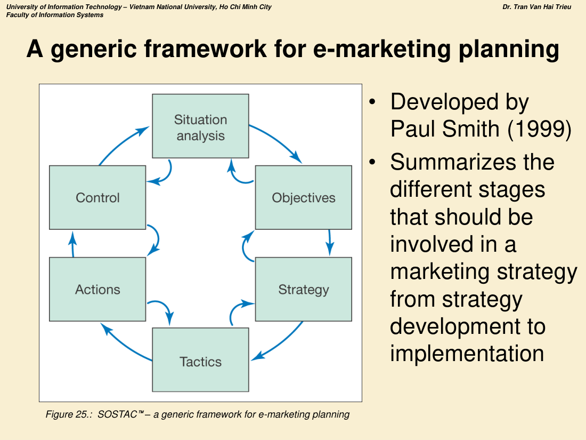

*Hình 25 — SOSTAC™: a generic framework for e-marketing planning. Do **Paul Smith (1999)** phát triển; tóm lược các giai đoạn từ xây dựng chiến lược tới triển khai.*

| Chữ | Giai đoạn | Nội dung cốt lõi |
|---|---|---|
| **S** | **Situation analysis** (Phân tích tình huống) | *"Chúng ta đang ở đâu?"* Xem xét môi trường bên ngoài, nhấn mạnh mức độ khách hàng tiếp cận Internet, **benchmarking đối thủ và người mới gia nhập** |
| **O** | **Objectives** (Mục tiêu) | *"Chúng ta muốn đi đâu?"* Mục tiêu then chốt là **online revenue contribution**. Với sản phẩm không bán trực tiếp được, đặt mục tiêu về **tác động của web tới truyền thông marketing, dịch vụ khách hàng và giảm chi phí** |
| **S** | **Strategy** (Chiến lược) | *"Đi tới đó bằng cách nào?"* Đánh giá mức phù hợp của sản phẩm để bán trực tiếp → chọn **replacement strategy** (SP phù hợp bán trực tiếp, VD vé máy bay) hoặc **complementary strategy** (SP không phù hợp, VD hàng tiêu dùng nhanh FMCG hay dịch vụ tư vấn). Replacement có thể phải **thay đổi mạng lưới phân phối**; Complementary dùng Internet như **kênh truyền thông marketing bổ sung** |
| **T** | **Tactics** (Chiến thuật) | Rà soát bằng cách biến đổi các thành tố **marketing mix: Price, Place, Product, Promotion, People, Processes, Physical evidence (7P)** |
| **A** | **Actions** (Hành động) | Lập kế hoạch chiến lược e-marketing bằng cách **xác định nguồn lực và tiến độ (timescales)** |
| **C** | **Control** (Kiểm soát) | Đạt được qua **giám sát sự hài lòng khách hàng và hiệu quả kênh** qua website lẫn kênh truyền thống |

## 6.4. Phân tích tình huống (Situation Analysis) trong E-marketing

**Mục tiêu:** hiểu **môi trường hiện tại và tương lai** nơi công ty vận hành; là cơ sở để xác định **mục tiêu, chiến lược, chiến thuật**.

### a) Demand analysis (Phân tích nhu cầu) ⭐ — 5 câu hỏi

1. **Bao nhiêu % khách hàng doanh nghiệp** có truy cập Internet?
2. **Bao nhiêu % thành viên trong đơn vị mua hàng (buying unit)** của các DN đó có truy cập Internet?
3. **Bao nhiêu % khách hàng sẵn sàng mua sản phẩm cụ thể của ta trực tuyến?**
4. **Bao nhiêu % khách hàng có Internet nhưng KHÔNG sẵn sàng mua online, song CHỊU ẢNH HƯỞNG bởi thông tin trên web để mua offline?**
5. **Rào cản chấp nhận (barriers to adoption)** của khách hàng là gì và làm sao khuyến khích họ?

### b) Competitor analysis (Phân tích đối thủ)

Giám sát việc đối thủ dùng e-commerce để **thu hút và giữ chân khách hàng**. Cần rà soát: **đối thủ đã biết**, **đối thủ quốc tế đã biết**, **các công ty Internet mới trong nước và toàn cầu**.

### c) Benchmarking solutions (Đối sánh) ⭐

| Tiêu chí | Nội dung đánh giá |
|---|---|
| **Financial performance** | Hiệu quả tài chính |
| **Marketplace performance** | Thị phần, xu hướng doanh số và đặc biệt **tỷ trọng doanh số đạt được qua Internet** |
| **Business and revenue models** | Có khác so với các bên khác trên thị trường không? |
| **Services offered** | Có gì ngoài brochureware? Mua trực tuyến được không? Mức hỗ trợ khách hàng online? Bao nhiêu thông tin kỹ thuật? |
| **Implementation of services** | Các đặc tính thực tế của thiết kế site: **thẩm mỹ, dễ dùng, cá nhân hóa, điều hướng, tốc độ** |
| **Marketing communications techniques** | **Value proposition của site có rõ không?** Site có hỗ trợ **mọi giai đoạn của quyết định mua** — từ khách chưa biết công ty tới khách hiện hữu? Có khuyến mãi đặc biệt định kỳ không? Ngoài site của đối thủ, họ dùng **site trung gian** thế nào để quảng bá và phân phối dịch vụ? |
| **The 7Ps** | Đối sánh theo 7P |

### d) Intermediary analysis (Phân tích trung gian)

- **Xác định các trung gian phù hợp** cho một thị trường cụ thể.
- **Xác định đối tác chiến lược** khi chạy chiến dịch quảng cáo trực tuyến.
- **Xem xét cách thị trường đang vận hành**.

### e) Internal marketing audit (Kiểm toán marketing nội bộ) ⭐

| Nhóm | Nội dung |
|---|---|
| **Business effectiveness** | **Đóng góp của site vào doanh thu**, khả năng sinh lời và các dấu hiệu về sứ mệnh doanh nghiệp đối với site. **Chi phí xây dựng và cập nhật site** cũng được rà soát ⇒ **phân tích chi phí – lợi ích** |
| **Customer service** | Đo lường cho **từng dòng sản phẩm** phân phối qua website; rà soát cách các thành tố **marketing mix** được sử dụng |
| **Marketing effectiveness** | **Leads; sales; retention; market share; brand enhancement and loyalty** |
| **Internet effectiveness** | Các chỉ số riêng đánh giá **cách website được sử dụng** và **đặc điểm khán giả**. Từ góc nhìn marketing, cần ghi nhận **value proposition của site có rõ ràng với khách hàng không** |

## 6.5. Mục tiêu E-marketing ⭐⭐

| Nhóm mục tiêu | Nội dung |
|---|---|
| **Acquisition** (Thu hút) | Thu hút khách truy cập tới website hoặc quảng bá thương hiệu bằng cách tiếp cận qua **công cụ tìm kiếm hoặc quảng cáo trên site khác** |
| **Conversion** (Chuyển đổi) | Tác động để khách truy cập **đạt mục tiêu của website**: ví dụ tạo sales lead, bán hàng, hoặc xem một nội dung nhất định |
| **Retention & Growth** (Giữ chân & tăng trưởng) | Mời khách hàng **mua lại (repeat purchases)** |

**Mục tiêu E-marketing SMART:** **S**pecific · **M**easurable · **A**chievable · **R**ealistic · **T**ime-constrained.

**Ví dụ mục tiêu SMART:**

| Loại doanh nghiệp | Mục tiêu SMART |
|---|---|
| **Start-up** | Thu hút **một số lượng khách hàng mới xác định** hoặc bán không gian quảng cáo để tạo **mức doanh thu xác định** — kỳ vọng vượt khoản đầu tư vào việc xây và quảng bá site |
| **Nhà mạng di động lâu năm** | **Tăng giữ chân khách hàng bằng cách giảm tỷ lệ rời bỏ (churn) từ 25% xuống 20%** |
| **Công ty truyền thông lâu năm** | **Tăng doanh thu trực tuyến, mục tiêu 20% đóng góp doanh thu online** bằng cách cung cấp dịch vụ trực tuyến mới và bán quảng cáo |

## 6.6. Các giai đoạn phát triển chiến lược marketing mục tiêu ⭐⭐

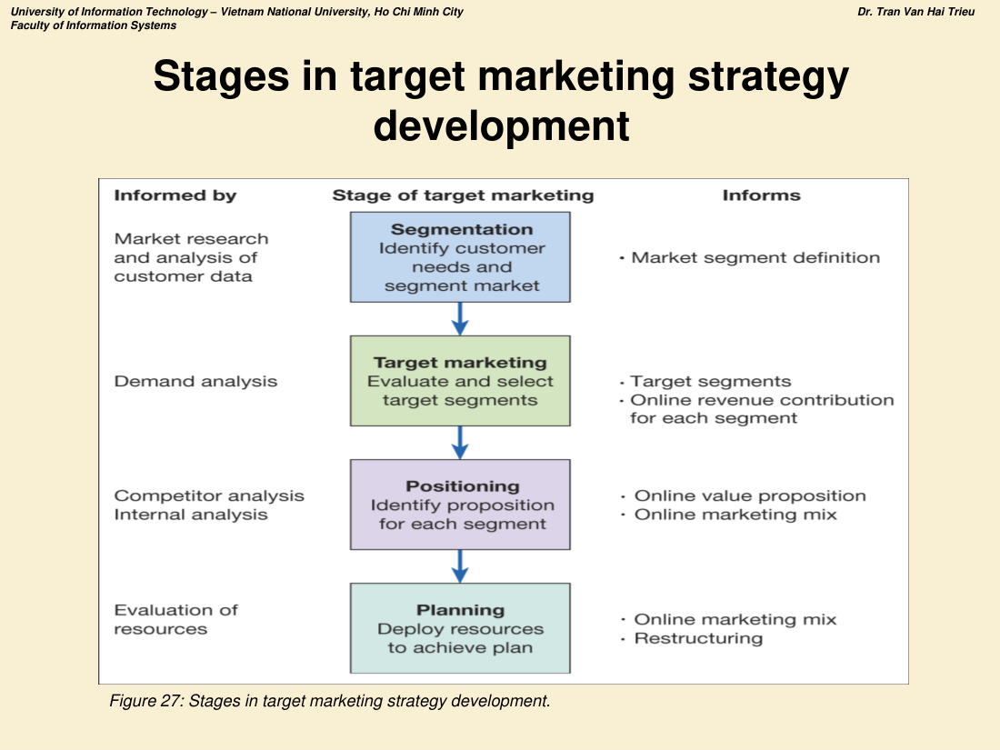

*Hình 27 — Stages in target marketing strategy development.*

| Đầu vào (Informed by) | **Giai đoạn** | Đầu ra (Informs) |
|---|---|---|
| Nghiên cứu thị trường & phân tích dữ liệu khách hàng | **1. Segmentation** — Xác định nhu cầu khách hàng và phân khúc thị trường | Định nghĩa phân khúc thị trường |
| Demand analysis | **2. Target marketing** — Đánh giá và chọn phân khúc mục tiêu | Phân khúc mục tiêu; **Online revenue contribution cho từng phân khúc** |
| Competitor analysis; Internal analysis | **3. Positioning** — Xác định proposition cho từng phân khúc | **Online value proposition (OVP)**; Online marketing mix |
| Đánh giá nguồn lực | **4. Planning** — Triển khai nguồn lực để thực hiện kế hoạch | Online marketing mix; Restructuring |

**5 câu hỏi khi xây chiến lược thị trường mục tiêu:**
1. **Khách hàng của chúng ta là ai?**
2. **Nhu cầu của họ đang thay đổi thế nào?**
3. **Chúng ta nhắm tới ai?**
4. **Chúng ta gia tăng giá trị bằng cách nào?**
5. **Làm sao trở thành lựa chọn đầu tiên?**

## 6.7. Đặc điểm truyền thông marketing thời kỳ truyền thông mới (6 chữ I) ⭐⭐

| # | Đặc điểm | Ý nghĩa |
|---|---|---|
| 1 | **Interactivity** | Tính tương tác |
| 2 | **Intelligence** | Tính thông minh (thu thập & phân tích dữ liệu) |
| 3 | **Individualization** | Cá nhân hóa |
| 4 | **Integration** | Tích hợp |
| 5 | **Industry restructuring** | Tái cấu trúc ngành |
| 6 | **Independence of location** | Độc lập về vị trí địa lý |

**So sánh mô hình truyền thông:**

| | **Traditional media** | **New media** |
|---|---|---|
| Mô hình | **Push** — một chiều, từ người bán đến nhiều người nhận (one-to-many) | **Pull / Interactive** — hai chiều, khách hàng chủ động; one-to-one và many-to-many |
| Mức cá nhân hóa | **Thấp** — thông điệp giống nhau cho cả khối khán giả (mass) | **Cao** — thông điệp riêng cho từng cá nhân |

**Tích hợp kênh (Channel integration):** Internet phải được tích hợp với các kênh khác trong chiến lược e-marketing tích hợp và phục vụ **mixed-mode buying** (khách nghiên cứu online, mua offline hoặc ngược lại).

**Ví dụ công cụ truyền thông tích hợp:**
- Internet dùng như **công cụ phản hồi trực tiếp (direct-response)**, cho phép khách hàng phản hồi lại các chào hàng/khuyến mãi được quảng bá trên phương tiện khác.
- Website có thể tích hợp **chức năng phản hồi trực tiếp hoặc gọi lại (callback)**.
- Internet dùng để **hỗ trợ quyết định mua ngay cả khi giao dịch không diễn ra trên website**.

## 6.8. Online Value Proposition (OVP) ⭐⭐

**OVP cần làm rõ 5 điều:**
1. **Sự khác biệt rõ ràng** của proposition so với đối thủ, dựa trên **đặc tính sản phẩm hoặc chất lượng dịch vụ**.
2. **Phân khúc thị trường mục tiêu** mà proposition hướng tới.
3. Proposition sẽ được **truyền thông thế nào** tới khách truy cập và trong mọi hoạt động truyền thông marketing.
4. Proposition được **phân phối ra sao ở các giai đoạn khác nhau của quy trình mua**.
5. Proposition sẽ được **phân phối và hỗ trợ bằng nguồn lực nào** — nội bộ hay bên ngoài?

**Ví dụ OVP:**

| Doanh nghiệp | OVP |
|---|---|
| **Kelkoo** | *"Compare. Buy. Save."* |
| **Amazon** | *"Earth's biggest selection"* |
| **AutoTrader** | *"Search the largest inventory of cars and trucks on the Internet. More than 1.5 million listings, updated daily"* |
| **Citibank** | *"Welcome to Citibank: The one-stop solution for all your financial needs"*; Look for a product or service; Learn about a financial product; Find a location |
| **Bhinneka.com** (Indonesia) | *"Indonesia's No 1 Webstore"* |
| **Tokopedia.com** | *"Jual Beli Online Aman dan Nyaman"* (Mua bán online an toàn và thoải mái) |
| **Alfa online** | *"Smart & Easy Shopping"* |

## 6.9. Marketing Mix trực tuyến (7P) ⭐⭐⭐

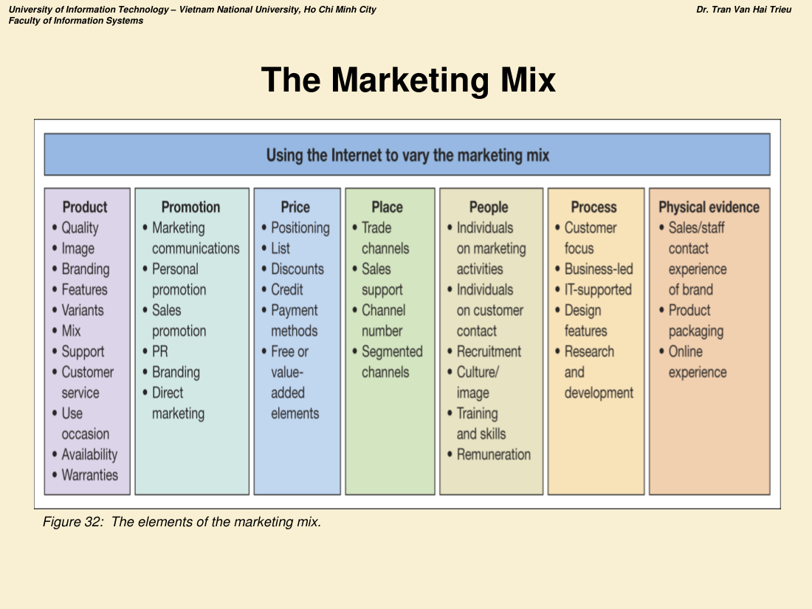

*Hình 32 — The elements of the marketing mix (Using the Internet to vary the marketing mix).*

**Các câu hỏi khi biến đổi mix trực tuyến:** Ta **biến đổi hay sao chép** mix offline? Chào hàng có **rõ ràng** không (brand proposition, online offer)? **Khác biệt online đã được định nghĩa chưa?** **Đã truyền thông được chưa?**

| P | Các biến số trong mix | Ứng dụng cụ thể cho E-business |
|---|---|---|
| **Product** | Quality, Image, Branding, Features, Variants, Mix, Support, Customer service, Use occasion, Availability, Warranties | **Mở rộng danh mục** (Tesco) · **Thu hẹp danh mục** (WH Smith iDTV) · **Sản phẩm chỉ có online** (ngân hàng) · **Phát triển thương hiệu mới** (Egg) · **Chuyển thương hiệu hiện có lên online** (HSBC) · **Hợp tác với thương hiệu online** (Waterstones + Amazon) |
| **Price** | Positioning, List, Discounts, Credit, Payment methods, Free or value-added elements | **Định giá phân biệt:** Giảm giá online do minh bạch giá & cạnh tranh (easyJet); **Giữ giá để tránh ăn thịt kênh offline (cannibalization)** (Dixon). **Lựa chọn giá mới:** Rental (thuê) · Pay per use (trả theo lần dùng) · **Reverse auctions** (đấu giá ngược — B2B) · **Dynamic pricing** (giá động — vé hòa nhạc) |
| **Place** | Trade channels, Sales support, Channel number, Segmented channels | **Place = tránh xung đột kênh.** **Disintermediation** (bán trực tiếp) · **Reintermediation** (hợp tác với trung gian mới) · **Countermediation** · Hình thành trung gian mới · Hợp tác với trung gian hiện có · Giữ khoảng cách với trung gian (Abbey National) |
| **Promotion** | Marketing communications, Personal promotion, Sales promotion, PR, Branding, Direct marketing | **Dùng chọn lọc công cụ online cho từng giai đoạn** của quy trình mua và vòng đời khách hàng · **Chiến dịch chỉ online** · **Chiến dịch tích hợp** — đưa công cụ online vào communications mix |
| **People** | Individuals on marketing activities, Individuals on customer contact, Recruitment, Culture/image, Training and skills, Remuneration | **Tự động hóa — dùng web self-service, cho khách hàng quyền lựa chọn:** Autoresponder · E-mail notification · **Callback facility** · **FAQ** · **Onsite search engines** · **Virtual assistance** |
| **Process** | Customer focus, Business-led, IT-supported, Design features, Research and development | **Thay đổi quy trình phục vụ — các chiến lược tiếp xúc (contact strategies)** |
| **Physical evidence** | Sales/staff contact experience of brand, Product packaging, Online experience | **Thiết kế site** — khác biệt hóa hoặc hỗ trợ thương hiệu · **Chất lượng hoàn tất đơn hàng (fulfillment quality)** |

## 6.10. Thương hiệu (Branding)

**Định nghĩa của Malcolm McDonald (*Creating Powerful Brands*, 1992):**
> Thương hiệu là **một sản phẩm hoặc dịch vụ nhận diện được, được bổ sung (augmented) theo cách mà người mua/người dùng cảm nhận được những giá trị gia tăng độc đáo, phù hợp, đáp ứng sát nhất nhu cầu của họ.** Thành công của nó đến từ khả năng **duy trì các giá trị gia tăng đó trước sức ép cạnh tranh.**

**Bốn phương án thay đổi nhận diện thương hiệu trực tuyến:**
1. **Transfer traditional brand online** — Chuyển thương hiệu truyền thống lên online
2. **Extend traditional brand** — Mở rộng thương hiệu truyền thống
3. **Partner with existing digital brand** — Hợp tác với thương hiệu số có sẵn
4. **Create a new digital brand** — Tạo thương hiệu số mới

## 6.11. Actions và Control

**Actions — 5 câu hỏi:**
1. **Mức đầu tư** nào vào kênh Internet là đủ để cung cấp dịch vụ?
2. Cần **đào tạo nhân viên** những gì?
3. Cần **trách nhiệm mới** nào cho Internet marketing hiệu quả?
4. Có cần **tái cấu trúc tổ chức** không?
5. Những **hoạt động nào liên quan tới tạo và duy trì website**?

**Control:** Thực hiện **nghiên cứu marketing** · **Phân tích file log của web server** · **Dùng intranet để chia sẻ thông tin**.

---

## ❖ CHECKLIST ÔN CHƯƠNG 2

- [ ] **Vẽ được mô hình quy trình chiến lược 4 giai đoạn** (Analysis → Objectives → Definition → Implementation)
- [ ] Mô hình động 4 bước + so sánh với mô hình tổng quát
- [ ] Quan hệ E-business strategy ↔ Corporate / SCM / Marketing-CRM / IS strategy
- [ ] **Stage model buy-side & sell-side (6 giai đoạn mỗi bên)**
- [ ] Portfolio analysis (4 ô) · SWOT + SO/ST/WO/WT · Porter 5 forces
- [ ] **SMART + Online revenue contribution + bảng Objective–Strategy–KPI**
- [ ] **8 quyết định chiến lược** (thuộc lòng)
- [ ] Ma trận Ansoff 4 ô cho Internet
- [ ] Công thức Customer Value
- [ ] Disintermediation / Re-intermediation / Counter-mediation
- [ ] Nguyên nhân thất bại + Productivity Paradox
- [ ] **8 yếu tố mô hình kinh doanh**
- [ ] 7 mô hình B2C + 5 mô hình B2B
- [ ] **SOSTAC 6 bước** (rất hay ra)
- [ ] **7P marketing mix online** (rất hay ra)
- [ ] Cộng đồng ảo: 4 loại, 5 lợi ích, 5 hạn chế
- [ ] Thống kê giỏ hàng bị bỏ (69,8% / 85% mobile / 4 lý do)
