# CHƯƠNG 3 — CÔNG NGHỆ CHO E-BUSINESS

> **Nội dung chương (4 phần):**
> 1. Hệ thống thuế và pháp luật cho E-business
> 2. Phần mềm E-business và Web hosting
> 3. An ninh trực tuyến (Online security)
> 4. Hệ thống thanh toán trực tuyến (Online payment system)

---

# PHẦN 1. HỆ THỐNG THUẾ VÀ PHÁP LUẬT CHO E-BUSINESS

## 1.1. Mô hình tổ chức các vấn đề đạo đức – xã hội – chính trị ⭐

Các vấn đề do Internet và TMĐT đặt ra có thể nhìn ở **ba cấp: cá nhân (individual), xã hội (social), chính trị (political)**.

**Bốn nhóm vấn đề chính (The Moral Dimensions of an Internet Society):**

| # | Nhóm vấn đề | Nội dung |
|---|---|---|
| 1 | **Information rights** | Quyền về thông tin (quyền riêng tư) |
| 2 | **Property rights** | Quyền sở hữu (sở hữu trí tuệ) |
| 3 | **Governance** | Quản trị (ai quản lý Internet, thuế, chủ quyền) |
| 4 | **Public safety and welfare** | An toàn và phúc lợi công cộng |

## 1.2. Quyền riêng tư và quyền thông tin ⭐⭐

> **Privacy (Quyền riêng tư):** **quyền đạo đức của cá nhân được ở một mình, không bị giám sát hay can thiệp** bởi cá nhân, tổ chức hoặc nhà nước khác.

**Information privacy — 4 quyền:**
1. Quyền **kiểm soát thông tin** được thu thập về mình
2. Quyền **được biết khi nào thông tin bị thu thập và được đồng ý (consent)**
3. Quyền được **xử lý thông tin cá nhân theo trình tự chính đáng (due process)**
4. Quyền có **thông tin cá nhân được lưu trữ an toàn**

**Khu vực công (Public sector):** Quyền riêng tư có lịch sử lâu đời (Tu chính án 1, 4, 14 của Hoa Kỳ). Tuy nhiên các quyền riêng tư ngầm định trong Hiến pháp **không bao phủ việc thu thập và sử dụng thông tin cá nhân** ⇒ có **Privacy Act 1974** và luật liên bang/tiểu bang bảo vệ cá nhân khỏi can thiệp bất hợp lý của chính phủ.

**Khu vực tư (Private sector):** Luật riêng tư mang tính **chắp vá (piecemeal)**, áp dụng cho từng ngành cụ thể. Lịch sử ít có yêu sách riêng tư trong thị trường mở. Sự xuất hiện của Internet tạo ra **kho dữ liệu cá nhân khổng lồ** ⇒ **môi trường lý tưởng để doanh nghiệp và chính phủ xâm phạm quyền riêng tư** (Google, Amazon, Netflix…).

**Thông tin do website thu thập:**
- **PII (Personally identifiable information)** — thông tin định danh cá nhân
- **Anonymous information** — thông tin ẩn danh

**Các loại dữ liệu:** tên, địa chỉ, điện thoại, email, số an sinh xã hội; tài khoản ngân hàng và thẻ tín dụng, giới tính, tuổi, nghề nghiệp, học vấn; **dữ liệu sở thích, dữ liệu giao dịch, dữ liệu clickstream, loại trình duyệt**.

**Năm mối lo hàng đầu về quyền riêng tư trực tuyến:**
1. **Profiling and ad targeting** (Lập hồ sơ và nhắm quảng cáo)
2. **Social network privacy**
3. **Sharing of information by marketers**
4. **Mobile phone privacy**
5. **Digital assistant privacy**

### Profiling, Behavioral Targeting và Retargeting

> **Profiling:** tạo **ảnh dữ liệu (data images)** đặc trưng hóa hành vi cá nhân và nhóm trên mạng. Gồm **anonymous profiles** và **personal profiles**; **nhận diện khuôn mặt** là chiều mới.

**Advertising networks:** theo dõi hành vi tiêu dùng và duyệt web; **điều chỉnh động** nội dung hiển thị; xây và làm mới hồ sơ người tiêu dùng.

| Góc nhìn doanh nghiệp | Góc nhìn người phê phán |
|---|---|
| **Tăng hiệu quả quảng cáo**, trợ giá cho nội dung miễn phí | **Phá vỡ kỳ vọng về ẩn danh và riêng tư** |
| **Cảm nhận được nhu cầu** cho sản phẩm mới | **Cho phép phân biệt giá (price discrimination)** |

**Mạng xã hội:** khuyến khích chia sẻ thông tin cá nhân; đặt ra thách thức riêng cho quyền riêng tư. Facebook: CSDL khổng lồ, phục vụ quảng cáo cho cả người không dùng Facebook, chia sẻ thông tin với bên thứ ba ⇒ **mâu thuẫn giữa quyền kiểm soát thông tin cá nhân và mong muốn kiếm tiền từ mạng xã hội của tổ chức**.

**Thiết bị di động:** ứng dụng cung cấp thông tin cá nhân cho nhà quảng cáo di động; theo dõi và lưu vị trí; theo dõi việc dùng ứng dụng khác. **Theo dõi vị trí không ngừng.** Tòa án Tối cao Mỹ phán quyết **cảnh sát cần lệnh khám xét (warrant)** trước khi khám điện thoại.

### GDPR — Bảo vệ quyền riêng tư tại châu Âu ⭐

- Bảo vệ quyền riêng tư ở châu Âu **mạnh hơn nhiều** so với Mỹ.
- **GDPR 2016 (General Data Protection Regulation)**:
  - Thay thế **Data Protection Directive 1998**
  - Áp dụng cho **mọi tổ chức hoạt động tại EU**
  - **Tăng cường quyền của công dân** đối với dữ liệu cá nhân của họ
  - **Tăng cường giám sát doanh nghiệp** để đảm bảo tuân thủ
- Môi trường đã quay lưng với các công ty Mỹ như Facebook về việc **thu thập và sử dụng dữ liệu cá nhân không giới hạn**.

### Giải pháp công nghệ bảo vệ quyền riêng tư

Intelligent Tracking Protection (ITP) · Differential privacy software · Privacy default browsers · Message encryption · Spyware blockers · Pop-up & ad blockers · Secure e-mail, anonymous remailers · Cookie managers · **Public key encryption**.

**Bảo vệ quyền riêng tư như một ngành kinh doanh:** **Personal Data Economy (PDE)**, **Life Management tools**; các **nhóm vận động quyền riêng tư (privacy advocacy groups)**.

## 1.3. Quyền sở hữu trí tuệ ⭐⭐

> **Intellectual property:** **mọi sản phẩm hữu hình và vô hình của trí tuệ con người.**

| Cấp độ | Vấn đề |
|---|---|
| **Đạo đức** | Nên xử lý tài sản thuộc về người khác như thế nào? |
| **Xã hội** | Việc bảo vệ sở hữu trí tuệ trong thời đại Internet còn giá trị không? |
| **Chính trị** | Làm sao điều tiết/quản trị Internet và TMĐT để bảo vệ sở hữu trí tuệ? |

**Bốn hình thức bảo hộ chính:**

| Hình thức | Nội dung |
|---|---|
| **Copyright** (Bản quyền) | Bảo hộ **hình thức thể hiện gốc (không bảo hộ ý tưởng)** khỏi bị sao chép trong một khoảng thời gian.<br>**Digital Millennium Copyright Act 1998 (DMCA)** — nỗ lực lớn đầu tiên điều chỉnh luật bản quyền cho thời đại Internet; thực thi Hiệp ước Bản quyền WIPO, **cấm sản xuất, phân phối hoặc sử dụng thiết bị vượt qua các biện pháp bảo vệ kỹ thuật** đối với tài liệu có bản quyền |
| **Patent** (Bằng sáng chế) | Trao cho chủ sở hữu **độc quyền 20 năm** đối với ý tưởng đằng sau một sáng chế. Sáng chế phải **mới và có tính sáng tạo (new and novel)**. Khuyến khích nhà sáng chế; thúc đẩy phổ biến kỹ thuật mới qua **cấp phép (licensing)**; **giảm cạnh tranh do nâng rào cản gia nhập** |
| **Trademark** (Nhãn hiệu) | **Nhận diện, phân biệt hàng hóa và chỉ dẫn nguồn gốc**.<br>Mục đích: đảm bảo người tiêu dùng **nhận đúng thứ đã trả tiền/kỳ vọng**; bảo vệ chủ sở hữu khỏi **sao chép lậu và chiếm đoạt**. Vấn đề: **xâm phạm (infringement)** |
| **Trade Secrets** (Bí mật kinh doanh) | Quy trình kinh doanh, công thức, phương pháp sản xuất và cung cấp dịch vụ. **Không cần độc đáo hay mới**. Điều kiện: (a) **bí mật**, (b) **có giá trị thương mại** với chủ sở hữu, (c) **chủ sở hữu đã thực hiện các bước bảo vệ**. Luật: **Defend Trade Secrets Act 2016** |

**Mục tiêu của luật sở hữu trí tuệ:** **cân bằng hai lợi ích cạnh tranh nhau — lợi ích công (public) và lợi ích tư (private)**.

**Bằng sáng chế trong TMĐT:**
- **1998 — State Street Bank & Trust v. Signature Financial Group:** công nhận **business method patents**.
- **2014 — vụ Alice Corporation:** Tòa án Tối cao phán quyết **phần mềm KHÔNG làm cho một phương pháp kinh doanh cơ bản hoặc ý tưởng trừu tượng trở nên có thể cấp bằng sáng chế**.
- Ví dụ: **Amazon — One-click purchasing**; **Akamai — hệ thống lưu trữ toàn cầu để phân phối nội dung Internet**.

## 1.4. Hệ thống văn bản pháp luật Việt Nam ⭐

*Hình 2 — Vietnam Legal Document System (theo Luật Ban hành văn bản quy phạm pháp luật số 64/2026/QH15 ngày 19/02/2025 và Luật số 87/2025/QH15 sửa đổi, bổ sung — hiệu lực từ 01/7/2025).*

### Định hướng, chủ trương của Bộ Chính trị

| Nghị quyết | Ngày | Nội dung |
|---|---|---|
| **Nghị quyết 57-NQ/TW** | 22/12/2024 | Về **đột phá phát triển khoa học, công nghệ, đổi mới sáng tạo và chuyển đổi số quốc gia**<br>→ **Nghị quyết 03/NQ-CP** ngày 09/01/2025 của Chính phủ ban hành chương trình hành động thực hiện NQ 57 |
| **Nghị quyết 59-NQ/TW** | 24/01/2025 | Về **hội nhập quốc tế trong tình hình mới** |
| **Nghị quyết 66-NQ/TW** | 30/4/2025 | Về **đổi mới công tác xây dựng và thi hành pháp luật** đáp ứng yêu cầu phát triển đất nước trong kỷ nguyên mới |
| **Nghị quyết 68-NQ/TW** | 04/5/2025 | Về **phát triển kinh tế tư nhân** |

### Các luật liên quan tới E-business ở Việt Nam

| Luật | Số hiệu / Ngày |
|---|---|
| **Bộ luật Dân sự** | 91/2015/QH13, ngày 24/11/2015 |
| **Luật Doanh nghiệp** | 59/2020/QH14, ngày 11/01/2020 (sửa đổi bởi Luật 76/2025/QH15, hiệu lực 01/7/2025) |
| **Luật Thương mại** | 17/VBHN-VPQH, ngày 05/7/2019 |
| **Luật Quản lý thuế** | 38/2019/QH14, ngày 13/6/2019 (sửa đổi bởi Luật 56/2024/QH15, hiệu lực 01/01/2025) |
| **Luật Đầu tư** | 143/2025/QH15, ngày 11/12/2025 (hiệu lực chính thức 01/3/2026) |
| **Luật Đầu tư công** | 39/2019/QH14, ngày 13/6/2019 (sửa đổi bởi Luật 58/2024/QH15 và 90/2025/QH15, hiệu lực 01/7/2025) |
| **Luật Đầu tư theo phương thức đối tác công tư (PPP)** | 64/2020/QH14, ngày 18/6/2020 (sửa đổi bởi Luật 57/2024/QH15 và 90/2025/QH15, hiệu lực 01/7/2025) |
| **Luật Cạnh tranh** | 23/2018/QH14, ngày 12/6/2018 |
| **Luật Đấu thầu** | 43/2013/QH13, ngày 26/11/2013 (sửa đổi bởi VBHN 74/VBHN-VPQH ngày 25/3/2026) |
| **Luật chuyên ngành khác** | Luật Sở hữu trí tuệ; Luật Viễn thông; Luật Báo chí; Luật Bảo vệ môi trường; Luật Công nghệ thông tin; **Luật An ninh mạng**… |

### Văn bản pháp luật riêng về Thương mại điện tử tại Việt Nam ⭐⭐

| Số hiệu | Tên văn bản | Ngày ban hành |
|---|---|---|
| **08/VBHN-BCT** | Thông tư của Bộ Công Thương: **Quy định về quản lý hoạt động TMĐT qua ứng dụng trên thiết bị di động** | 03/02/2026 |
| **85/2021/NĐ-CP** | Nghị định của Chính phủ: **Sửa đổi, bổ sung một số điều của Nghị định 52/2013/NĐ-CP về thương mại điện tử** | 28/9/2021 |
| **117/2025/NĐ-CP** | Nghị định của Chính phủ: **Quy định quản lý thuế đối với hoạt động kinh doanh TMĐT và nền tảng số của hộ, cá nhân** | 09/6/2025 |
| **98/2020/NĐ-CP** | Nghị định: **Xử phạt vi phạm hành chính trong hoạt động thương mại, sản xuất, buôn bán hàng giả, hàng cấm và bảo vệ quyền lợi người tiêu dùng**<br>Sửa đổi bởi NĐ 17/2022/NĐ-CP; NĐ 24/2025/NĐ-CP; VBHN 03/VBHN-BCT ngày 23/4/2025 | 09/9/2020 |
| **122/2025/QH15** | **LUẬT THƯƠNG MẠI ĐIỆN TỬ** — hiệu lực từ **01/7/2026** | 10/12/2025 |

## 1.5. Các loại thuế liên quan tới E-business ở Việt Nam ⭐

**Thuế ảnh hưởng tới hầu hết hoạt động kinh doanh & đầu tư:**

| # | Loại thuế |
|---|---|
| 1 | **Thuế thu nhập doanh nghiệp** (Corporate income tax) |
| 2 | **Thuế nhà thầu nước ngoài** (Foreign Contractor Tax) |
| 3 | **Thuế trên lãi vốn** (Capital gains tax) |
| 4 | **Thuế giá trị gia tăng — VAT** |
| 5 | **Các loại thuế khấu trừ tại nguồn** (Withholding taxes) |
| 6 | **Thuế nhập khẩu** (Import duties) |
| 7 | **Thuế thu nhập cá nhân** — với cả người Việt và người nước ngoài |
| 8 | **Bảo hiểm xã hội, bảo hiểm thất nghiệp, bảo hiểm y tế** |

**Các thuế khác áp dụng cho hoạt động cụ thể:** Thuế tiêu thụ đặc biệt · Thuế tài nguyên · Thuế tài sản · Thuế xuất khẩu · Thuế bảo vệ môi trường · Tiền thuê đất.

---

# PHẦN 2. PHẦN MỀM E-BUSINESS VÀ WEB HOSTING

## 2.1. XÂY DỰNG SỰ HIỆN DIỆN TMĐT (Building E-commerce Presence)

### a) Hình dung sự hiện diện TMĐT — các câu hỏi cần trả lời ⭐

| Câu hỏi | Nội dung cần xác định |
|---|---|
| **What's the idea?** (Ý tưởng là gì — **the vision**) | Mission statement · Target audience · Intended market space · Strategic analysis · Marketing matrix · Development timeline · **Preliminary budget** |
| **Where's the money?** (Tiền ở đâu) | **Business model(s)** · **Revenue model(s)** |
| **Who and where is the target audience?** | Nhân khẩu học, lối sống, mô hình tiêu dùng… |
| **What does the marketplace characterize?** | Quy mô, tăng trưởng, nhân khẩu, cấu trúc… |
| **Where's the content coming from?** | Nguồn nội dung |
| **Know yourself** | **SWOT analysis** |
| **Develop an e-commerce presence map** | Bản đồ hiện diện |
| **Develop a timeline** | **Milestones** (các mốc) |
| **How much will this cost?** | Website đơn giản: **tới $5.000**<br>Start-up nhỏ: **$25.000 – $50.000**<br>Website doanh nghiệp lớn: **$100.000+ tới hàng triệu** |

### b) E-commerce Presence Map ⭐⭐

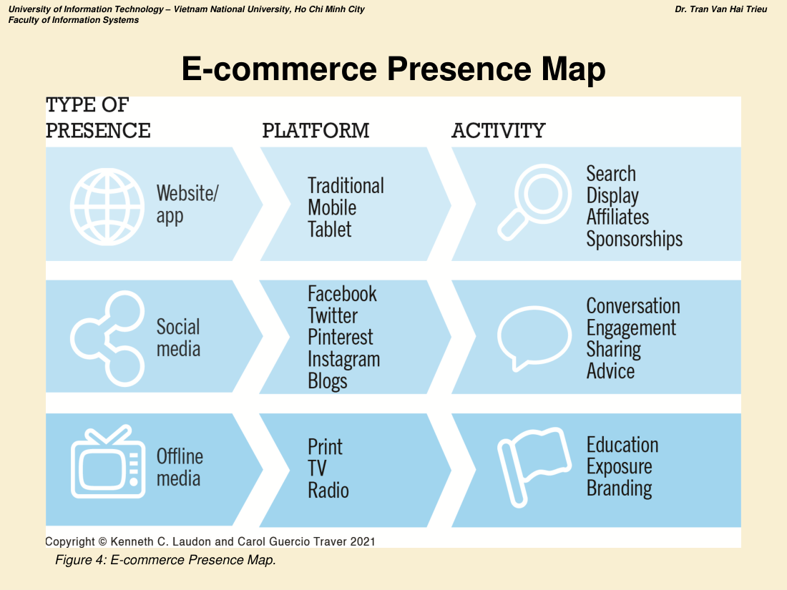

*Hình 4 — E-commerce Presence Map.*

| **Type of presence** | **Platform** | **Activity** |
|---|---|---|
| **Website / app** | Traditional · Mobile · Tablet | **Search · Display · Affiliates · Sponsorships** |
| **Social media** | Facebook · Twitter · Pinterest · Instagram · Blogs | **Conversation · Engagement · Sharing · Advice** |
| **Offline media** | Print · TV · Radio | **Education · Exposure · Branding** |

## 2.2. XÂY DỰNG SITE TMĐT: CÁCH TIẾP CẬN HỆ THỐNG

**Hai thách thức quản trị quan trọng nhất:**
1. **Hiểu rõ mục tiêu kinh doanh**
2. **Biết cách chọn công nghệ phù hợp** để đạt mục tiêu đó

**Các yếu tố chính cần cân nhắc:** Management · Hardware architecture · Software · Design · Telecommunications · Human resources.

### a) Vòng đời phát triển hệ thống (SDLC) ⭐⭐⭐

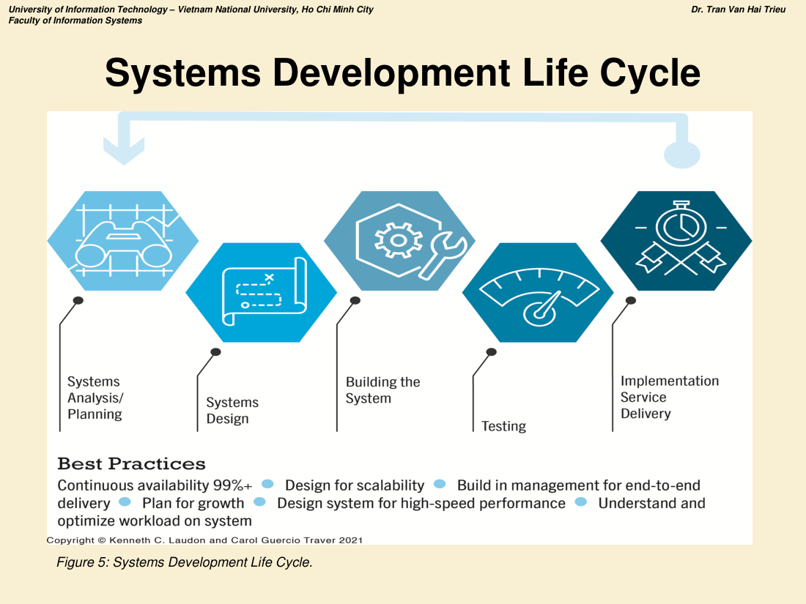

*Hình 5 — Systems Development Life Cycle.*

> **SDLC:** phương pháp luận để **hiểu mục tiêu kinh doanh của một hệ thống và thiết kế giải pháp phù hợp.**

| # | Bước | Nội dung |
|---|---|---|
| **1** | **Systems Analysis / Planning** | Phân tích và lập kế hoạch hệ thống |
| **2** | **Systems Design** | Thiết kế hệ thống |
| **3** | **Building the System** | Xây dựng hệ thống |
| **4** | **Testing** | Kiểm thử |
| **5** | **Implementation / Service Delivery** | Triển khai và cung cấp dịch vụ |

**Best Practices (thực hành tốt nhất):**
- **Continuous availability 99%+** (sẵn sàng liên tục trên 99%)
- **Design for scalability** (thiết kế để mở rộng)
- **Build in management for end-to-end delivery** (tích hợp quản trị cho phân phối đầu-cuối)
- **Plan for growth** (lập kế hoạch tăng trưởng)
- **Design system for high-speed performance**
- **Understand and optimize workload on system**

### b) Bước 1 — Phân tích/Lập kế hoạch hệ thống ⭐⭐⭐

Ba khái niệm:
- **Business objectives:** danh sách **khả năng** bạn muốn site có
- **System functionalities:** danh sách **năng lực hệ thống thông tin** cần để đạt mục tiêu kinh doanh
- **Information requirements:** các **phần tử thông tin** mà hệ thống phải tạo ra để đạt mục tiêu

**Bảng 3 — Mục tiêu kinh doanh, chức năng hệ thống và yêu cầu thông tin cho một site TMĐT điển hình (BẢNG RẤT HAY RA THI):**

| **Business Objective** | **System Functionality** | **Information Requirements** |
|---|---|---|
| **Display goods** (Trưng bày hàng hóa) | Digital Catalog | Catalogue văn bản và đồ họa động |
| **Provide product information** (Cung cấp thông tin sản phẩm) | Product database | Mô tả sản phẩm, mã hàng (stocking numbers), mức tồn kho |
| **Personalize/customize product** (Cá nhân hóa sản phẩm) | Customer on-site tracking | Site log cho mỗi lượt khách; **khả năng data mining** để nhận diện đường đi phổ biến của khách và phản ứng phù hợp |
| **Engage customers in conversations** (Tương tác hội thoại) | On-site blog; user forums | Phần mềm có chức năng blog và diễn đàn cộng đồng |
| **Execute a transaction** (Thực hiện giao dịch) | Shopping cart / payment system | **Xử lý thẻ tín dụng an toàn; nhiều lựa chọn thanh toán** |
| **Accumulate customer information** (Tích lũy thông tin KH) | Customer database | Tên, địa chỉ, điện thoại, email của mọi khách; **đăng ký khách hàng trực tuyến** |
| **Provide after-sale customer support** (Hỗ trợ sau bán) | Sales database | Customer ID, sản phẩm, ngày, thanh toán, ngày giao hàng |
| **Coordinate marketing/advertising** (Điều phối marketing/quảng cáo) | Ad server, e-mail server, e-mail campaign manager, ad banner manager | Log hành vi của khách tiềm năng và khách hàng, liên kết với chiến dịch email và banner |
| **Understand marketing effectiveness** (Hiểu hiệu quả marketing) | Site tracking and reporting system | Số khách truy cập duy nhất, số trang xem, sản phẩm đã mua, **phân theo chiến dịch marketing** |
| **Provide production and supplier links** (Kết nối sản xuất & nhà cung cấp) | Inventory management system | Mức sản phẩm & tồn kho, **ID và liên hệ nhà cung cấp**, dữ liệu số lượng đặt theo sản phẩm |

### c) Bước 2 — Thiết kế hệ thống ⭐⭐

> **System design specification:** mô tả **các thành phần chính của hệ thống và quan hệ giữa chúng**.

| | **Logical design** (Thiết kế logic) | **Physical design** (Thiết kế vật lý) |
|---|---|---|
| Nội dung | **Data flow diagrams**, các hàm xử lý, cơ sở dữ liệu | Xác định **thành phần vật lý, phần mềm, model thực tế** |

**Ví dụ thiết kế logic cho một website đơn giản (Sơ đồ luồng dữ liệu — DFD) ⭐⭐⭐:**

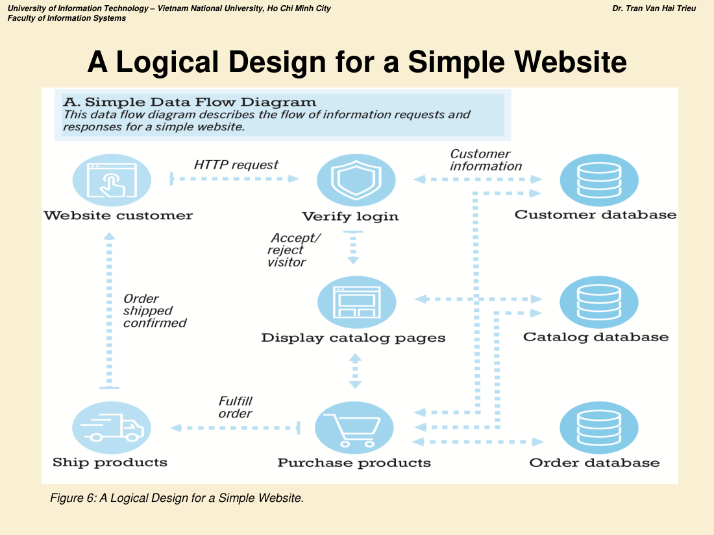

*Hình 6 — A Logical Design for a Simple Website (Simple Data Flow Diagram).*

**Đọc sơ đồ (quy trình mua hàng trên website):**

| Bước | Tiến trình | Luồng dữ liệu |
|---|---|---|
| 1 | **Website customer** gửi **HTTP request** | → **Verify login** |
| 2 | **Verify login** ↔ **Customer database** | Trao đổi **Customer information** |
| 3 | **Verify login** → **Accept/reject visitor** | → **Display catalog pages** |
| 4 | **Display catalog pages** ↔ **Catalog database** | Lấy dữ liệu sản phẩm |
| 5 | **Purchase products** ↔ **Order database** và **Customer database** | Ghi nhận đơn hàng |
| 6 | **Purchase products** → **Fulfill order** → **Ship products** | Hoàn tất đơn |
| 7 | **Ship products** → **Order shipped confirmed** → **Website customer** | Xác nhận đã giao |

> 📌 **Đây là sơ đồ nên vẽ lại khi đề bài yêu cầu "mô tả quy trình bán hàng trực tuyến trên website".**

### d) Bước 3 — Xây dựng hệ thống: tự làm hay thuê ngoài ⭐⭐

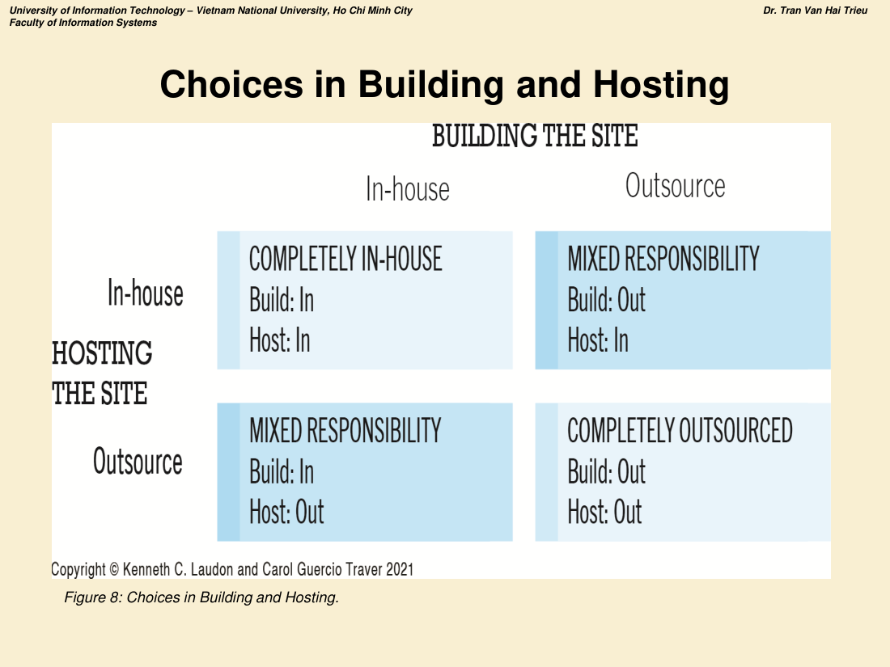

*Hình 8 — Choices in Building and Hosting.*

**Hai trục quyết định: XÂY (Building) và VẬN HÀNH/LƯU TRỮ (Hosting).**

| | **Build: In-house** | **Build: Outsource** |
|---|---|---|
| **Host: In-house** | **COMPLETELY IN-HOUSE**<br>Build: In — Host: In | **MIXED RESPONSIBILITY**<br>Build: Out — Host: In |
| **Host: Outsource** | **MIXED RESPONSIBILITY**<br>Build: In — Host: Out | **COMPLETELY OUTSOURCED**<br>Build: Out — Host: Out |

**Khái niệm:**
- **Outsourcing:** thuê nhà cung cấp thực hiện các dịch vụ trong việc xây dựng site.
- **Build your own:** cần đội ngũ **kỹ năng đa dạng**, phải chọn công cụ phần mềm; **có rủi ro nhưng cũng có lợi ích tiềm năng**.
- **Hosting:** công ty hosting **chịu trách nhiệm đảm bảo site truy cập được 24/7** với phí hàng tháng.
- **Co-location:** doanh nghiệp **mua hoặc thuê máy chủ (có quyền kiểm soát vận hành)**, nhưng **máy chủ đặt tại cơ sở của nhà cung cấp**.

### e) Bước 4 — Kiểm thử hệ thống ⭐

| Loại kiểm thử | Nội dung |
|---|---|
| **Unit testing** | Kiểm thử đơn vị |
| **System testing** | Kiểm thử hệ thống |
| **Acceptance testing** | Kiểm thử chấp nhận |
| **A/B testing (split testing)** | So sánh 2 phiên bản |
| **Multivariate testing** | Kiểm thử đa biến |

### f) Bước 5 — Triển khai, bảo trì và tối ưu

- **Hệ thống hỏng hóc không đoán trước được**; **bảo trì là công việc liên tục**.
- **Chi phí bảo trì tương đương chi phí phát triển:** một site TMĐT trị giá **$40K có thể cần $40K/năm** để duy trì.
- Quy tắc chung (Chương 4): **chi phí vận hành hằng năm bằng 50–200% chi phí ban đầu**.

### g) Các phương pháp phát triển web thay thế

**Prototyping · Agile development · DevOps · Component-based development · Web services.**

## 2.3. KIẾN TRÚC SITE TMĐT ⭐⭐

> **System architecture:** cách sắp xếp **phần mềm, máy móc và tác vụ** trong một hệ thống thông tin để đạt một chức năng cụ thể.

| | **Two-tier** | **Multi-tier** |
|---|---|---|
| Thành phần | **Web server + database server** | **Web application servers**; backend, legacy databases |

**Kiến trúc đa tầng (Multi-Tier) — 3 lớp:**

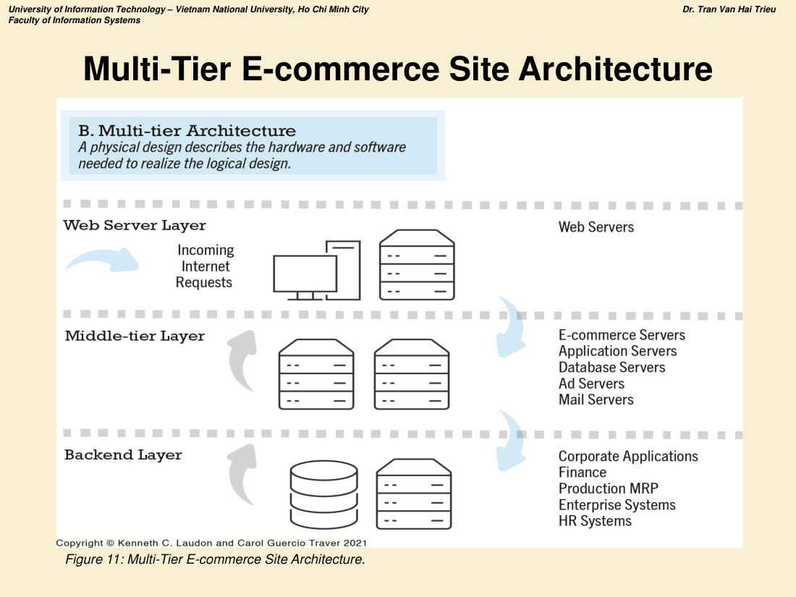

*Hình 11 — Multi-Tier E-commerce Site Architecture.*

| Lớp | Thành phần |
|---|---|
| **Web Server Layer** | **Web Servers** — nhận Incoming Internet Requests |
| **Middle-tier Layer** | **E-commerce Servers · Application Servers · Database Servers · Ad Servers · Mail Servers** |
| **Backend Layer** | **Corporate Applications · Finance · Production MRP · Enterprise Systems · HR Systems** |

## 2.4. CÁC CÔNG CỤ PHẦN MỀM CHO SITE TMĐT

### a) Site Management Tools
- Công cụ cơ bản có sẵn trong mọi web server: **kiểm tra liên kết còn hợp lệ**, **xác định file mồ côi (orphan files)**.
- Phần mềm bên thứ ba cho quản lý nâng cao: **theo dõi giao dịch mua của khách**, **hiệu quả chiến dịch marketing**, **đếm lượt truy cập và các thống kê khác**. Ví dụ: **Webtrends Analytics**.

### b) Dynamic Page Generation Tools ⭐
> **Dynamic page generation:** nội dung được **lưu trong CSDL và lấy ra khi cần**.

**Công cụ phổ biến:** CGI, ASP, JSP, ODBC, JDBC.

**Ưu điểm:**
- **Giảm chi phí menu (menu costs)**
- Cho phép **phân khúc thị trường trực tuyến dễ dàng**
- Cho phép **phân biệt giá (price discrimination) không tốn chi phí**
- Cho phép triển khai **hệ quản trị nội dung (CMS)**

### c) Application Servers
- Cung cấp **chức năng nghiệp vụ cụ thể** cho website.
- Là một dạng **middleware**.
- **Tách biệt ứng dụng nghiệp vụ khỏi web server và cơ sở dữ liệu**.
- Các ứng dụng đơn chức năng đang được thay bằng **công cụ tích hợp** gộp mọi chức năng cần cho site TMĐT.

### d) E-commerce Merchant Server Software ⭐

**Chức năng cơ bản cho bán hàng:**

| Chức năng | Mô tả |
|---|---|
| **Online catalog** | Danh sách sản phẩm có trên website |
| **Shopping cart** | Cho phép người mua **để dành, xem lại, chỉnh sửa lựa chọn rồi mua** |
| **Credit card processing** | Thường hoạt động cùng shopping cart; **xác minh thẻ và ghi có vào tài khoản công ty** khi thanh toán |

**Gói phần mềm Merchant Server — môi trường tích hợp gồm:** shopping cart · merchandise display · order management.

| Quy mô doanh nghiệp | Giải pháp |
|---|---|
| **SME** | Yahoo Small Business; các giải pháp mã nguồn mở |
| **Tầm trung** | IBM WebSphere Commerce Express; Sitecore Experience Commerce |
| **Cao cấp** | IBM WebSphere Professional/Enterprise; **SAP Hybris**; Oracle ATG Web Commerce |

Nhiều gói nay có sẵn dưới dạng **SaaS trên nền cloud**.

**9 yếu tố then chốt khi chọn gói phần mềm:**
1. Functionality (chức năng)
2. Hỗ trợ các **mô hình kinh doanh khác nhau**, kể cả **m-commerce**
3. **Công cụ mô hình hóa quy trình kinh doanh** (business process modeling tools)
4. Quản lý site và báo cáo trực quan
5. **Hiệu năng và khả năng mở rộng**
6. **Khả năng kết nối với hệ thống nghiệp vụ hiện có**
7. **Tuân thủ chuẩn**
8. Khả năng toàn cầu và đa văn hóa
9. **Quy tắc thuế bán hàng và vận chuyển địa phương**

## 2.5. TỐI ƯU HÓA NỀN TẢNG PHẦN CỨNG

### a) Phía cầu (Demand Side)
**Nhu cầu khách hàng là yếu tố quan trọng nhất ảnh hưởng tốc độ site.**

Các yếu tố cấu thành tổng cầu:
- **Số người dùng đồng thời ở giờ cao điểm**
- **Bản chất yêu cầu của khách (user profile)**
- **Loại nội dung** (trang động vs trang tĩnh)
- **Mức bảo mật yêu cầu**
- **Số lượng mặt hàng trong kho**
- **Số lượt yêu cầu trang**
- **Tốc độ các ứng dụng kế thừa (legacy)**

### b) Phía cung (Supply Side) — Scalability ⭐

> **Scalability:** khả năng **site tăng quy mô theo nhu cầu**.

| Cách mở rộng | Nội dung |
|---|---|
| **Vertically** (Theo chiều dọc) | **Tăng sức mạnh xử lý của từng thành phần riêng lẻ** |
| **Horizontally** (Theo chiều ngang) | **Dùng nhiều máy tính chia sẻ tải** |
| **Improve processing architecture** | Cải thiện kiến trúc xử lý |
| **Outsource hosting** | Thuê ngoài hosting, dùng **CDN (content delivery network)** |

**Bảng 5 — Kỹ thuật mở rộng dọc và ngang:**

| Kỹ thuật | Ứng dụng |
|---|---|
| **Use a faster computer** | Triển khai edge servers, presentation servers, data servers… |
| **Create a cluster of computers** | Dùng máy tính song song để **cân bằng tải** |
| **Use appliance servers** | Máy chuyên dụng tối ưu cho một tác vụ |
| **Segment workload** | Phân luồng công việc đến các máy chuyên biệt |
| **Batch requests** | Gộp các yêu cầu dữ liệu liên quan thành nhóm, xử lý theo nhóm |
| **Manage connections** | Giảm số kết nối giữa tiến trình và máy tính xuống mức tối thiểu |
| **Aggregate user data** | Gộp dữ liệu người dùng từ ứng dụng kế thừa vào một kho dữ liệu duy nhất |
| **Cache** | Lưu dữ liệu dùng thường xuyên trong bộ đệm thay vì trên đĩa |

**Bảng 6 — Cải thiện kiến trúc xử lý của site:**

| Cải tiến kiến trúc | Mô tả |
|---|---|
| **Separate static content from dynamic content** | Dùng server chuyên biệt cho từng loại tải |
| **Cache static content** | Tăng RAM lên mức gigabyte và **lưu nội dung tĩnh trong RAM** |
| **Cache database lookup tables** | Dùng bảng đệm để tra cứu bản ghi CSDL |
| **Consolidate business logic on dedicated servers** | Đặt **shopping cart, xử lý thẻ tín dụng** và hoạt động tốn CPU khác lên server riêng |
| **Optimize ASP code** | Rà soát mã để đảm bảo hoạt động hiệu quả |
| **Optimize the database schema** | Rà soát thời gian tìm kiếm CSDL và giảm thời gian truy cập |

## 2.6. THIẾT KẾ WEBSITE TMĐT

### a) Tối ưu công cụ tìm kiếm (SEO)
**Search engine placement:** Metatags, titles, content · Xác định **ngách thị trường** · Thể hiện **chuyên môn** · **Liên kết (links)** · **Mua quảng cáo** · **Local e-commerce**.

### b) Các tính năng website làm KHÁCH HÀNG KHÓ CHỊU ⭐⭐

**(Rất hay dùng làm cơ sở cho câu hỏi "đề xuất cải tiến website/quy trình")**

1. Bắt xem quảng cáo hoặc trang giới thiệu trước khi vào nội dung
2. **Quảng cáo pop-up và pop-under**
3. **Quá nhiều cú click** mới tới được nội dung
4. **Liên kết hỏng (links that don't work)**
5. **Điều hướng khó hiểu; không có chức năng tìm kiếm**
6. **Bắt buộc đăng ký và đăng nhập** trước khi xem nội dung hoặc đặt hàng
7. **Trang tải chậm**
8. **Nội dung lỗi thời**
9. **Không dùng được nút Back của trình duyệt**
10. **Không có thông tin liên hệ** (chỉ có web form)
11. Splash/flash screens, animation không cần thiết
12. **Nhạc hoặc âm thanh tự động phát**
13. Yếu tố thiết kế thiếu chuyên nghiệp
14. **Chữ khó đọc** do kích thước, màu sắc, định dạng
15. **Lỗi chính tả**
16. **Không có hoặc không rõ chính sách đổi trả**

### c) Tám yếu tố quan trọng nhất của thiết kế site TMĐT thành công ⭐⭐

| # | Yếu tố | Mô tả |
|---|---|---|
| 1 | **Functionality** | Trang **hoạt động được, tải nhanh** và hướng khách hàng tới sản phẩm |
| 2 | **Informational** | **Liên kết dễ tìm** để khách khám phá thêm về công ty và sản phẩm |
| 3 | **Ease of use** | **Điều hướng đơn giản, không thể sai (foolproof)** |
| 4 | **Redundant navigation** | **Đường dẫn thay thế** tới cùng một nội dung |
| 5 | **Ease of purchase** | **Một hoặc hai cú click là mua được** |
| 6 | **Multi-browser functionality** | Site **hoạt động với các trình duyệt phổ biến nhất** |
| 7 | **Simple graphics** | **Tránh đồ họa và âm thanh gây phân tâm, khó chịu** mà người dùng không kiểm soát được |
| 8 | **Legible text** | **Tránh nền làm biến dạng hoặc khó đọc chữ** |

### d) Công cụ tạo tương tác và nội dung động
**CGI · ASP/ASP.NET · Java, JSP, JavaScript (Angular JS, D3, jQuery, Ajax) · ActiveX và VBScript · ColdFusion · PHP, Ruby on Rails, Django · Widgets, mashups.**

### e) Công cụ cá nhân hóa ⭐

| Khái niệm | Định nghĩa |
|---|---|
| **Personalization** (Cá nhân hóa) | Khả năng **đối xử với từng người dựa trên đặc điểm cá nhân và lịch sử tương tác trước** với site |
| **Customization** (Tùy biến) | Khả năng **thay đổi sản phẩm** để phù hợp hơn với nhu cầu khách hàng |
| **Cookies** | **Phương pháp chính** để đạt được cá nhân hóa |

### f) Bộ chính sách thông tin (Information Policy Set)
- **Privacy policy:** tập hợp các tuyên bố công khai về **cách site xử lý thông tin cá nhân của khách hàng** mà site thu thập.
- **Accessibility rules:** tập hợp mục tiêu thiết kế đảm bảo **người khuyết tật truy cập được site hiệu quả**.

## 2.7. PHÁT TRIỂN WEBSITE VÀ ỨNG DỤNG DI ĐỘNG ⭐

### a) Bốn loại phần mềm m-commerce

| Loại | Đặc điểm |
|---|---|
| **Mobile website** | Dùng **Responsive Web design** |
| **Mobile Web app** | Chạy trong trình duyệt, có thể dùng **browser API** |
| **Native app** | Ứng dụng gốc — **dùng được phần cứng thiết bị, hoạt động offline**; **đắt nhất, cần nhiều lập trình nhất** |
| **Hybrid app** | Chạy trong **native container**; phân phối qua app store; xây bằng **HTML5, CSS, JavaScript** |

### b) Bốn đặc điểm riêng phải tính đến khi thiết kế hiện diện di động ⭐⭐

| Đặc điểm | Hệ quả cho nền tảng di động |
|---|---|
| **Hardware** | Phần cứng di động **nhỏ hơn**, **hạn chế nhiều hơn** về lưu trữ dữ liệu và năng lực xử lý |
| **Connectivity** | Nền tảng di động bị giới hạn bởi **tốc độ kết nối chậm hơn** so với website desktop |
| **Displays** | Màn hình **nhỏ hơn nhiều, đòi hỏi đơn giản hóa**; một số màn hình hiển thị kém dưới ánh nắng |
| **Interface** | **Công nghệ cảm ứng tạo ra thói quen tương tác mới**, khác chuột và bàn phím. Nền tảng di động **không phải công cụ nhập liệu tốt nhưng là công cụ điều hướng tốt** |

### c) Cân nhắc thiết kế

| Khái niệm | Nội dung |
|---|---|
| **Platform constraints** | Giới hạn về đồ họa, kích thước file |
| **Mobile first design** | **Thiết kế cho mobile trước, desktop sau** — **hiệu quả nhất** |
| **Responsive web design (RWD)** | CSS **điều chỉnh bố cục site theo độ phân giải màn hình thiết bị** |
| **Adaptive web design (AWD)** | **Server phân phối template/phiên bản site khác nhau** tối ưu cho từng thiết bị |

**Công cụ phát triển đa nền tảng:** Appery.io, Codiqa, Swiftic, PhoneGap, Axway Appcelerator; Objective-C, Java.

**Cân nhắc hiệu năng & chi phí:**
- **Mobile first design** — hiệu quả nhất
- **Mobile website** — **chỉnh lại website hiện có cho mobile là rẻ nhất**
- **Mobile web app** — dùng được browser API
- **Native app** — **đắt nhất**

## 2.8. PHẦN MỀM GIỎ HÀNG (SHOPPING CART SOFTWARE) ⭐⭐⭐

### a) Định nghĩa
> **Shopping cart** là một **phần mềm TMĐT trên web server cho phép khách truy cập chọn các mặt hàng trên website để mua trực tuyến.**

- Dùng để **theo dõi các mặt hàng khách chọn để mua**.
- Cho phép khách **xem lại toàn bộ các mặt hàng đã chọn**.

### b) Chín tính năng quan trọng của phần mềm giỏ hàng ⭐

| # | Tính năng |
|---|---|
| 1 | **Payment Alternatives** — Nhiều lựa chọn thanh toán |
| 2 | **Searching and Browsing Website** — Tìm kiếm & duyệt site |
| 3 | **Product Ratings and Reviews** — Đánh giá & nhận xét sản phẩm |
| 4 | **Gift Registry Options** — Đăng ký quà tặng |
| 5 | **Inventory Management** — Quản lý tồn kho |
| 6 | **Faster Checkout** — Thanh toán nhanh hơn |
| 7 | **Tracking Orders** — Theo dõi đơn hàng |
| 8 | **Special Offers** — Ưu đãi đặc biệt |
| 9 | **Security for E-commerce Sites** — Bảo mật cho site TMĐT |

### c) QUY TRÌNH MUA HÀNG TRỰC TUYẾN QUA PHẦN MỀM GIỎ HÀNG ⭐⭐⭐

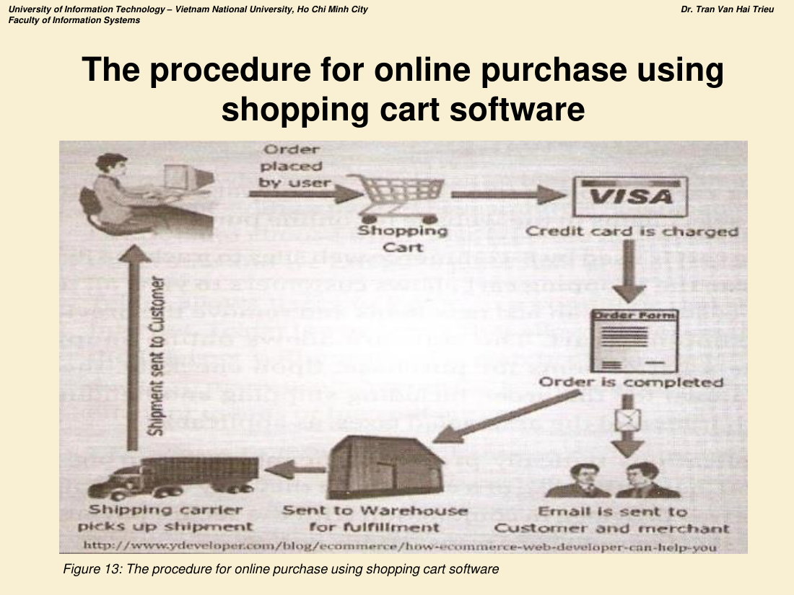

*Hình 13 — The procedure for online purchase using shopping cart software.*

**Mô tả quy trình (7 bước — HỌC THUỘC ĐỂ VẼ LẠI):**

| Bước | Hoạt động |
|---|---|
| **1** | **Order placed by user** — Người dùng đặt hàng (chọn sản phẩm trên website) |
| **2** | Sản phẩm được đưa vào **Shopping Cart** (giỏ hàng) |
| **3** | **Credit card is charged** — Thẻ tín dụng được ghi nợ (thanh toán) |
| **4** | **Order is completed** — Đơn hàng được hoàn tất (sinh Order Form) |
| **5** | **Email is sent to Customer and merchant** — Email xác nhận gửi tới cả khách hàng và người bán |
| **6** | **Sent to Warehouse for fulfillment** — Chuyển tới kho để hoàn tất đơn |
| **7** | **Shipping carrier picks up shipment** → **Shipment sent to Customer** — Đơn vị vận chuyển nhận hàng và giao tới khách hàng |

**Các đặc tính bổ sung của phần mềm giỏ hàng:**
- Khách hàng **thêm mặt hàng mới và bỏ mặt hàng đã chọn** khỏi giỏ.
- Phần mềm cho phép **lưu danh sách các mặt hàng để mua**.
- Khi **checkout**, phần mềm **tính tổng đơn hàng gồm phí vận chuyển & xử lý (shipping and handling) và các khoản thuế liên quan**.
- Hầu hết phần mềm giỏ hàng cung cấp **thêm tính năng quản lý toàn bộ cửa hàng trực tuyến**.
- Dữ liệu về **sản phẩm, danh mục, chiết khấu, đơn hàng và khách hàng** được lưu trong **CSDL và truy cập thời gian thực**.
- Các ứng dụng này thường cung cấp cách **thu thập thông tin thanh toán của khách**.
- Còn được gọi là **e-commerce software, e-store software**.

### d) Ba loại phần mềm giỏ hàng ⭐

| Loại | Mô tả |
|---|---|
| **Licensed software** (Có bản quyền) | Người bán trả **phí license (thường một lần)** và **sở hữu phần mềm**. Trong giới hạn hợp lý, có thể **đặt phần mềm trên bất kỳ web server nào** và thường **có thể sửa đổi/tùy biến**. **Ưu điểm chính:** sở hữu license nên **host được trên bất kỳ web server nào đáp ứng yêu cầu** |
| **Hosted service** (Dịch vụ lưu trữ) | Người bán trả **phí định kỳ hằng tháng/năm** để truy cập phần mềm. **Không được chọn cấu hình hoặc vị trí web server**, và **không được sửa đổi/tùy biến** phần mềm |
| **Free licensed** (Miễn phí có license) | Phần mềm miễn phí, nhưng **vẫn phải sở hữu/bảo trì hoặc thuê web server** |

## 2.9. QUẢN TRỊ QUAN HỆ KHÁCH HÀNG (CRM) ⭐⭐

### a) CRM là gì?

> **Technology-enabled relationship management** xảy ra khi doanh nghiệp **thu được thông tin chi tiết về hành vi, sở thích, nhu cầu và mô hình mua hàng của một khách hàng.**

- Dùng thông tin đó để **định giá, thương lượng điều khoản, điều chỉnh khuyến mãi, bổ sung tính năng sản phẩm** và **tùy biến toàn bộ quan hệ với khách hàng đó**.
- Còn gọi là **CRM** hoặc **eCRM (electronic CRM)**.

**Mục tiêu của CRM:**
- **Hiểu nhu cầu cụ thể của từng khách hàng** rồi **tùy biến sản phẩm/dịch vụ** để đáp ứng.
- Ý tưởng: **khách hàng được đáp ứng đúng nhu cầu sẵn sàng trả giá cao hơn**.
- Công ty mọi quy mô đều áp dụng được kỹ thuật CRM, nhưng **công ty lớn đủ khả năng mua và triển khai phần mềm tự động hóa nhiều chức năng CRM**.

### b) Các thành phần của hệ thống CRM điển hình ⭐⭐

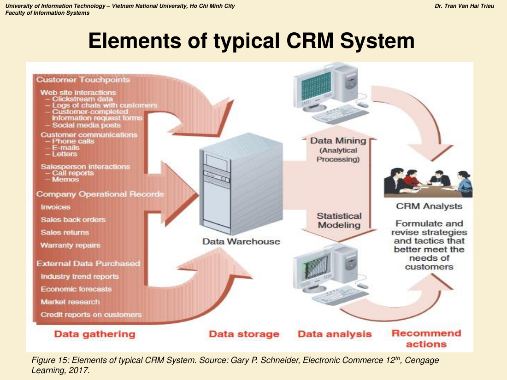

*Hình 15 — Elements of typical CRM System (Schneider, Electronic Commerce 12th).*

**Bốn giai đoạn: Data gathering → Data storage → Data analysis → Recommend actions**

| Giai đoạn | Nội dung |
|---|---|
| **1. Data gathering** (Thu thập dữ liệu) | **Customer Touchpoints:**<br>• *Web site interactions:* clickstream data, log chat với khách, form yêu cầu thông tin do khách điền, bài đăng mạng xã hội<br>• *Customer communications:* cuộc gọi, e-mail, thư<br>• *Salesperson interactions:* báo cáo cuộc gọi, memo<br>**Company Operational Records:** hóa đơn, đơn hàng chờ, hàng trả lại, sửa chữa bảo hành<br>**External Data Purchased:** báo cáo xu hướng ngành, dự báo kinh tế, nghiên cứu thị trường, báo cáo tín dụng khách hàng |
| **2. Data storage** (Lưu trữ) | Tất cả đổ vào **Data Warehouse (Kho dữ liệu)** |
| **3. Data analysis** (Phân tích) | **Data Mining (Analytical Processing)** và **Statistical Modeling** |
| **4. Recommend actions** (Khuyến nghị hành động) | **CRM Analysts** — **xây dựng và điều chỉnh các chiến lược, chiến thuật** để đáp ứng tốt hơn nhu cầu khách hàng |

**Sơ đồ thành phần chi tiết hơn:**

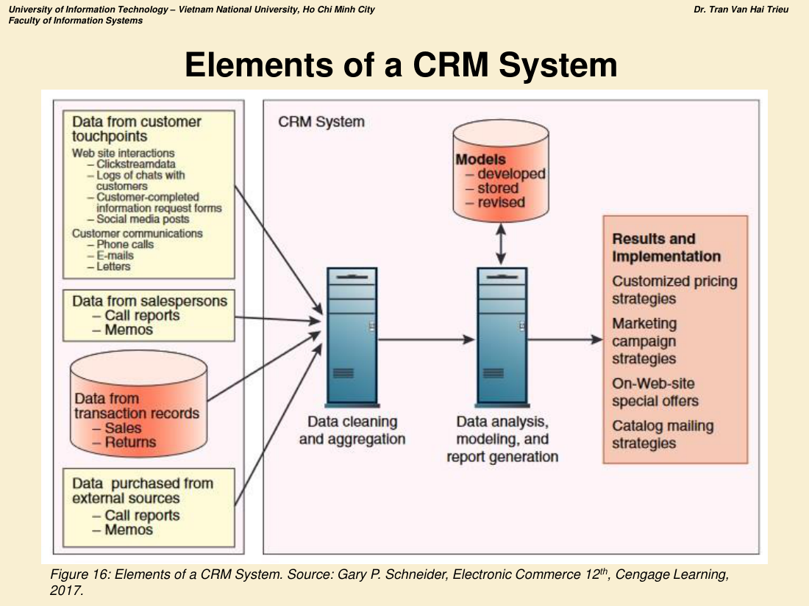

*Hình 16 — Elements of a CRM System.*

| Đầu vào | Xử lý trong CRM System | Kết quả |
|---|---|---|
| • Data from customer touchpoints (clickstream, chat logs, form, social media, gọi điện, email, thư)<br>• Data from salespersons (call reports, memos)<br>• Data from transaction records (Sales, Returns)<br>• Data purchased from external sources | **1. Data cleaning and aggregation** (Làm sạch & tổng hợp dữ liệu)<br>→ **2. Data analysis, modeling, and report generation** (Phân tích, mô hình hóa, tạo báo cáo)<br>↕ **Models** — developed / stored / revised | **Results and Implementation:**<br>• **Customized pricing strategies** (chiến lược giá tùy biến)<br>• **Marketing campaign strategies**<br>• **On-Web-site special offers**<br>• **Catalog mailing strategies** |

### c) Phần mềm CRM
- Phải **lấy dữ liệu từ phần mềm vận hành** thực hiện các hoạt động như **tự động hóa bán hàng, vận hành trung tâm dịch vụ khách hàng và chiến dịch marketing**.
- Phải **thu thập dữ liệu về hoạt động của khách trên website** và mọi điểm tiếp xúc khác với khách hiện tại lẫn tiềm năng.
- Dùng dữ liệu này giúp nhà quản lý thực hiện **hoạt động phân tích**: thu thập **business intelligence**, lập **chiến lược marketing**, **mô hình hóa hành vi khách hàng**…

## 2.10. QUẢN TRỊ CHUỖI CUNG ỨNG (SCM) ⭐⭐⭐

### a) Định nghĩa

> **Supply chain management:** **việc điều phối tất cả các hoạt động cung ứng của một tổ chức, từ nhà cung cấp và đối tác tới khách hàng của tổ chức.**

| Khái niệm | Định nghĩa | Tương đương |
|---|---|---|
| **Upstream supply chain** (Chuỗi cung ứng thượng nguồn) | Giao dịch giữa tổ chức với **nhà cung cấp và trung gian** | **Buy-side e-commerce** |
| **Downstream supply chain** (Chuỗi cung ứng hạ nguồn) | Giao dịch giữa tổ chức với **khách hàng và trung gian** | **Sell-side e-commerce** |

### b) Thành viên của chuỗi cung ứng ⭐⭐⭐

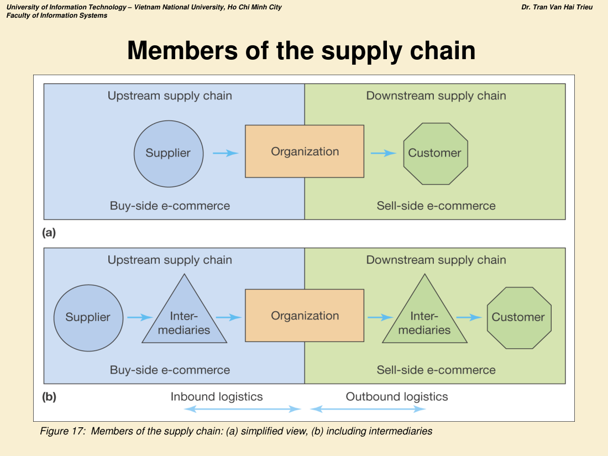

*Hình 17 — Members of the supply chain: (a) simplified view, (b) including intermediaries.*

**(a) Dạng đơn giản:**
```
[Supplier] → [Organization] → [Customer]
  Upstream supply chain    |    Downstream supply chain
  Buy-side e-commerce      |    Sell-side e-commerce
```

**(b) Có trung gian:**
```
[Supplier] → [Intermediaries] → [Organization] → [Intermediaries] → [Customer]
       Upstream (Buy-side)      |       Downstream (Sell-side)
       ← Inbound logistics →    |       ← Outbound logistics →
```

> 📌 **Ghi nhớ:** **Inbound logistics** ở phía thượng nguồn (mua), **Outbound logistics** ở phía hạ nguồn (bán).

### c) Một chuỗi cung ứng điển hình (ví dụ The B2B Company) ⭐⭐⭐

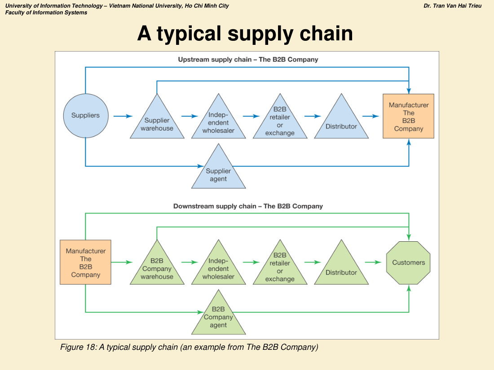

*Hình 18 — A typical supply chain (an example from The B2B Company).*

**Upstream supply chain (từ nhà cung cấp về Manufacturer):**
```
Suppliers → Supplier warehouse → Independent wholesaler → B2B retailer or exchange
          → Distributor → Manufacturer (The B2B Company)
```
Đồng thời có các **đường tắt (by-pass)**: Suppliers có thể đi **thẳng** tới Manufacturer, hoặc đi qua **Supplier agent** rồi tới Manufacturer.

**Downstream supply chain (từ Manufacturer tới khách hàng):**
```
Manufacturer (The B2B Company) → B2B Company warehouse → Independent wholesaler
          → B2B retailer or exchange → Distributor → Customers
```
Cũng có **đường tắt**: Manufacturer đi thẳng tới Customers, hoặc qua **B2B Company agent** rồi tới Customers.

> 📌 **Ý nghĩa các đường tắt = cơ hội DISINTERMEDIATION** — dùng Internet để bán/mua trực tiếp, bỏ bớt trung gian, giảm chi phí và thời gian.

### d) Tiếp cận PUSH và PULL trong SCM ⭐⭐⭐

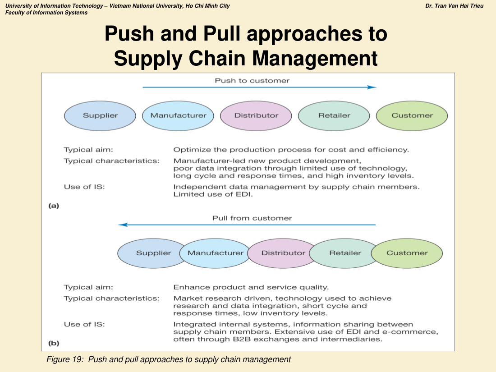

*Hình 19 — Push and pull approaches to supply chain management.*

| Tiêu chí | **(a) PUSH — "Push to customer"** | **(b) PULL — "Pull from customer"** |
|---|---|---|
| **Chiều dòng chảy** | Supplier → Manufacturer → Distributor → Retailer → **Customer** | **Customer** → Retailer → Distributor → Manufacturer → Supplier |
| **Typical aim** (Mục tiêu điển hình) | **Tối ưu quy trình sản xuất về chi phí và hiệu quả** | **Nâng cao chất lượng sản phẩm và dịch vụ** |
| **Typical characteristics** | • **Phát triển sản phẩm mới do nhà sản xuất dẫn dắt**<br>• **Tích hợp dữ liệu kém** do sử dụng công nghệ hạn chế<br>• **Chu kỳ và thời gian đáp ứng dài**<br>• **Mức tồn kho cao** | • **Do nghiên cứu thị trường dẫn dắt**<br>• **Công nghệ được dùng để tích hợp nghiên cứu và dữ liệu**<br>• **Chu kỳ và thời gian đáp ứng ngắn**<br>• **Mức tồn kho thấp** |
| **Use of IS** (Sử dụng HTTT) | **Quản lý dữ liệu độc lập bởi từng thành viên chuỗi. Sử dụng EDI hạn chế** | **Hệ thống nội bộ tích hợp, chia sẻ thông tin giữa các thành viên. Sử dụng EDI và e-commerce rộng rãi, thường qua sàn B2B và trung gian** |

> 📌 **ĐÂY LÀ MỘT TRONG NHỮNG CÂU HỎI DỄ RA NHẤT: "So sánh mô hình push và pull trong SCM; đề xuất chuyển từ push sang pull cho một doanh nghiệp cụ thể".**

### e) Hai mô hình thay thế của chuỗi giá trị ⭐⭐⭐

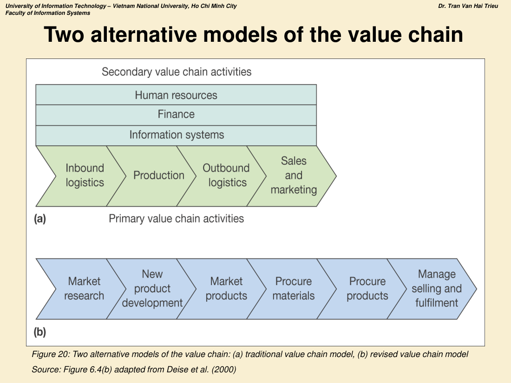

*Hình 20 — Two alternative models of the value chain: (a) traditional, (b) revised (Deise et al., 2000).*

**(a) Mô hình chuỗi giá trị TRUYỀN THỐNG (Porter):**

| Loại hoạt động | Các hoạt động |
|---|---|
| **Secondary value chain activities** (Hoạt động hỗ trợ) | **Human resources · Finance · Information systems** |
| **Primary value chain activities** (Hoạt động chính) | **Inbound logistics → Production → Outbound logistics → Sales and marketing** |

**(b) Mô hình chuỗi giá trị SỬA ĐỔI (revised — Deise et al. 2000):**

```
Market research → New product development → Market products → Procure materials
→ Procure products → Manage selling and fulfilment
```

**So sánh — điểm khác biệt cốt lõi:**

| Tiêu chí | **Truyền thống** | **Sửa đổi** |
|---|---|---|
| Điểm khởi đầu | **Logistics đầu vào** (bắt đầu từ nguyên vật liệu) | **Market research** (bắt đầu từ thị trường/khách hàng) |
| Tư duy | **Push** — sản xuất rồi bán | **Pull** — nghiên cứu thị trường trước, mua & sản xuất sau |
| Vị trí "Procure" | Ở đầu chuỗi (inbound logistics) | **Ở SAU khi đã nghiên cứu thị trường và phát triển sản phẩm** |
| Tính chất | Tuyến tính, nội bộ | **Định hướng khách hàng, tích hợp thông tin** |

### f) Hạ tầng HTTT điển hình cho SCM ⭐⭐⭐

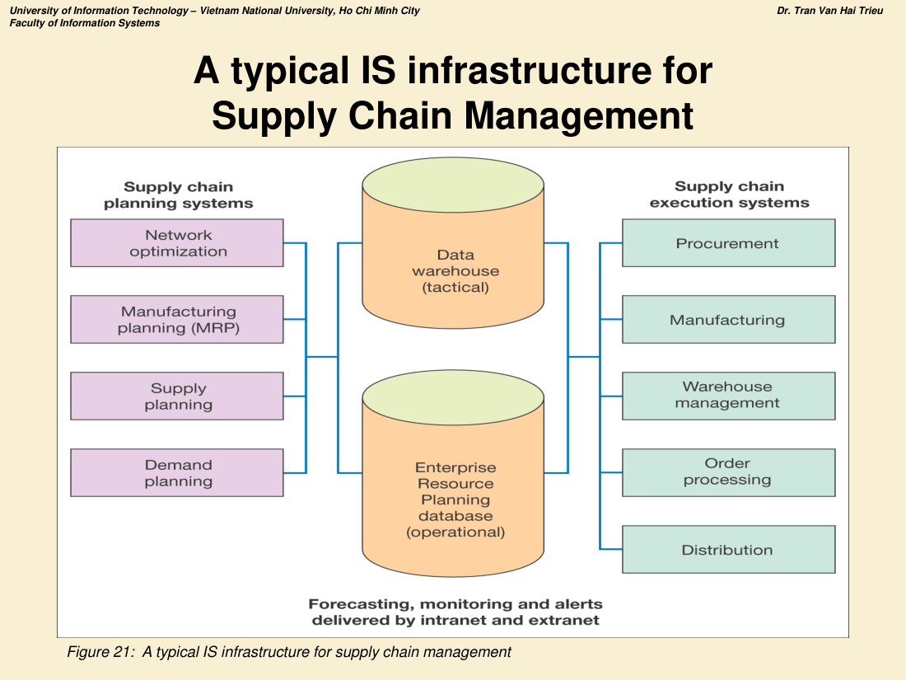

*Hình 21 — A typical IS infrastructure for supply chain management.*

| Bên trái: **Supply chain PLANNING systems** | Trung tâm: **Cơ sở dữ liệu** | Bên phải: **Supply chain EXECUTION systems** |
|---|---|---|
| • **Network optimization** (Tối ưu mạng lưới)<br>• **Manufacturing planning (MRP)**<br>• **Supply planning** (Hoạch định cung)<br>• **Demand planning** (Hoạch định cầu) | • **Data warehouse (tactical)** — Kho dữ liệu, cấp chiến thuật<br>• **Enterprise Resource Planning database (operational)** — CSDL ERP, cấp tác nghiệp | • **Procurement** (Mua hàng)<br>• **Manufacturing** (Sản xuất)<br>• **Warehouse management** (Quản lý kho)<br>• **Order processing** (Xử lý đơn hàng)<br>• **Distribution** (Phân phối) |

**Ở dưới cùng:** *"Forecasting, monitoring and alerts delivered by **intranet and extranet**"* — Dự báo, giám sát và cảnh báo được phân phối qua intranet và extranet.

### g) Lợi ích của việc áp dụng HTTT vào SCM ⭐⭐

| Lợi ích | Kết quả cụ thể |
|---|---|
| **Tăng hiệu quả từng quy trình riêng lẻ** | **Giảm chu kỳ (cycle time) và chi phí trên mỗi đơn hàng** |
| **Giảm độ phức tạp của chuỗi cung ứng** | **Giảm chi phí phân phối và bán qua kênh** |
| **Cải thiện tích hợp dữ liệu** giữa các mắt xích | **Giảm chi phí xử lý giấy tờ** |
| **Giảm chi phí nhờ thuê ngoài (outsourcing)** | **Chi phí thấp hơn nhờ cạnh tranh giá** |
| **Đổi mới (Innovation)** | **Đáp ứng khách hàng tốt hơn** |

## 2.11. E-PROCUREMENT (MUA SẮM ĐIỆN TỬ) ⭐⭐⭐

### a) Định nghĩa

- **Procurement (Mua sắm):** **mọi hoạt động để có được hàng hóa từ nhà cung cấp**, bao gồm cả **việc mua (purchasing)** lẫn **logistics đầu vào (inbound logistics)** và **lưu kho (warehousing)**.
- **E-Procurement:** **việc tích hợp và quản lý toàn bộ các hoạt động mua sắm, bao gồm: yêu cầu mua (purchase request), phê duyệt (authorization), đặt hàng (ordering), giao hàng (delivery) và thanh toán (payment).**

### b) 5 quyền (5 rights) của E-procurement ⭐⭐

Mua hàng phải:
1. **At the right price** — đúng giá
2. **Delivered at the right time** — giao đúng thời điểm
3. **Are of the right quality** — đúng chất lượng
4. **Of the right quantity** — đúng số lượng
5. **From the right source** — từ đúng nguồn

### c) CÁC HOẠT ĐỘNG MUA SẮM CHÍNH TRONG MỘT TỔ CHỨC ⭐⭐⭐

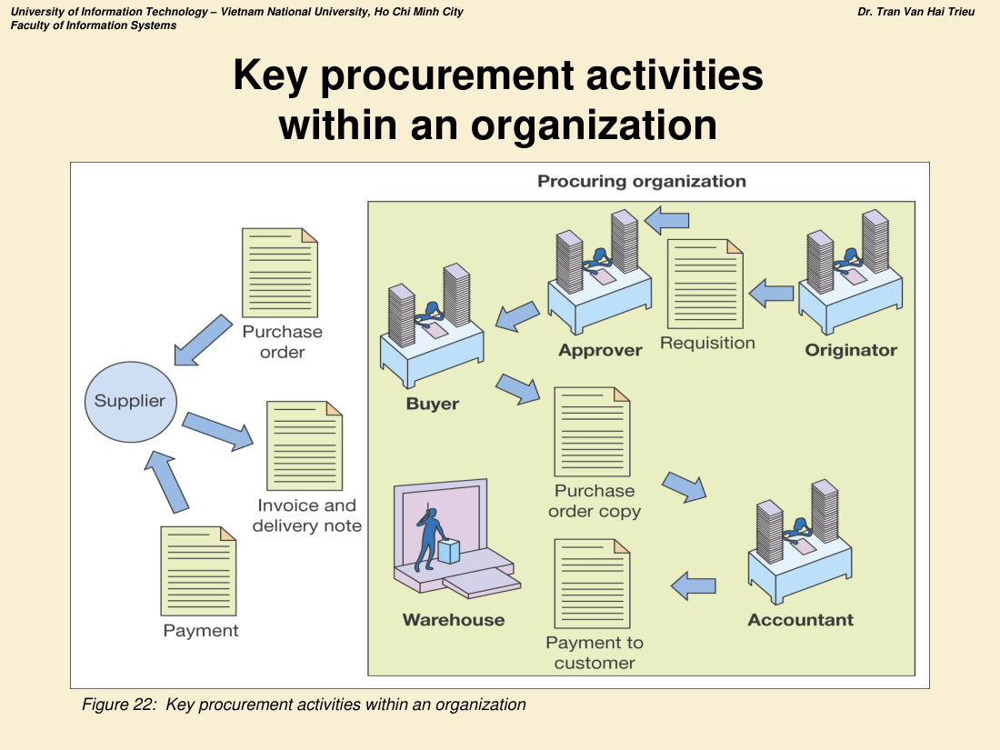

*Hình 22 — Key procurement activities within an organization.*

**Bốn vai trò trong tổ chức mua hàng (procuring organization): Originator → Approver → Buyer → Accountant (+ Warehouse)**

**QUY TRÌNH MUA SẮM ĐẦY ĐỦ (8 bước — HỌC THUỘC ĐỂ VẼ LẠI):**

| Bước | Chủ thể | Hoạt động / Chứng từ |
|---|---|---|
| **1** | **Originator** (Người khởi tạo) | Lập **Requisition** (Đề nghị mua hàng) và gửi cho Approver |
| **2** | **Approver** (Người phê duyệt) | **Phê duyệt** đề nghị mua hàng, chuyển cho Buyer |
| **3** | **Buyer** (Người mua) | Phát hành **Purchase order (Đơn đặt hàng)** gửi tới **Supplier** |
| **4** | **Supplier** (Nhà cung cấp) | Giao hàng kèm **Invoice and delivery note** (Hóa đơn và phiếu giao hàng) |
| **5** | **Warehouse** (Kho) | **Nhận hàng và nhập kho** |
| **6** | **Buyer → Accountant** | Gửi **Purchase order copy** (bản sao đơn đặt hàng) cho Kế toán |
| **7** | **Accountant** (Kế toán) | **Đối chiếu 3 chứng từ** (PO, phiếu giao hàng, hóa đơn) và lập lệnh **Payment** |
| **8** | **Payment** | **Thanh toán** được gửi tới Supplier |

> 📌 **Đây là quy trình chuẩn để trả lời câu "Hãy mô tả quy trình mua hàng của doanh nghiệp và đề xuất cải tiến bằng e-procurement".**
>
> **Cải tiến bằng e-procurement:** thay chứng từ giấy bằng **luồng điện tử (EDI / extranet / hệ thống e-procurement)**; **phê duyệt điện tử theo workflow**; **catalogue điện tử của nhà cung cấp**; **tự động đối chiếu ba chiều (3-way matching)**; **thanh toán điện tử** ⇒ giảm chu kỳ, giảm sai sót, giảm chi phí xử lý giấy tờ, chống **maverick purchasing**.

### d) Các loại hình mua sắm ⭐

| Câu hỏi | Phân loại |
|---|---|
| **What is bought?** (Mua gì?) | **Production-related** (liên quan sản xuất — hàng trực tiếp)<br>**Non-production related** (không liên quan sản xuất — hàng gián tiếp, MRO) |
| **How are items bought?** (Mua thế nào?) | **Systematic sourcing** — **quan hệ dài hạn**<br>**Spot sourcing** — **đáp ứng nhu cầu tức thời** |

### e) Tám loại trung gian trong mua sắm trực tuyến

1. **Traditional manufacturers** (Nhà sản xuất truyền thống)
2. **Direct sales manufacturers** (Nhà sản xuất bán trực tiếp)
3. **Procurement partners** (Đối tác mua sắm)
4. **Online hubs** (Trung tâm trực tuyến)
5. **Knowledge expert** (Chuyên gia tri thức)
6. **Online information services** (Dịch vụ thông tin trực tuyến)
7. **Online retailers** (Nhà bán lẻ trực tuyến)
8. **Portal communities** (Cộng đồng cổng thông tin)

### f) Rủi ro và tác động của E-procurement ⭐⭐

| Loại rủi ro | Nội dung |
|---|---|
| **Tỷ lệ áp dụng thấp** | Vì sao e-procurement ít được chấp nhận? |
| **Rủi ro tổ chức** | **Dịch chuyển/thay thế nhân viên (displace employees)** và **Maverick purchases** (mua ngoài hệ thống, không tuân thủ quy trình) |
| **Không đạt được mức giảm chi phí thực sự** | Failure to achieve real cost reductions |
| **Rủi ro công nghệ** | **Công nghệ và mô hình mới liên tục xuất hiện; khó quyết định chọn cái nào** |

### g) Triển khai E-procurement ⭐⭐

- **Doanh nghiệp nên CẢI TIẾN QUY TRÌNH KINH DOANH chứ không chỉ đơn thuần tự động hóa quy trình hiện có.** *(Ý cực kỳ quan trọng — hay được hỏi!)*
- **Thách thức lớn nhất:**
  1. **Training / Change management** (Đào tạo / Quản trị thay đổi)
  2. **Supplier relationship management** (Quản trị quan hệ nhà cung cấp)
- **Nhà quản lý HTTT và đội mua hàng phải phối hợp cùng nhau.**
- **Các loại HTTT khác nhau có thể dùng cho các phần khác nhau của chu trình mua sắm.**

### h) Ba mô hình E-procurement cho người mua ⭐⭐⭐

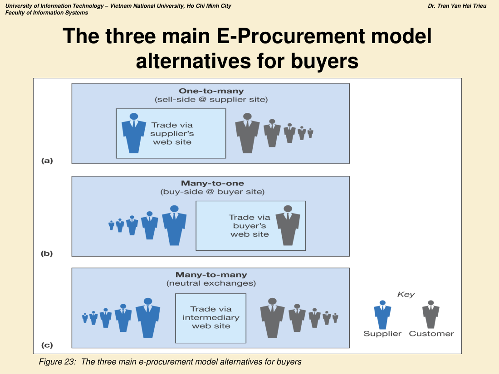

*Hình 23 — The three main e-procurement model alternatives for buyers.*

| Mô hình | Tên gọi | Cơ chế | Ai hưởng lợi |
|---|---|---|---|
| **(a) One-to-many** | **Sell-side @ supplier site** | **Trade via supplier's web site** — giao dịch qua website của **nhà cung cấp**; 1 nhà cung cấp phục vụ nhiều khách hàng | **Nhà cung cấp** kiểm soát |
| **(b) Many-to-one** | **Buy-side @ buyer site** | **Trade via buyer's web site** — giao dịch qua website của **người mua**; nhiều nhà cung cấp phục vụ 1 người mua | **Người mua** kiểm soát (thường là DN lớn) |
| **(c) Many-to-many** | **Neutral exchanges** | **Trade via intermediary web site** — giao dịch qua website của **trung gian trung lập**; nhiều nhà cung cấp ↔ nhiều khách hàng | **Trung gian** — sàn giao dịch |

### i) Các loại thị trường (Marketplace) ⭐

| Loại | Định nghĩa |
|---|---|
| **Vertical marketplace** | Phục vụ **cùng một ngành** |
| **Horizontal marketplace** | Phục vụ **nhiều ngành** |
| **Reverse aggregation** | **Gộp sức mua** (của nhiều người mua) |
| **Forward aggregation** | **Gộp nhiều nhà cung cấp hoặc nhiều chức năng chuỗi cung ứng** |
| **Metamediaries** | Trung gian của trung gian |

## 2.12. HOẠCH ĐỊNH NGUỒN LỰC DOANH NGHIỆP (ERP) ⭐⭐

### a) ERP là gì?

> **ERP** là các **gói phần mềm hệ thống kinh doanh tích hợp TOÀN BỘ các mặt của một doanh nghiệp.**

**Bao gồm:** kế toán (accounting), logistics, sản xuất (manufacturing), marketing, hoạch định (planning), quản trị dự án (project management), các chức năng ngân quỹ (treasury)…

### b) Tích hợp hệ thống ERP với EDI ⭐⭐⭐

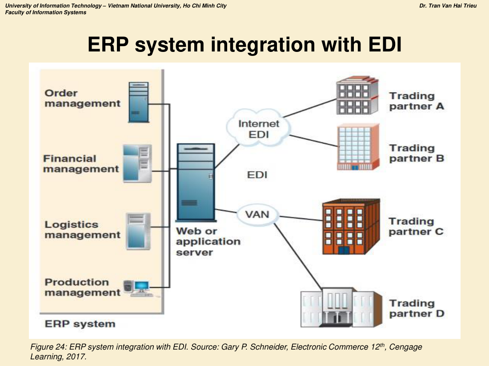

*Hình 24 — ERP system integration with EDI (Schneider, Electronic Commerce 12th).*

**Cấu trúc:**

| Thành phần | Nội dung |
|---|---|
| **ERP system** (bên trái) | **Order management · Financial management · Logistics management · Production management** |
| **Kết nối** (giữa) | **Web or application server** |
| **Hai kênh EDI** | **Internet EDI** (qua Internet) → **Trading partner A, B**<br>**VAN** (Value Added Network) → **Trading partner C, D** |

> 📌 **Ý nghĩa:** ERP tích hợp nội bộ; **EDI** (qua **Internet EDI** hoặc **VAN**) kết nối ERP với **các đối tác thương mại bên ngoài** ⇒ đây chính là cầu nối giữa **E-business nội bộ** và **E-commerce với bên ngoài**.

### c) Nhà cung cấp ERP
- **Hai nhà cung cấp ERP lớn nhất: Oracle và SAP.**
- Doanh nghiệp trực tuyến nhỏ không đủ khả năng mua trọn gói ERP; có thể mua các sản phẩm như **NetSuite** — thuê bao phần mềm ERP cho mọi quy mô doanh nghiệp.
- Thay vì cài đặt và tùy biến ERP trên mạng riêng, doanh nghiệp **dùng trình duyệt truy cập ERP trên site của nhà cung cấp** — đây chính là **SaaS (Software as a Service)**.

## 2.13. WEB HOSTING ⭐⭐

### a) Định nghĩa

> **Web hosting** là **dịch vụ cho phép tổ chức và cá nhân xuất bản (publish) hoặc tải lên (upload) một website/trang web lên Internet.**

- **Web host / web hosting service provider:** doanh nghiệp cung cấp **công nghệ và dịch vụ** cần thiết để website được xem trên Internet.
- Website được **lưu trữ trên các máy tính đặc biệt gọi là web server**.
- Nhà cung cấp tiêu biểu: **GoDaddy, Bluehost, Dreamhost, IONOS**.

**Các bước host một website:**
1. **Upload file từ máy tính lên server web hosting**
2. **Máy chủ làm cho site khả dụng trên Internet**
3. **Khách truy cập xem được website**

### b) Tính năng do nhà cung cấp Web Hosting cung cấp

| # | Tính năng |
|---|---|
| 1 | **Amount of Storage** (Dung lượng lưu trữ) |
| 2 | **Amount of Bandwidth** (Băng thông) |
| 3 | **Domain Registration** (Đăng ký tên miền) |
| 4 | **Number of Sub-domains** (Số tên miền phụ) |
| 5 | **Email Support** |
| 6 | **Database Support** |
| 7 | **Technical Support** |
| 8 | **Site Backup** |
| 9 | **Choice of Operating System** |
| 10 | **24/7 Availability** |

### c) Tiêu chí chọn nhà cung cấp Web Hosting ⭐

1. **Đánh giá nhu cầu dung lượng đĩa và băng thông**
2. **Độ tin cậy và tính sẵn sàng** (Reliability and availability)
3. **Hỗ trợ 24/7**
4. **Giá cả**
5. **Chọn đúng hệ điều hành**
6. **Bảo mật:** firewall, sao lưu hằng ngày, xác thực người dùng…
7. **Dịch vụ e-mail**

### d) Năm loại Web Hosting ⭐⭐⭐

| Loại | Mô tả | Ưu/Nhược |
|---|---|---|
| **1. Free Web Hosting** | Nhiều nhà cung cấp bù chi phí bằng **quảng cáo tự động chèn vào trang** qua pop-up, frame, script. Có thể qua dịch vụ như **Google Cloud Hosting** hoặc qua **ISP** | **Bị giới hạn** so với hosting trả phí: ít dung lượng và băng thông hơn |
| **2. Shared Web Hosting** | **Phổ biến nhất.** Gọi là "shared" vì **nhiều ứng dụng web (thường là website) được lưu trên MỘT máy chủ vật lý và chia sẻ tài nguyên** (RAM, CPU). Trả tiền **hằng tháng** cho không gian và dịch vụ | **Rẻ**; giá phụ thuộc dịch vụ mong muốn (email, CSDL, bảo mật, thêm dung lượng, thêm băng thông…). **Bị ảnh hưởng bởi các site khác** |
| **3. Dedicated Web Hosting** | **Ngược với shared:** ứng dụng của khách hàng **KHÔNG chia sẻ tài nguyên server** với người khác. Server **dùng toàn bộ băng thông khả dụng cho riêng mình** | Dành cho **website và ứng dụng lưu lượng cao**. **Đắt hơn** |
| **4. Cloud Web Hosting** | "Cloud" là cấu trúc điện tử nơi **dữ liệu được lưu trên nhiều máy tính khác nhau** và phục vụ qua kết nối mạng. Dữ liệu website (HTML, CSS, hình ảnh…) được **trải trên một cụm ổ cứng liên kết với nhau** | **Xu hướng nóng nhất**; **nhiều ưu điểm hơn shared hosting, đôi khi vượt cả dedicated hosting**. Dựa trên công nghệ điện toán đám mây cho phép **số lượng máy không giới hạn hoạt động như một hệ thống** |
| **5. Co-location Web Hosting** | Giống dedicated nhưng **NGƯỜI DÙNG SỞ HỮU MÁY CHỦ**. Công ty hosting cung cấp **không gian vật lý** đặt server và chăm sóc server. **Mạnh nhất và đắt nhất.** Khách hàng phải **cử quản trị viên tới data center** để nâng cấp/thay đổi phần cứng | Có hai dạng: **managed** và **unmanaged** ("unmanaged" = doanh nghiệp/cá nhân **tự xử lý toàn bộ quản trị server**: cập nhật phần mềm, web server và chính site). **Hoàn hảo cho công ty cần cấu hình phần mềm tùy biến hoặc bảo mật web nâng cao** |

---

# PHẦN 3. AN NINH TRỰC TUYẾN (ONLINE SECURITY)

## 3.1. Môi trường an ninh TMĐT

- **Quy mô vấn đề:** tổng thiệt hại do tội phạm mạng **chưa rõ ràng**. Nghiên cứu McAfee/CSIS: **tác động kinh tế toàn cầu của tội phạm mạng và gián điệp mạng từ 455 tới 600 tỷ USD**.
- Báo cáo của các nhà cung cấp sản phẩm bảo mật cho thấy **tội phạm mạng ngày càng tăng**.
- **Gian lận thẻ tín dụng trực tuyến** là một trong những dạng nổi bật nhất.
- **Chợ kinh tế ngầm (underground economy marketplaces)** bán thông tin đánh cắp, mã độc…

**An ninh TMĐT tốt là gì?**
- Để đạt mức bảo mật cao nhất cần: **công nghệ mới + chính sách và quy trình của tổ chức + chuẩn ngành và luật pháp**.
- Yếu tố khác: **giá trị thời gian của tiền**, **chi phí bảo mật so với tổn thất tiềm tàng**.

## 3.2. SÁU CHIỀU AN NINH TMĐT ⭐⭐⭐

**Bảng 9 — Góc nhìn của khách hàng và người bán về các chiều an ninh TMĐT:**

| Chiều an ninh | **Góc nhìn KHÁCH HÀNG** | **Góc nhìn NGƯỜI BÁN** |
|---|---|---|
| **Integrity**<br>(Toàn vẹn) | *Thông tin tôi gửi/nhận có bị thay đổi không?* | *Dữ liệu trên site có bị thay đổi trái phép không? Dữ liệu nhận từ khách có hợp lệ không?* |
| **Nonrepudiation**<br>(Chống chối bỏ) | *Bên giao dịch với tôi có thể chối bỏ hành động đã thực hiện sau này không?* | *Khách hàng có thể phủ nhận việc đã đặt hàng không?* |
| **Authenticity**<br>(Xác thực) | *Tôi đang giao dịch với ai? Làm sao chắc chắn người/tổ chức đó đúng là họ tuyên bố?* | *Danh tính thật của khách hàng là gì?* |
| **Confidentiality**<br>(Bảo mật) | *Ngoài người nhận dự kiến, có ai khác đọc được tin nhắn của tôi không?* | *Tin nhắn hoặc dữ liệu mật có bị ai ngoài người được phép truy cập không?* |
| **Privacy**<br>(Riêng tư) | *Tôi có kiểm soát được việc sử dụng thông tin về bản thân đã gửi cho người bán không?* | *Dữ liệu cá nhân thu thập trong giao dịch TMĐT được dùng thế nào? Thông tin cá nhân của khách có bị dùng trái phép không?* |
| **Availability**<br>(Sẵn sàng) | *Tôi có truy cập được site không?* | *Site có đang hoạt động không?* |

**Căng thẳng giữa an ninh và các giá trị khác:**
- **Ease of use:** **càng thêm biện pháp bảo mật thì site càng khó dùng và càng chậm**.
- **Public safety và việc tội phạm dùng Internet:** tội phạm dùng công nghệ để lập kế hoạch phạm tội hoặc đe dọa quốc gia.

## 3.3. BA ĐIỂM DỄ BỊ TỔN THƯƠNG ⭐⭐

**Ba điểm yếu then chốt trong môi trường TMĐT:**
1. **Client** (Máy khách)
2. **Server** (Máy chủ)
3. **Communications pipeline** (Đường ống truyền thông — kênh truyền Internet)

### Một giao dịch TMĐT điển hình ⭐⭐⭐

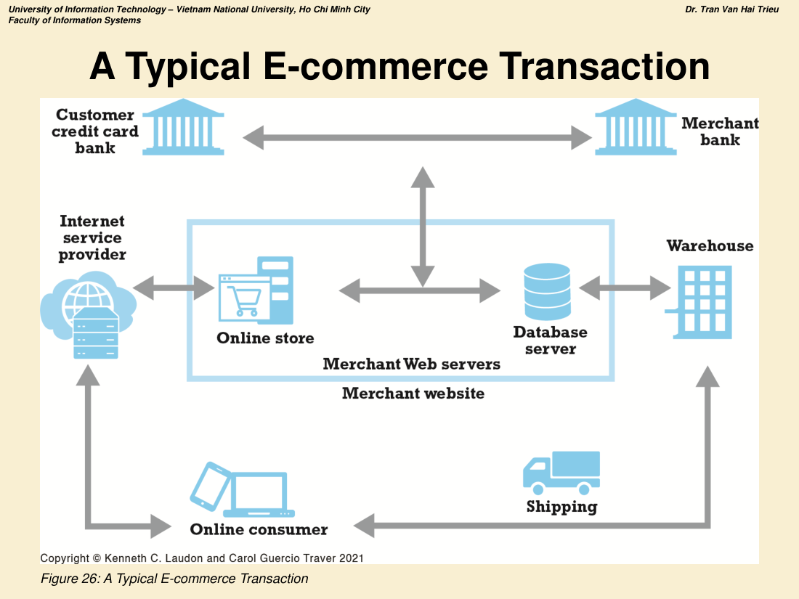

*Hình 26 — A Typical E-commerce Transaction.*

**Các thành phần và luồng:**

| Thành phần | Vai trò |
|---|---|
| **Online consumer** | Người tiêu dùng trực tuyến (máy tính, điện thoại) |
| **Internet service provider** | Nhà cung cấp dịch vụ Internet — cầu nối người tiêu dùng tới merchant |
| **Merchant website** | Gồm **Online store** ↔ **Merchant Web servers** ↔ **Database server** |
| **Customer credit card bank** ↔ **Merchant bank** | Hai ngân hàng trao đổi để thanh toán |
| **Warehouse** | Kho hàng — nhận lệnh từ database server |
| **Shipping** | Vận chuyển hàng tới **Online consumer** |

**Luồng:** Online consumer → ISP → Online store → Database server → Warehouse → Shipping → Online consumer; song song: Merchant Web servers ↔ Merchant bank ↔ Customer credit card bank.

### Các điểm dễ bị tổn thương trong giao dịch TMĐT ⭐⭐⭐

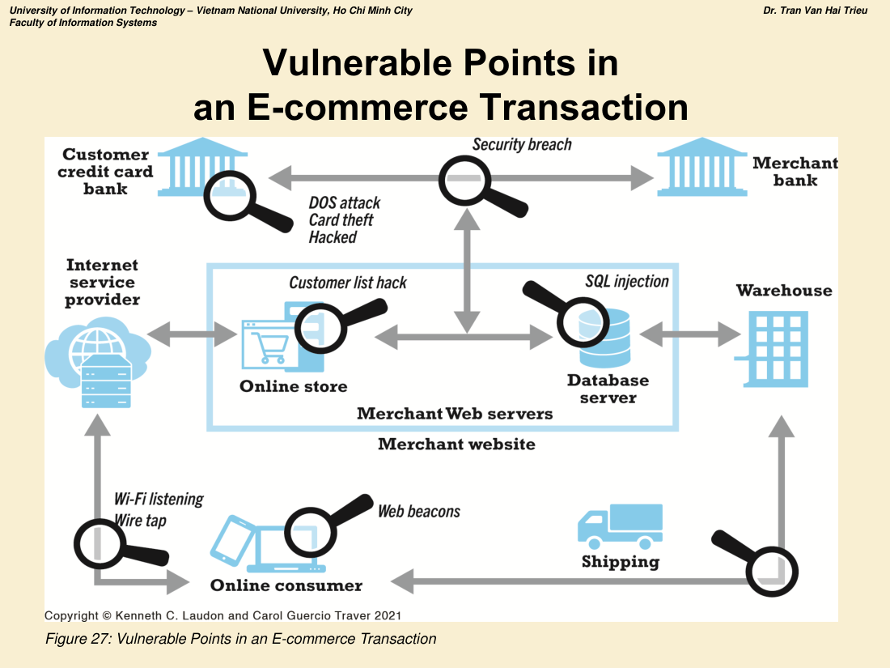

*Hình 27 — Vulnerable Points in an E-commerce Transaction.*

| Vị trí | Mối đe dọa |
|---|---|
| Giữa **consumer và ISP** | **Wi-Fi listening** (nghe lén Wi-Fi), **Wire tap** (nghe lén đường truyền) |
| Tại **Online consumer** | **Web beacons** |
| Tại **Online store** | **Customer list hack** (đánh cắp danh sách khách hàng) |
| Tại **Database server** | **SQL injection** |
| Giữa **Customer credit card bank và Merchant bank** | **Security breach** (xâm phạm bảo mật) |
| Tại **Customer credit card bank** | **DOS attack, Card theft, Hacked** |
| Tại **Shipping / Warehouse** | Điểm yếu trong khâu giao nhận |

> 📌 **Câu hỏi rất hay ra: "Vẽ sơ đồ một giao dịch TMĐT điển hình và chỉ ra các điểm dễ bị tấn công cùng giải pháp phòng ngừa."**

## 3.4. CÁC MỐI ĐE DỌA AN NINH ⭐⭐

### a) Malicious Code (Mã độc)
**Malvertising · Viruses · Worms · Ransomware · Trojan horses · Backdoors · Drive-by downloads.**

### b) Potentially Unwanted Programs (Chương trình không mong muốn)

| Loại | Mô tả |
|---|---|
| **Browser parasites** | **Giám sát và thay đổi trình duyệt** của người dùng |
| **Adware** | **Gọi quảng cáo pop-up** |
| **Spyware** | **Theo dõi thao tác bàn phím, email, tin nhắn** của người dùng |

### c) Phishing
> Mọi **nỗ lực lừa đảo trực tuyến của bên thứ ba nhằm lấy thông tin bí mật để trục lợi tài chính**.

**Chiến thuật:** **Social engineering** · **E-mail scams và BEC phishing** · **Spear phishing**. Dùng cho **gian lận và đánh cắp danh tính**.

### d) Hacking, Cybervandalism và Hacktivism

| Khái niệm | Nội dung |
|---|---|
| **Hacking** | **Hackers vs crackers**; **White hats, black hats, grey hats**; Mục tiêu: cybervandalism, data breaches |
| **Cybervandalism** | **Phá rối và phá hủy website** |
| **Hacktivism** | Tấn công mạng vì mục đích chính trị/xã hội |

### e) Data Breaches (Rò rỉ dữ liệu)
> Tổ chức **mất kiểm soát thông tin doanh nghiệp vào tay người ngoài**.

- ITRC ghi nhận **1.244 vụ rò rỉ năm 2018** (giảm 23% so với 2017).
- **Facebook 2018:** lộ thông tin cá nhân của **30 triệu người**.
- **Nguyên nhân hàng đầu:** **Hacking · Truy cập trái phép · Lỗi/bất cẩn của nhân viên**.

### f) Credit Card Fraud/Theft
- Thẻ tín dụng bị đánh cắp chiếm khoảng **0,9% trên Web** và **0,8% giao dịch di động**.
- **Nguyên nhân chính: hacking và cướp dữ liệu từ máy chủ doanh nghiệp.**
- **Vấn đề an ninh trung tâm: xác lập danh tính khách hàng** — **E-signatures · Multi-factor authentication · Fingerprint identification**.

### g) Identity Fraud/Theft
> **Sử dụng trái phép dữ liệu cá nhân của người khác để trục lợi tài chính bất hợp pháp**: số an sinh xã hội, giấy phép lái xe, số thẻ tín dụng, username/password.

2017: gần **17 triệu** người Mỹ bị; 2018: **14,4 triệu**.

### h) Spoofing, Pharming và Spam websites

| Khái niệm | Định nghĩa |
|---|---|
| **Spoofing** | **Che giấu danh tính thật bằng cách dùng email hoặc địa chỉ IP của người khác** |
| **Pharming** | **Tự động chuyển hướng một URL sang địa chỉ khác** để hacker trục lợi |
| **Spam (junk) websites** | Cung cấp tập hợp quảng cáo cho site khác, **có thể chứa mã độc** |

### i) Sniffing và Man-In-The-Middle

| Khái niệm | Định nghĩa |
|---|---|
| **Sniffer** | **Chương trình nghe lén giám sát mạng**; có thể phát hiện điểm sự cố mạng; cũng có thể bị tội phạm dùng để **đánh cắp thông tin độc quyền** |
| **E-mail wiretaps** | **Ghi lại email tại cấp mail server** |
| **Man-in-the-middle attack** | Kẻ tấn công **chặn và thay đổi liên lạc giữa hai bên** đang tin rằng họ giao tiếp trực tiếp với nhau |

### j) DoS và DDoS ⭐

| Loại | Mô tả |
|---|---|
| **DoS (Denial of Service)** | **Làm ngập website bằng ping và yêu cầu trang**, **áp đảo và có thể làm sập web server**; thường kèm **tống tiền** |
| **DDoS (Distributed DoS)** | Dùng **hàng trăm/hàng nghìn máy tính** tấn công mạng mục tiêu; có thể dùng **thiết bị IoT và thiết bị di động** |

### k) Insider Attacks (Tấn công từ bên trong) ⭐
- **Mối đe dọa lớn nhất với doanh nghiệp đến từ biển thủ nội bộ (insider embezzlement).**
- Nhân viên có **quyền truy cập thông tin đặc quyền**.
- **Quy trình bảo mật kém.**
- **Người bên trong có khả năng là nguồn tấn công mạng cao hơn người ngoài.**

### l) Phần mềm thiết kế kém
Độ phức tạp và nhu cầu phần mềm tăng ⇒ tăng lỗi và lỗ hổng. **SQL injection attacks · Zero-day vulnerability · Heartbleed bug; Shellshock (BashBug); FREAK.**

### m) Các môi trường rủi ro khác

| Môi trường | Vấn đề |
|---|---|
| **Social Network** | Virus, chiếm quyền site, gian lận danh tính, app chứa mã độc, **click hijacking**, phishing, spam; **Manual sharing scams** (chia sẻ file dẫn tới site độc hại); **fake services, fake Like buttons, fake apps** |
| **Mobile Platform** | **Nhận thức công chúng về lỗ hổng thiết bị di động còn thấp**; 2017: Symantec xác định hơn **26.500 biến thể mã độc di động**; **Vishing · Smishing · SMS spoofing · Madware** |
| **Cloud** | **DDoS attacks · Infrastructure scanning · Phishing công nghệ thấp lấy mật khẩu và quyền truy cập · Dùng cloud storage để kết nối tài khoản liên kết · Thiếu mã hóa và quy trình bảo mật mạnh** |
| **IoT** | **Môi trường khó bảo vệ**; **số lượng liên kết kết nối khổng lồ**; **thiết bị gần như giống hệt nhau và vòng đời dài**; **nhiều thiết bị không có tính năng nâng cấp**; **khả năng quan sát hoạt động, dữ liệu, bảo mật rất hạn chế** |

## 3.5. GIẢI PHÁP CÔNG NGHỆ ⭐⭐⭐

| Nhóm | Giải pháp |
|---|---|
| **Protecting Internet communications** | **Encryption** (Mã hóa) |
| **Securing channels of communication** | **SSL, TLS, VPNs, Wi-Fi** |
| **Protecting networks** | **Firewalls, proxy servers, IDS, IPS** |
| **Protecting servers and clients** | **OS security, anti-virus software** |

### a) Mã hóa (Encryption) ⭐⭐

> **Encryption:** **biến đổi dữ liệu thành bản mã (cipher text) mà chỉ người gửi và người nhận đọc được.** Bảo vệ cả **thông tin lưu trữ** lẫn **thông tin truyền đi**.

**Mã hóa cung cấp 4 trên 6 chiều an ninh TMĐT:**
1. **Message integrity**
2. **Nonrepudiation**
3. **Authentication**
4. **Confidentiality**

*(Không cung cấp: Privacy và Availability)*

### b) Mã hóa khóa đối xứng (Symmetric Key Cryptography)
- **Người gửi và người nhận dùng CÙNG một khóa số để mã hóa và giải mã.**
- **Cần một bộ khóa khác nhau cho mỗi giao dịch.**
- **Độ mạnh = độ dài khóa nhị phân.**
- Chuẩn: **DES (Data Encryption Standard)**, **AES (Advanced Encryption Standard)**; các chuẩn khác dùng khóa tới **2.048 bit**.

### c) Mã hóa khóa công khai (Public Key Cryptography) ⭐⭐
- Dùng **hai khóa số liên quan toán học với nhau**:
  - **Public key** (khóa công khai — phân phát rộng rãi)
  - **Private key** (khóa riêng — chủ sở hữu giữ bí mật)
- **Cả hai khóa đều dùng để mã hóa và giải mã thông điệp.**
- **Khóa nào đã dùng để mã hóa thì KHÔNG dùng chính nó để giải mã được.**
- **Người gửi dùng khóa công khai của người nhận để mã hóa; người nhận dùng khóa riêng của mình để giải mã.**

### d) Chữ ký số và Hash Digest ⭐⭐

**Quy trình:**
1. Người gửi **áp dụng thuật toán băm (hash function)** lên thông điệp, rồi **mã hóa thông điệp và kết quả băm bằng khóa công khai của người nhận**.
2. Người gửi **mã hóa thông điệp và kết quả băm bằng khóa RIÊNG của mình** — tạo ra **chữ ký số (digital signature)**, phục vụ **tính xác thực (authenticity)** và **chống chối bỏ (nonrepudiation)**.
3. Người nhận **trước tiên dùng khóa công khai của người gửi để xác thực thông điệp**, sau đó **dùng khóa riêng của mình để giải mã kết quả băm và thông điệp**.

### e) Digital Envelope (Phong bì số) ⭐

**Giải quyết điểm yếu của cả hai phương pháp:**

| Phương pháp | Điểm yếu |
|---|---|
| **Public key cryptography** | **Chậm về tính toán**, giảm tốc độ truyền, tăng thời gian xử lý |
| **Symmetric key cryptography** | **Đường truyền không an toàn** (khó trao đổi khóa an toàn) |

**Cách hoạt động:**
- **Dùng mã hóa khóa đối xứng để mã hóa TÀI LIỆU** (nhanh)
- **Dùng mã hóa khóa công khai để mã hóa và gửi KHÓA ĐỐI XỨNG** (an toàn)

### f) Chứng thư số và PKI ⭐⭐

**Digital certificate bao gồm:**
1. **Tên chủ thể/công ty**
2. **Khóa công khai của chủ thể**
3. **Số sê-ri của chứng thư số**
4. **Ngày hết hạn, ngày cấp**
5. **Chữ ký số của CA (Certification Authority)**

**PKI (Public Key Infrastructure):** các **CA và quy trình chứng thư số**; **PGP**.

**Hạn chế của PKI:**
1. **Không bảo vệ việc lưu trữ khóa riêng** — PKI **không hiệu quả với người bên trong, nhân viên**; việc bảo vệ khóa riêng của cá nhân có thể rất tùy tiện.
2. **Không đảm bảo máy tính xác minh của người bán là an toàn.**
3. **CA không phổ biến và không được kiểm soát.**

### g) Bảo mật kênh truyền thông ⭐

| Công nghệ | Nội dung |
|---|---|
| **SSL/TLS** | **Thiết lập phiên client–server an toàn, được thương lượng (negotiated)** |
| **VPN (Virtual Private Network)** | Cho phép **người dùng từ xa truy cập mạng nội bộ an toàn qua Internet** |
| **Wireless (Wi-Fi)** | **WPA2, WPA3** |

### h) Bảo vệ mạng ⭐

| Công nghệ | Nội dung |
|---|---|
| **Firewall** | Phần cứng hoặc phần mềm **dùng chính sách bảo mật để lọc gói tin**: **Packet filters**, **Application gateways**; **Next-generation firewalls** |
| **Proxy servers** | **Máy chủ phần mềm xử lý mọi liên lạc từ hoặc gửi tới Internet** |
| **IDS (Intrusion Detection Systems)** | Hệ thống phát hiện xâm nhập |
| **IPS (Intrusion Prevention Systems)** | Hệ thống ngăn chặn xâm nhập |

### i) Bảo vệ server và client
- **Tăng cường bảo mật hệ điều hành:** nâng cấp, vá lỗi (upgrades, patches).
- **Phần mềm diệt virus:** cách **dễ nhất và rẻ nhất** để ngăn các mối đe dọa tới tính toàn vẹn hệ thống; **cần cập nhật hằng ngày**.

## 3.6. CHÍNH SÁCH QUẢN TRỊ, QUY TRÌNH NGHIỆP VỤ VÀ LUẬT CÔNG ⭐⭐

- Toàn cầu, doanh nghiệp chi hơn **86 tỷ USD** cho phần cứng, phần mềm và dịch vụ bảo mật.
- **Quản trị rủi ro bao gồm:** **Công nghệ · Chính sách quản trị hiệu quả · Luật công và thực thi tích cực**.

### KẾ HOẠCH AN NINH: QUY TRÌNH 5 BƯỚC ⭐⭐⭐

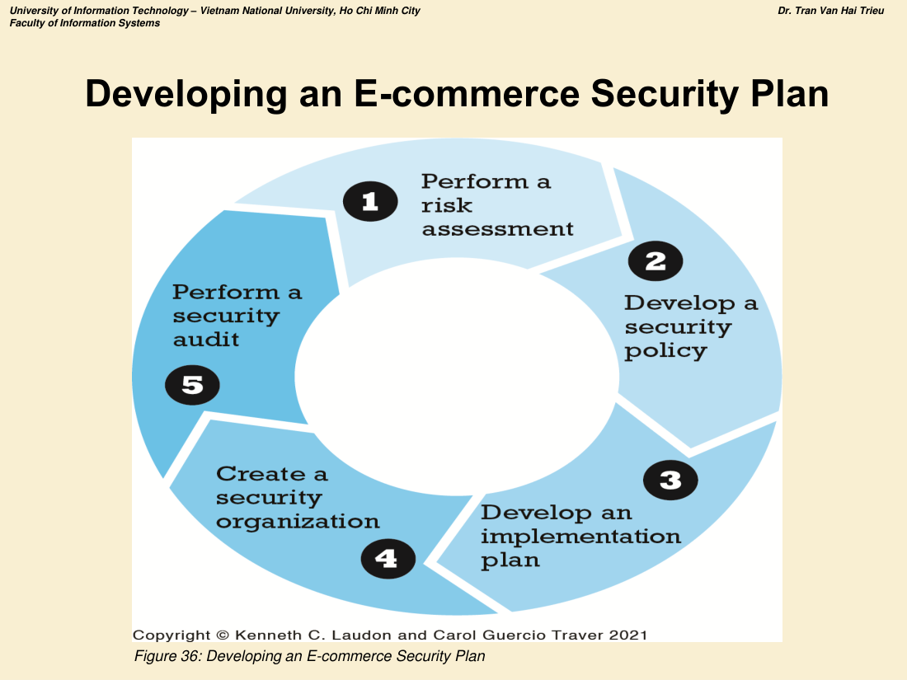

*Hình 36 — Developing an E-commerce Security Plan.*

| Bước | Nội dung | Giải thích |
|---|---|---|
| **1** | **Perform a risk assessment** | **Đánh giá rủi ro** — xác định tài sản, mối đe dọa, xác suất và mức thiệt hại |
| **2** | **Develop a security policy** | **Xây dựng chính sách an ninh** — tuyên bố về các rủi ro ưu tiên và mức chấp nhận được |
| **3** | **Develop an implementation plan** | **Xây dựng kế hoạch triển khai** — gồm **Security organization**, **Access controls**, **Authentication procedures** (kể cả **biometrics**), **Authorization policies & authorization management systems** |
| **4** | **Create a security organization** | **Thành lập bộ phận an ninh** — đào tạo, thiết lập công cụ truy cập |
| **5** | **Perform a security audit** | **Kiểm toán an ninh** — rà soát định kỳ nhật ký truy cập và đánh giá lại |

> 📌 **Đây là quy trình vòng tròn — sau audit lại quay về risk assessment.**

**Vai trò của luật pháp và chính sách công:**
- Luật cung cấp công cụ **nhận diện, truy vết, truy tố tội phạm mạng**: **USA Patriot Act**, **Homeland Security Act**.
- **Hợp tác tư nhân và công-tư:** **US-CERT**, **CERT Coordination Center**.
- **Chính sách chính phủ và kiểm soát phần mềm mã hóa:** OECD, G7/G8, Council of Europe.
- **Việt Nam: Luật An ninh mạng (Cybersecurity Law)**…

---

# PHẦN 4. HỆ THỐNG THANH TOÁN TRỰC TUYẾN

## 4.1. Các thực thể của E-payment ⭐⭐

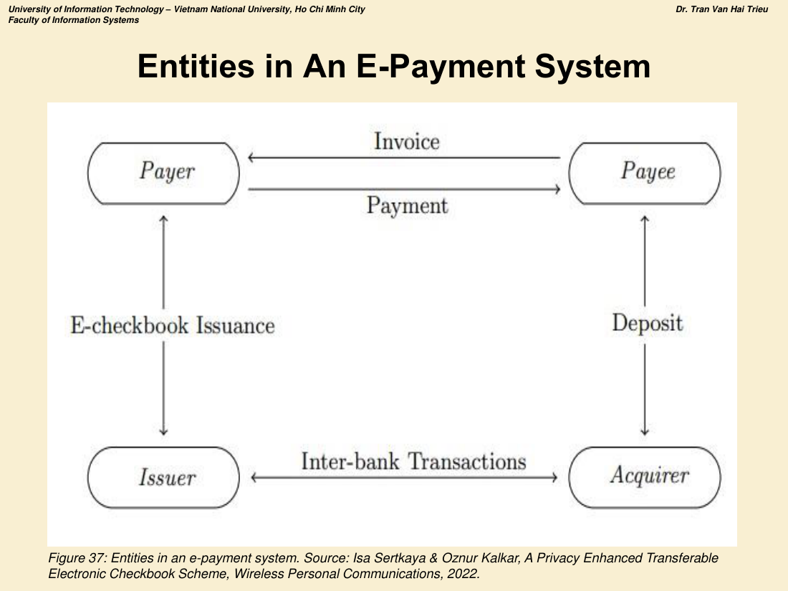

*Hình 37 — Entities in an e-payment system.*

| Thực thể | Vai trò |
|---|---|
| **Payer** (Người trả tiền) | **Người mua/khách hàng** — thực thể thực hiện thanh toán |
| **Payee** (Người nhận tiền) | **Người bán/thương nhân** — thực thể nhận thanh toán |
| **Financial institution** | **Tổ chức tài chính** (ngân hàng) — gồm **Issuer** (ngân hàng phát hành, phía người trả) và **Acquirer** (ngân hàng thanh toán, phía người nhận) |

**Các luồng trong sơ đồ:**

| Luồng | Giữa | Nội dung |
|---|---|---|
| **Invoice** | Payee → Payer | Hóa đơn |
| **Payment** | Payer → Payee | Thanh toán |
| **E-checkbook Issuance** | Issuer ↔ Payer | Phát hành sổ séc điện tử |
| **Deposit** | Payee ↔ Acquirer | Gửi tiền vào tài khoản |
| **Inter-bank Transactions** | Issuer ↔ Acquirer | Giao dịch liên ngân hàng |

> **Mục đích chính của giao thức thanh toán điện tử: chuyển giá trị tiền tệ từ Payer sang Payee.**

## 4.2. BỐN GIAI ĐOẠN CỦA E-PAYMENT ⭐⭐⭐

| Giai đoạn | Nội dung |
|---|---|
| **1. Registration** (Đăng ký) | **Payer đăng ký với Issuer** và **Payee đăng ký với Acquirer**. Hầu hết hệ thống thanh toán điện tử đều yêu cầu đăng ký để **tạo liên kết giữa danh tính và tài khoản** tại ngân hàng |
| **2. Invoicing** (Lập hóa đơn) | **Payer nhận hóa đơn thanh toán từ Payee.** Thực hiện bằng cách **duyệt và chọn sản phẩm trên website của người bán** (nếu mua qua Internet) hoặc **nhận hóa đơn điện tử qua phương tiện điện tử khác như e-mail** |
| **3. Payment selection and processing** (Chọn và xử lý thanh toán) | **Payer chọn loại hình thanh toán** (thẻ, E-cash, E-cheque…) **dựa trên loại thanh toán mà Payee chấp nhận**. Sau đó Payer **gửi thông tin thanh toán liên quan** (số tài khoản, định danh duy nhất) tới Payee **cùng số tiền đã chấp nhận theo hóa đơn** |
| **4. Payment authorization and confirmation** (Ủy quyền và xác nhận thanh toán) | **Acquirer nhận thông tin thanh toán từ Payee, ủy quyền thanh toán và phát hành biên nhận** thông báo **thành công hay thất bại** cho Payee. **Payee dựa trên thông điệp đó có thể phát hành biên nhận thanh toán cho Payer** |

## 4.3. Phân loại hệ thống thanh toán ⭐⭐

### a) Theo công cụ thanh toán (Payment instruments)
Ba công cụ thanh toán phổ biến: **cheque (séc) và card (thẻ)**…

### b) Theo thời điểm thanh toán (Payment time) ⭐⭐

| Hệ thống | Cơ chế |
|---|---|
| **Pre-paid system** (Trả trước) | **Tài khoản của Payer bị ghi nợ TRƯỚC khi giao dịch được xử lý** |
| **Pay-now system** (Trả ngay) | **Khi giao dịch điện tử được xử lý, tài khoản Payer bị ghi nợ và tài khoản Payee được ghi có** |
| **Post-pay system** (Trả sau) | **Tài khoản Payer chỉ bị ghi nợ khi Payee yêu cầu quyết toán thanh toán với Acquirer** |

### c) Ưu điểm của hệ thống online
- **Payee kết nối tới ngân hàng để có được ủy quyền thanh toán** ⇒ **tăng yêu cầu truyền thông** cho hệ thống thanh toán.
- **Payee có được bảo đảm về khoản thanh toán**, vì ngân hàng **ủy quyền và kiểm tra được khả năng chi trả trong tài khoản của Payer**.

## 4.4. GIAO THỨC SET (SECURE ELECTRONIC TRANSACTION) ⭐⭐⭐

### a) SET là gì?
> **SET** là một dạng **giao thức cho thanh toán bằng thẻ tín dụng điện tử**, dùng để **truyền thông tin thẻ tín dụng của người tiêu dùng một cách an toàn qua các kênh điện tử như Internet**.

**SET che giấu chi tiết thông tin thẻ tín dụng, ngăn người bán, hacker và kẻ trộm điện tử truy cập thông tin này.**

### b) Năm đặc tính chính của SET

1. **Confidentiality of information** — Bảo mật thông tin
2. **Integrity of data** — Toàn vẹn dữ liệu
3. **Cardholder account authentication** — Xác thực tài khoản chủ thẻ
4. **Merchant authentication** — Xác thực người bán
5. **Participants** — Các bên tham gia

### c) Sáu bên tham gia hệ thống SET ⭐

| # | Bên tham gia |
|---|---|
| 1 | **Card holder** (Chủ thẻ) |
| 2 | **Merchant** (Người bán) |
| 3 | **Issuer** (Ngân hàng phát hành thẻ) |
| 4 | **Acquirer** (Ngân hàng thanh toán của người bán) |
| 5 | **Payment gateway** (Cổng thanh toán) |
| 6 | **Certification authority** (Tổ chức chứng thực) |

### d) TRÌNH TỰ GIAO DỊCH SET (11 bước) ⭐⭐⭐

| Bước | Hoạt động |
|---|---|
| **1** | **Khách hàng mở tài khoản thẻ tín dụng** tại ngân hàng hỗ trợ thanh toán điện tử và SET |
| **2** | **Khách hàng nhận chứng thư số do ngân hàng ký** |
| **3** | **Người bán có chứng thư riêng của mình.** Khách hàng **đặt hàng** với người bán |
| **4** | **Người bán gửi cho khách hàng khóa công khai và bản sao chứng thư của mình** để khách xác minh đây là cửa hàng hợp lệ |
| **5** | **Khách hàng gửi cho người bán:**<br>• Chứng thư của mình<br>• **Chi tiết đơn hàng — đã mã hóa**<br>• **Chi tiết tài khoản ngân hàng — mã hóa bằng khóa công khai của NGÂN HÀNG** |
| **6** | **Người bán yêu cầu ủy quyền thanh toán** bằng cách gửi cho ngân hàng:<br>• **Chi tiết thanh toán mã hóa bằng khóa công khai của ngân hàng**<br>• **Chi tiết tài khoản ngân hàng của khách hàng, mã hóa bằng khóa công khai của ngân hàng** |
| **7** | ⚠️ **NGƯỜI BÁN KHÔNG BIẾT chi tiết thanh toán và tài khoản ngân hàng của khách hàng** *(đặc tính cốt lõi của SET!)* |
| **8** | **Ngân hàng gửi cho người bán xác nhận, mã hóa bằng khóa công khai của người bán** |
| **9** | **Người bán gửi cho khách hàng phản hồi của ngân hàng, mã hóa bằng khóa công khai của khách hàng** |
| **10** | **Người bán giao hàng hoặc cung cấp dịch vụ** cho khách hàng |
| **11** | **Người bán gửi cho ngân hàng yêu cầu giao dịch, mã hóa bằng khóa công khai của ngân hàng → Ngân hàng chuyển tiền cho người bán** |

### e) Ưu và nhược điểm của SET ⭐⭐

| **Ưu điểm** | **Nhược điểm** |
|---|---|
| **Đủ an toàn để bảo vệ số thẻ tín dụng và thông tin cá nhân** của người dùng khỏi tấn công | **Người dùng phải có thẻ tín dụng** |
| **Độc lập phần cứng** (hardware independent) | **Không hiệu quả về chi phí khi giá trị thanh toán nhỏ** |
| **Được dùng trên toàn thế giới** | **Không ẩn danh và có thể truy vết** (traceable) |
| Cung cấp **tính bảo mật của thông tin** | **Hiệu ứng mạng (network effect)** — cần cài phần mềm client (**e-wallet**) |
| Cung cấp **tính toàn vẹn dữ liệu** | **Chi phí và độ phức tạp cho người bán** để hỗ trợ, so với **giải pháp dựa trên SSL rẻ và đơn giản hơn** |
| Cung cấp **xác thực tài khoản chủ thẻ** | |
| Cung cấp **xác thực người bán** | |

## 4.5. HỆ THỐNG THANH TOÁN TMĐT

- Tại **Mỹ, thẻ tín dụng và thẻ ghi nợ là phương thức thanh toán trực tuyến chính**; các nước khác có hệ thống khác.
- **Hạn chế của thanh toán thẻ tín dụng trực tuyến:**
  - **Security, merchant risk** (bảo mật, rủi ro cho người bán)
  - **Cost** (chi phí)
  - **Social equity** (công bằng xã hội — không phải ai cũng có thẻ)

### CHU TRÌNH GIAO DỊCH THẺ TÍN DỤNG TRỰC TUYẾN ⭐⭐⭐

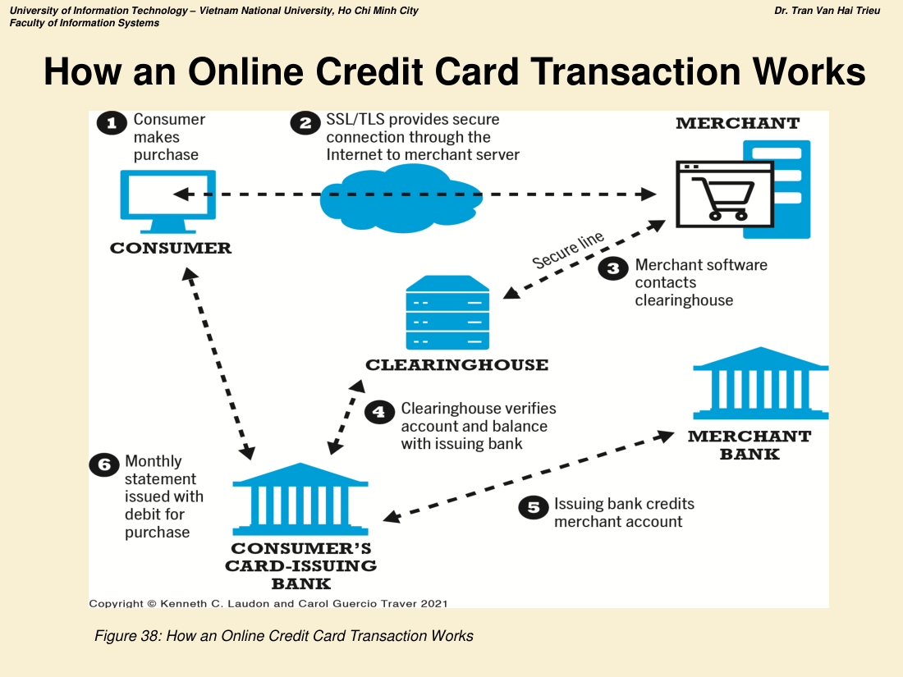

*Hình 38 — How an Online Credit Card Transaction Works.*

**SÁU BƯỚC (HỌC THUỘC ĐỂ VẼ LẠI):**

| Bước | Hoạt động |
|---|---|
| **1** | **Consumer makes purchase** — Người tiêu dùng thực hiện mua hàng |
| **2** | **SSL/TLS provides secure connection through the Internet to merchant server** — SSL/TLS cung cấp kết nối an toàn qua Internet tới máy chủ người bán |
| **3** | **Merchant software contacts clearinghouse** (qua **secure line** — đường truyền an toàn) — Phần mềm của người bán liên hệ trung tâm thanh toán bù trừ |
| **4** | **Clearinghouse verifies account and balance with issuing bank** — Clearinghouse xác minh tài khoản và số dư với ngân hàng phát hành thẻ |
| **5** | **Issuing bank credits merchant account** (qua **Merchant bank**) — Ngân hàng phát hành ghi có vào tài khoản người bán |
| **6** | **Monthly statement issued with debit for purchase** — Sao kê hằng tháng được phát hành, ghi nợ khoản mua hàng cho người tiêu dùng |

**Các bên tham gia:** **Consumer · Merchant · Clearinghouse · Consumer's card-issuing bank · Merchant bank.**

## 4.6. Các hệ thống thanh toán thay thế ⭐

| Loại | Mô tả | Ví dụ |
|---|---|---|
| **Online stored value systems** | Dựa trên **giá trị lưu trong tài khoản ngân hàng, tài khoản séc hoặc thẻ tín dụng** của người tiêu dùng | **PayPal** |
| **Khác** | — | **Amazon Pay**, **Visa Checkout**, **Mastercard MasterPass** |

**Hệ thống thanh toán di động (Mobile Payment Systems):**
- Dùng **điện thoại di động làm thiết bị thanh toán**; đã phổ biến ở **châu Âu và châu Á**, đang mở rộng ở Mỹ.
- Công nghệ: **NFC (Near Field Communication)**.
- **Ba loại ví di động:**

| Loại ví | Ví dụ |
|---|---|
| **Universal proximity mobile wallets** | **Apple Pay, Google Pay, Samsung Pay, PayPal Mobile** |
| **Branded store proximity wallets** | **Walmart, Target, Starbucks** |
| **P2P mobile payment apps** | **Zelle, Venmo** |

## 4.7. Blockchain và Tiền mã hóa ⭐⭐

### a) Blockchain
> **Blockchain** cho phép tổ chức **tạo và xác minh giao dịch gần như tức thời bằng cách dùng CSDL P2P phân tán (sổ cái phân tán — distributed ledger).**

**Lợi ích:**
- **Giảm chi phí xác minh người dùng**
- **Giảm chi phí xác thực giao dịch**
- **Giảm rủi ro của việc lưu trữ và xử lý thông tin giao dịch**

**Ứng dụng:** Là **công nghệ nền tảng cho tiền mã hóa và quản trị chuỗi cung ứng**, cũng như tiềm năng trong **dịch vụ tài chính và y tế**.

### b) Cryptocurrencies (Tiền mã hóa)
- **Dùng công nghệ blockchain và mật mã học để tạo ra một phương tiện trao đổi thuần số.**
- **Bitcoin** là ví dụ nổi bật nhất:
  - **Giá trị biến động mạnh**
  - **Vấn đề lớn về trộm cắp và gian lận**
  - **Một số chính phủ đã cấm Bitcoin**, tuy nó đang được chấp nhận dần ở Mỹ
- **Các altcoin khác:** **Ethereum/Ether, Ripple, Litecoin, Monero**.

---

## ❖ CHECKLIST ÔN CHƯƠNG 3

**Pháp luật – Thuế:**
- [ ] 4 nhóm vấn đề đạo đức; 4 quyền information privacy; GDPR
- [ ] 4 hình thức bảo hộ SHTT (Copyright/Patent/Trademark/Trade secret) + DMCA + vụ Alice 2014
- [ ] Nghị quyết 57/59/66/68; **Luật TMĐT 122/2025/QH15 hiệu lực 01/7/2026**; NĐ 52/2013 + 85/2021; NĐ 117/2025; NĐ 98/2020
- [ ] 8 loại thuế chính

**Phần mềm & Hosting:**
- [ ] **SDLC 5 bước** + best practices
- [ ] **Bảng Business objective – System functionality – Information requirements** (10 dòng)
- [ ] **DFD website đơn giản** (vẽ lại được)
- [ ] Ma trận Build × Host (4 ô)
- [ ] 5 loại testing; kiến trúc 2-tier vs multi-tier (3 lớp)
- [ ] 16 tính năng gây khó chịu + 8 yếu tố thiết kế thành công
- [ ] 4 loại phần mềm m-commerce; 4 đặc điểm riêng của mobile; RWD vs AWD
- [ ] **Quy trình 7 bước mua hàng qua shopping cart** ⭐
- [ ] 3 loại phần mềm giỏ hàng
- [ ] **CRM: 4 giai đoạn (gather – store – analyze – recommend)** ⭐
- [ ] **SCM: upstream/downstream; sơ đồ thành viên chuỗi; chuỗi B2B Company** ⭐
- [ ] **PUSH vs PULL (bảng 3 dòng: aim / characteristics / use of IS)** ⭐⭐
- [ ] **Chuỗi giá trị truyền thống vs sửa đổi** ⭐
- [ ] **IS infrastructure cho SCM (planning – DB – execution)** ⭐
- [ ] 5 lợi ích của IS cho SCM
- [ ] **E-procurement: định nghĩa, 5 rights, quy trình 8 bước, 3 mô hình, rủi ro, triển khai** ⭐⭐⭐
- [ ] **ERP + EDI (Internet EDI / VAN)** ⭐
- [ ] 5 loại web hosting

**An ninh:**
- [ ] **6 chiều an ninh × 2 góc nhìn** ⭐⭐
- [ ] 3 điểm yếu; **sơ đồ giao dịch TMĐT và các điểm tấn công** ⭐⭐
- [ ] Các loại tấn công (phishing, DoS/DDoS, MITM, SQLi, spoofing, pharming, insider…)
- [ ] Mã hóa: đối xứng vs khóa công khai; chữ ký số; digital envelope; PKI + 3 hạn chế
- [ ] **Kế hoạch an ninh 5 bước** ⭐⭐

**Thanh toán:**
- [ ] Payer/Payee/Issuer/Acquirer + 5 luồng
- [ ] **4 giai đoạn E-payment** ⭐⭐
- [ ] Pre-paid / Pay-now / Post-pay
- [ ] **SET: 6 bên, 11 bước, ưu – nhược** ⭐⭐
- [ ] **6 bước giao dịch thẻ tín dụng trực tuyến** ⭐⭐
- [ ] Blockchain + cryptocurrency
