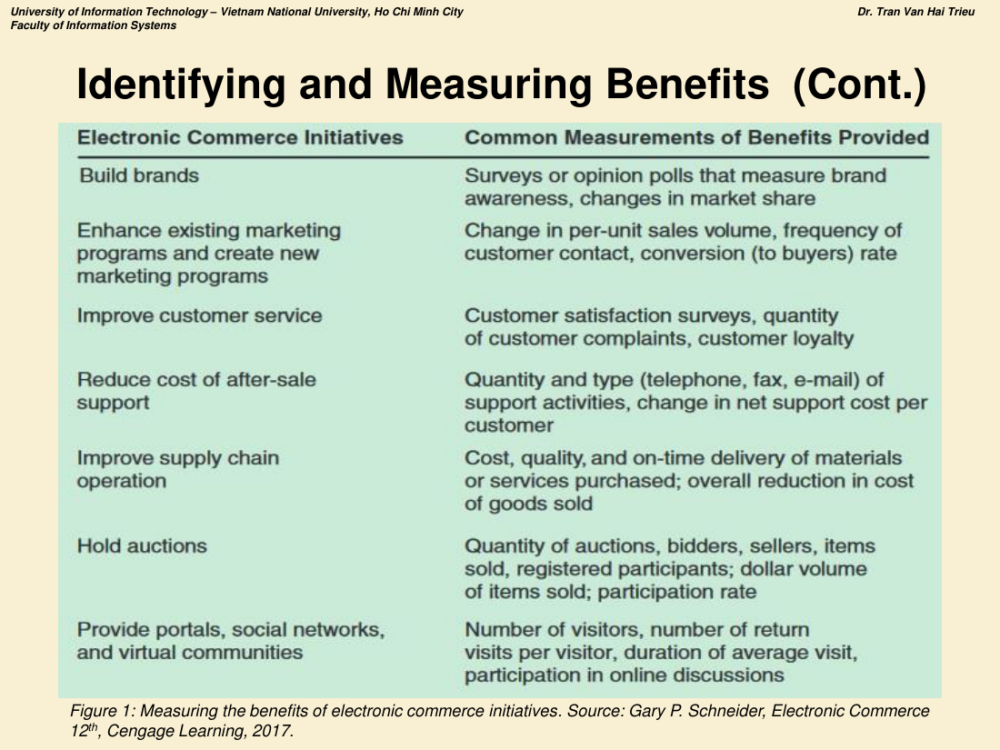
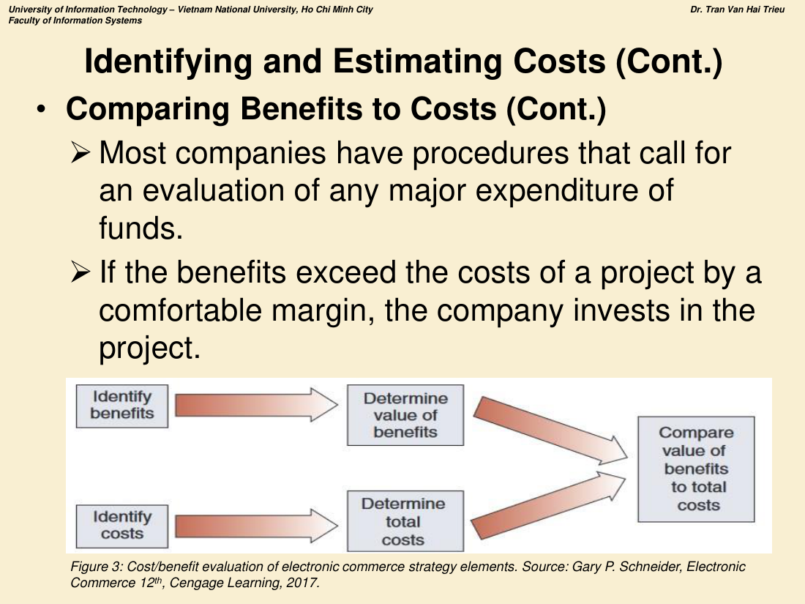

# CHƯƠNG 4 — XÁC ĐỊNH VÀ TRIỂN KHAI E-BUSINESS

> **Nội dung chương (3 phần):**
> 1. Xác định lợi ích và ước tính chi phí của các sáng kiến E-business
> 2. Chiến lược phát triển website
> 3. Quản trị thực thi TMĐT (E-commerce enforcement management)

---

# PHẦN 1. XÁC ĐỊNH LỢI ÍCH VÀ ƯỚC TÍNH CHI PHÍ

## 1.1. Xác định mục tiêu (Identifying Objectives) ⭐⭐

Doanh nghiệp triển khai sáng kiến TMĐT vì nhiều lý do khác nhau. **Sáu mục tiêu điển hình:**

| # | Mục tiêu |
|---|---|
| 1 | **Increasing sales in existing markets** — Tăng doanh số ở thị trường hiện có |
| 2 | **Opening new markets** — Mở thị trường mới |
| 3 | **Serving existing customers better** — Phục vụ khách hàng hiện tại tốt hơn |
| 4 | **Identifying new vendors** — Tìm nhà cung cấp mới |
| 5 | **Coordinating with existing vendors** — Phối hợp với nhà cung cấp hiện có |
| 6 | **Recruiting employees more effectively** — Tuyển dụng hiệu quả hơn |

## 1.2. Liên kết mục tiêu với chiến lược kinh doanh ⭐⭐

| Loại chiến lược | Nội dung |
|---|---|
| **Downstream strategies** (Chiến lược hạ nguồn) | Các chiến thuật nhằm **cải thiện giá trị doanh nghiệp mang lại cho KHÁCH HÀNG** |
| **Upstream strategies** (Chiến lược thượng nguồn) | Các chiến thuật nhằm **giảm chi phí hoặc tạo giá trị bằng cách làm việc với NHÀ CUNG CẤP** hoặc các nhà cung cấp dịch vụ vận chuyển, giao nhận đầu vào |

> Web là **kênh bán hàng hấp dẫn**; tuy nhiên doanh nghiệp dùng TMĐT để làm **nhiều hơn là bán hàng** — họ dùng Web để **bổ trợ cho chiến lược kinh doanh và cải thiện vị thế cạnh tranh**.

**Mười cơ hội kinh doanh trực tuyến:**

1. **Building brands** — Xây dựng thương hiệu
2. **Enhancing existing marketing programs** — Nâng cao các chương trình marketing hiện có
3. **Selling products and services** — Bán sản phẩm và dịch vụ
4. **Selling advertising** — Bán quảng cáo
5. **Developing a better understanding of customer needs** — Hiểu rõ hơn nhu cầu khách hàng
6. **Improving after-sale service and support** — Cải thiện dịch vụ và hỗ trợ sau bán
7. **Purchasing products and services** — Mua sản phẩm và dịch vụ
8. **Managing supply chains** — Quản trị chuỗi cung ứng
9. **Operating auctions** — Vận hành đấu giá
10. **Building or using virtual communities** để duy trì quan hệ với khách hàng và nhà cung cấp

## 1.3. Xác định và đo lường lợi ích ⭐⭐⭐

**Nguyên tắc:**
- Một số lợi ích **rõ ràng, hữu hình, dễ đo** (tăng doanh số, giảm chi phí).
- Một số lợi ích **vô hình, khó xác định và đo lường hơn nhiều** (tăng sự hài lòng khách hàng).
- **Khi xác định lợi ích, nhà quản lý phải cố gắng đặt ra những mục tiêu ĐO LƯỜNG ĐƯỢC, ngay cả với lợi ích vô hình.**

**Ví dụ cách "đo lường cái vô hình":**
- Thành công của mục tiêu **tăng sự hài lòng khách hàng** có thể đo bằng **số khách hàng mua lần đầu quay lại và mua tiếp**.
- Doanh nghiệp tạo website để **xây thương hiệu hoặc nâng cao chương trình marketing** có thể đặt mục tiêu về **tăng nhận biết thương hiệu**, đo bằng **nghiên cứu thị trường và thăm dò ý kiến**.
- Doanh nghiệp bán hàng/dịch vụ online có thể **đo mức tăng sản lượng bán**.
- **Đội nghiên cứu marketing hoặc công ty tư vấn bên ngoài** có thể giúp xác định tác động cụ thể của các sáng kiến marketing/bán hàng trực tuyến, và giúp **đặt và đánh giá mục tiêu cụ thể**.
- Doanh nghiệp muốn dùng website để **cải thiện dịch vụ hoặc hỗ trợ sau bán** có thể đặt mục tiêu **tăng sự hài lòng hoặc giảm chi phí cung cấp dịch vụ/hỗ trợ khách hàng**.

### BẢNG ĐO LƯỜNG LỢI ÍCH CỦA CÁC SÁNG KIẾN TMĐT ⭐⭐⭐



*Hình 1 — Measuring the benefits of electronic commerce initiatives (Schneider, Electronic Commerce 12th).*

| **Sáng kiến TMĐT** | **Thước đo lợi ích thường dùng** |
|---|---|
| **Build brands** (Xây dựng thương hiệu) | **Khảo sát hoặc thăm dò ý kiến** đo **nhận biết thương hiệu**, **thay đổi thị phần** |
| **Enhance existing marketing programs and create new marketing programs** (Nâng cao và tạo mới chương trình marketing) | **Thay đổi sản lượng bán trên đơn vị**, **tần suất tiếp xúc khách hàng**, **tỷ lệ chuyển đổi thành người mua (conversion rate)** |
| **Improve customer service** (Cải thiện dịch vụ khách hàng) | **Khảo sát hài lòng khách hàng**, **số lượng khiếu nại**, **lòng trung thành của khách hàng** |
| **Reduce cost of after-sale support** (Giảm chi phí hỗ trợ sau bán) | **Số lượng và loại hoạt động hỗ trợ** (điện thoại, fax, e-mail), **thay đổi chi phí hỗ trợ ròng trên mỗi khách hàng** |
| **Improve supply chain operation** (Cải thiện vận hành chuỗi cung ứng) | **Chi phí, chất lượng và mức giao hàng đúng hạn** của vật tư/dịch vụ mua vào; **mức giảm tổng thể trong giá vốn hàng bán (COGS)** |
| **Hold auctions** (Tổ chức đấu giá) | **Số lượng phiên đấu giá, số người đặt giá và người bán, số món hàng bán được, số người tham gia đã đăng ký; giá trị bằng tiền của hàng đã bán; tỷ lệ tham gia** |
| **Provide portals, social networks, and virtual communities** | **Số khách truy cập, số lượt quay lại trên mỗi khách, thời lượng trung bình mỗi lượt truy cập, mức tham gia thảo luận trực tuyến** |

**Các thước đo khác:**
- **Nhà quản trị chuỗi cung ứng** có thể đo **mức giảm chi phí cung ứng, cải thiện chất lượng, hoặc giao hàng nhanh hơn**.
- **Site đấu giá** có thể đặt mục tiêu về **số phiên đấu giá, số người đặt giá và bán, giá trị bằng tiền các món hàng bán được**.
- **Cộng đồng ảo và cổng web** đo **số khách truy cập** và cố gắng đo **chất lượng trải nghiệm của khách**.

## 1.4. Xác định và ước tính chi phí ⭐⭐⭐

### a) Total Cost of Ownership (TCO) — Tổng chi phí sở hữu

> Ngoài chi phí phần cứng và phần mềm, **ngân sách dự án phải bao gồm chi phí tuyển dụng, đào tạo và trả lương cho người thiết kế website, viết hoặc tùy biến phần mềm, tạo nội dung, vận hành và bảo trì site.**

Nhiều tổ chức nay **theo dõi chi phí theo hoạt động** và tính **tổng chi phí cho mỗi hoạt động** — đó chính là **TCO**, bao gồm **toàn bộ chi phí liên quan tới hoạt động đó**.

**TCO của một triển khai TMĐT bao gồm:**

| Nhóm chi phí | Chi tiết |
|---|---|
| **Hardware** | Server computers, routers, **firewalls**, **load-balancing devices** |
| **Software** | License cho hệ điều hành, phần mềm web server, phần mềm CSDL, phần mềm ứng dụng |
| **Internet connections** | Kết nối Internet |
| **Design work outsourced** | Thiết kế thuê ngoài |
| **Salaries and benefits** | Lương và phúc lợi cho nhân viên tham gia dự án |
| **Maintenance costs** | Chi phí duy trì site sau khi vận hành |

### b) Opportunity Cost (Chi phí cơ hội) ⭐⭐

> Với nhiều công ty, **một trong những chi phí lớn nhất và quan trọng nhất liên quan tới sáng kiến TMĐT chính là CƠ HỘI BỊ MẤT DO KHÔNG TRIỂN KHAI sáng kiến đó.**

- Nhà quản lý và kế toán dùng thuật ngữ **opportunity cost** để mô tả **các lợi ích bị mất do một hành động KHÔNG được thực hiện**.
- **Ví dụ:** **giá trị của khách hàng không có được, doanh số không thực hiện được, nhà cung cấp không tìm ra, hoặc mức giảm chi phí không đạt được trong chuỗi cung ứng.**

### c) Chi phí website
> **Chi phí vận hành hằng năm của một website kinh doanh trực tuyến thường nằm trong khoảng 50–200% chi phí ban đầu của site.**

### d) Cấp vốn cho start-up trực tuyến ⭐

- Các công ty khởi nghiệp trực tuyến **nhìn chung KHÔNG thể vay ngân hàng hay phát hành trái phiếu/cổ phiếu cho nhà đầu tư**:
  - **Ngân hàng ngại cho vay chỉ dựa trên một ý tưởng tốt**
  - **Tiếp cận thị trường chứng khoán và trái phiếu bị giới hạn** cho các công ty có **bề dày lợi nhuận lâu dài**

| Nguồn vốn | Đặc điểm |
|---|---|
| **Angel investors** (Nhà đầu tư thiên thần) | **Cấp vốn khởi nghiệp ban đầu và trở thành cổ đông**. **Trong nhiều trường hợp, angel investor cuối cùng sở hữu phần lớn hơn cả nhà sáng lập** |
| **Venture capitalists** (Nhà đầu tư mạo hiểm) | **Cá nhân rất giàu, nhóm cá nhân giàu, hoặc quỹ đầu tư**, đầu tư **số tiền lớn** với kỳ vọng trong vài năm công ty sẽ **đủ lớn để bán cổ phiếu ra công chúng** trong một sự kiện gọi là **IPO (initial public offering)** |

### e) So sánh lợi ích với chi phí ⭐⭐⭐



*Hình 3 — Cost/benefit evaluation of electronic commerce strategy elements.*

**Quy trình đánh giá chi phí – lợi ích (5 bước):**

```
[Identify benefits] ──→ [Determine value of benefits] ──┐
                                                          ├──→ [Compare value of benefits to total costs]
[Identify costs] ──────→ [Determine total costs] ────────┘
```

| Bước | Nội dung |
|---|---|
| **1** | **Identify benefits** — Xác định lợi ích (kể cả **vô hình** như **sự hài lòng của nhân viên và uy tín công ty**) |
| **2** | **Identify costs** — Xác định chi phí |
| **3** | **Determine value of benefits** — Định lượng giá trị lợi ích |
| **4** | **Determine total costs** — Xác định tổng chi phí cần để tạo ra các lợi ích đó |
| **5** | **Compare value of benefits to total costs** — So sánh và **đánh giá xem giá trị lợi ích có vượt tổng chi phí không** |

- **Hầu hết công ty đều có quy trình đánh giá mọi khoản chi lớn.**
- **Nếu lợi ích vượt chi phí với biên độ an toàn, công ty sẽ đầu tư vào dự án.**

### f) Return on Investment (ROI) ⭐⭐

- **Kỹ thuật ROI cung cấp một biểu diễn ĐỊNH LƯỢNG về việc lợi ích của một khoản đầu tư có vượt chi phí hay không (bao gồm cả chi phí cơ hội).**
- Gọi là **ROI technique** vì chúng **đo lượng thu nhập (return) mà một khoản chi hiện tại (investment) sẽ mang lại**.

**Các kỹ thuật hoạch định vốn (Capital budgeting techniques):**

| Kỹ thuật | Tên đầy đủ |
|---|---|
| **PBP** | **Payback method** — Phương pháp thời gian hoàn vốn |
| **NPV** | **Net present value method** — Phương pháp giá trị hiện tại ròng |
| **IRR** | **Internal rate of return method** — Phương pháp tỷ suất hoàn vốn nội bộ |

**Ví dụ thực tế — Cisco Systems:**
- Cisco tạo **diễn đàn khách hàng trực tuyến** để khách hàng thảo luận vấn đề sản phẩm với nhau.
- **Lợi ích chính:** **giảm chi phí dịch vụ khách hàng** và **tăng sự hài lòng của khách hàng** về tính sẵn có của thông tin sản phẩm.

---

# PHẦN 2. CHIẾN LƯỢC PHÁT TRIỂN WEBSITE

## 2.1. Phát triển nội bộ hay thuê ngoài? ⭐⭐⭐

### a) The Internal Team (Đội nội bộ)

- **Bước đầu tiên** để quyết định phần nào của dự án TMĐT cần thuê ngoài là **thành lập một đội nội bộ (internal team)**.
- Đội này phải có **thành viên hiểu biết đủ về công nghệ để biết những gì là khả thi**.
- Đội nội bộ phải **chịu trách nhiệm cho toàn bộ sáng kiến TMĐT — từ đặt mục tiêu tới triển khai và vận hành site cuối cùng**.
- ⚠️ **Sai lầm thường gặp:** một số công ty **bổ nhiệm trưởng dự án TMĐT là một người kỹ thuật KHÔNG hiểu nhiều về kinh doanh và không được biết đến rộng rãi trong công ty.**
  - **Trưởng dự án cần hiểu rõ mục tiêu và văn hóa công ty** để quản lý triển khai hiệu quả.

### b) Ba mô hình thuê ngoài ⭐⭐⭐

| Mô hình | Cơ chế | Ưu điểm |
|---|---|---|
| **Early Outsourcing** (Thuê ngoài sớm) | Công ty **thuê ngoài việc thiết kế và phát triển site ban đầu để khởi động dự án nhanh**. Đội thuê ngoài sau đó **đào tạo nhân sự HTTT của công ty về công nghệ mới trước khi bàn giao việc vận hành site cho họ** | **Vận hành site TMĐT có thể NHANH CHÓNG trở thành lợi thế cạnh tranh** cho công ty |
| **Late Outsourcing** (Thuê ngoài muộn) | **Nhân sự HTTT của công ty tự thiết kế và phát triển ban đầu, triển khai và vận hành** cho tới khi hệ thống trở thành một phần ổn định của hoạt động kinh doanh. Sau khi đã đạt được lợi thế cạnh tranh, **việc bảo trì hệ thống được thuê ngoài** | Chuyên gia của công ty **được giải phóng để phát triển công nghệ mới nhằm tạo thêm lợi thế cạnh tranh** |
| **Partial Outsourcing** (Thuê ngoài một phần) | Trong hai mô hình trên, **MỘT nhóm chịu trách nhiệm cho toàn bộ thiết kế, phát triển và vận hành** — trong hoặc ngoài công ty. Mô hình này phù hợp cho nhiều dự án HTTT, **nhưng sáng kiến TMĐT cũng có thể hưởng lợi từ thuê ngoài MỘT PHẦN** | **Ví dụ:** nhiều website nhỏ **thuê ngoài chức năng xử lý và phản hồi e-mail**; một số công ty chuyên cung cấp **e-mail auto-response**. Một dạng khác là **thuê ngoài xử lý thanh toán** — nhiều nhà cung cấp sẵn sàng xử lý trọn gói thanh toán của khách hàng |

## 2.2. Vườn ươm doanh nghiệp (Incubators) ⭐⭐

> **Incubator** là một công ty **cung cấp cho các start-up một địa điểm vật lý với văn phòng, hỗ trợ kế toán và pháp lý, máy tính và kết nối Internet với chi phí hằng tháng rất thấp.**

- Đôi khi incubator còn cung cấp **vốn mồi (seed money)**, **tư vấn quản trị** và **hỗ trợ marketing**.
- **Đổi lại, incubator nhận một phần sở hữu trong công ty, thường từ 10% tới 50%.**
- Khi công ty phát triển đến mức có thể **huy động vốn đầu tư mạo hiểm hoặc phát hành cổ phiếu ra công chúng**, **incubator bán toàn bộ hoặc một phần cổ phần của mình và tái đầu tư vào một ứng viên incubator mới.**
- Một số công ty đã tạo **internal incubators (vườn ươm nội bộ)** để phát triển công nghệ dùng trong hoạt động kinh doanh.
- Các ý tưởng kinh doanh phát triển trong incubator **cuối cùng được tách ra thành công ty riêng biệt**, sở hữu các tài sản dùng để tạo ra ý tưởng hoặc sản phẩm đó.

---

# PHẦN 3. QUẢN TRỊ THỰC THI TMĐT

## 3.1. Quản lý một triển khai TMĐT phức tạp như thế nào? ⭐

> **Cách tốt nhất để quản lý bất kỳ triển khai TMĐT phức tạp nào là sử dụng các KỸ THUẬT QUẢN TRỊ CHÍNH THỨC (formal management techniques).**

**Bốn phương pháp doanh nghiệp dùng để quản lý hiệu quả dự án TMĐT:**
1. **Project management** — Quản trị dự án
2. **Project portfolio management** — Quản trị danh mục dự án
3. **Specific staffing** — Bố trí nhân sự cụ thể
4. **Post-implementation audits** — Kiểm toán sau triển khai

## 3.2. Quản trị dự án (Project Management) ⭐⭐

> **Project management** là **tập hợp các kỹ thuật chính thức để lập kế hoạch và kiểm soát các hoạt động được thực hiện nhằm đạt một mục tiêu cụ thể.**

**Kế hoạch dự án bao gồm tiêu chí về BA yếu tố: COST (chi phí), SCHEDULE (tiến độ), PERFORMANCE (hiệu năng)** — giúp quản lý dự án **đưa ra quyết định đánh đổi (trade-off) thông minh giữa ba tiêu chí này**.

> **Ví dụ đánh đổi:** Nếu dự án cần **hoàn thành sớm hơn**, quản lý dự án có thể **nén tiến độ bằng cách (a) TĂNG chi phí hoặc (b) GIẢM hiệu năng.**

**Phần mềm quản trị dự án:**
- Quản lý dự án dùng **project management software** (ví dụ **Microsoft Project**) — cung cấp nhiều công cụ tích hợp để **quản lý nguồn lực và tiến độ**.
- Phần mềm giúp **quản lý các tác vụ giao cho tư vấn, đối tác công nghệ, nhà cung cấp dịch vụ thuê ngoài**…
- Quản lý dự án có thể **cập nhật ước tính chi phí và thời gian hoàn thành cho các tác vụ tương lai**.

## 3.3. Quản trị danh mục dự án (Project Portfolio Management) ⭐⭐

> **Project portfolio management** là kỹ thuật trong đó **từng dự án được giám sát** (như một khoản mục trong danh mục).

- Tổ chức lớn thường có **nhiều dự án triển khai CNTT diễn ra đồng thời**, một số là triển khai hoặc nâng cấp TMĐT.
- **Nhà quản lý công nghệ cao nhất của công ty là CIO (Chief Information Officer)**.
- CIO của một số công ty lớn nay dùng **cách tiếp cận danh mục** để quản lý nhiều dự án này.
- **Hầu hết phần mềm quản trị dự án được thiết kế cho từng dự án riêng lẻ và KHÔNG hợp nhất tốt các hoạt động xuyên nhiều dự án.**
- **Thông tin dùng trong quản trị danh mục KHÁC với thông tin dùng để quản lý từng dự án cụ thể.**
- Trong project portfolio management, **CIO gán một thứ hạng (ranking) cho mỗi dự án dựa trên: (1) TẦM QUAN TRỌNG với mục tiêu chiến lược của doanh nghiệp và (2) MỨC RỦI RO (xác suất thất bại).**

## 3.4. Bố trí nhân sự cho TMĐT (Staffing) ⭐⭐⭐

Bất kể đội nội bộ có quyết định thuê ngoài phần nào của thiết kế và triển khai hay không, **đội phải xác định nhu cầu nhân sự** cho sáng kiến TMĐT.

**Các vị trí nhân sự quan trọng nhất:**

| # | Vị trí | Trách nhiệm |
|---|---|---|
| **1** | **Chief Information Officer (CIO)** | Ngoài triển khai dự án CNTT, chịu trách nhiệm **giám sát toàn bộ hệ thống thông tin và các yếu tố công nghệ liên quan** cần để thực hiện và vận hành hoạt động kinh doanh trực tuyến. **Góc nhìn mang tính CHIẾN LƯỢC**; thường là **người ủng hộ quan trọng cho các sáng kiến kinh doanh trực tuyến**. Phải có **nhiều năm kinh nghiệm ở vị trí quản lý** |
| **2** | **Business manager** | Phải là **thành viên của đội nội bộ đặt ra mục tiêu dự án**. Chịu trách nhiệm **thực hiện các thành tố của kế hoạch kinh doanh và đạt các mục tiêu do đội nội bộ đặt ra**. Phải có **kinh nghiệm và kiến thức liên quan tới hoạt động kinh doanh đang được triển khai trên site**. *(Ví dụ: nếu quản lý một site bán lẻ cho người tiêu dùng thì phải có kinh nghiệm quản lý hoạt động bán lẻ.)* |
| **3** | **Project manager** | Người có **đào tạo hoặc kỹ năng cụ thể về theo dõi chi phí và việc hoàn thành các mục tiêu cụ thể trong dự án**. Nhiều người được **chứng nhận bởi các tổ chức như Project Management Institute (PMI)** và có kỹ năng dùng phần mềm quản trị dự án |
| **4** | **Project portfolio manager** | Thường được **thăng tiến từ hàng ngũ project manager**; chịu trách nhiệm **theo dõi toàn bộ các dự án đang diễn ra và quản lý chúng như một danh mục**. Là người **thực hiện các đánh đổi về chi phí, tiến độ và chất lượng XUYÊN các dự án** và **cân bằng nhu cầu của tổ chức với nguồn lực dành cho tất cả các dự án** |
| **5** | **Applications specialists** | Khi ngày càng nhiều nhà cung cấp bán giải pháp phần mềm đóng gói cho TMĐT, công ty cần nhân sự HTTT **cài đặt và bảo trì phần mềm**. Hầu hết doanh nghiệp lớn có **applications specialists** bảo trì phần mềm kế toán, nhân sự và logistics. Tương tự, site TMĐT mua phần mềm xử lý **catalogue, xử lý thanh toán** cần applications specialists bảo trì |
| **6** | **Social networking administrator** | Chịu trách nhiệm **quản lý các yếu tố cộng đồng ảo trong hoạt động Web**. Có thể có nền tảng công nghệ, bán hàng, dịch vụ khách hàng, **hoặc các ngành rất khác như xã hội học hay nhân học**. Phải **điều phối mọi công nghệ làm site vận hành như một mạng xã hội theo cách tạo ra giá trị cho tổ chức** |
| **7** | **Customer service reps / Call center** | **Call center** là công ty **xử lý cuộc gọi điện thoại và e-mail đến từ khách hàng thay cho công ty khác**. Một số call center làm việc với nhiều doanh nghiệp; số khác **chuyên về một lĩnh vực** (ví dụ: hợp đồng với nhà sản xuất phần mềm để hỗ trợ cài đặt sản phẩm) |
| **8** | **Systems administrator** | Chịu trách nhiệm **vận hành hệ thống một cách đáng tin cậy và an toàn**. Nếu vận hành site được thuê ngoài cho nhà cung cấp dịch vụ thì nhà cung cấp đảm nhiệm chức năng này. **Systems administrator nội bộ cần đủ nhân sự để duy trì vận hành 24/7 và bảo mật site** |
| **9** | **Network operators** | Chức năng gồm **ước tính và giám sát tải (load estimation and load monitoring)**, **xử lý sự cố mạng**, **thiết kế và triển khai công nghệ chống lỗi (fault-resistant technologies)** |
| **10** | **Database administrator** | Hầu hết site TMĐT cần chức năng quản trị CSDL để hỗ trợ **xử lý giao dịch, nhập đơn hàng, quản lý yêu cầu (inquiry management), logistics giao hàng**. Cần **CSDL sẵn có để tích hợp** hoặc **CSDL riêng cho sáng kiến TMĐT**. Cần **DBA quản lý hiệu quả việc thiết kế và triển khai chức năng này** |

**Các vị trí khác:** Web programmers · Web graphics designers · Content creators · Online marketing managers.

## 3.5. Kiểm toán sau triển khai (Post-implementation Audits) ⭐⭐⭐

> **Post-implementation audit** (còn gọi **post-audit review**) là **một cuộc rà soát chính thức về một dự án SAU KHI dự án đã hoạt động.**

**Mục đích:** cho nhà quản lý cơ hội **xem xét lại các MỤC TIÊU, ĐẶC TẢ HIỆU NĂNG, ƯỚC TÍNH CHI PHÍ và LỊCH GIAO HÀNG đã được thiết lập cho dự án trong giai đoạn lập kế hoạch, rồi SO SÁNH với những gì thực sự đã xảy ra.**

**Kết quả của audit:** một **báo cáo toàn diện** phân tích:
1. **Hiệu quả tổng thể của dự án**
2. **Dự án được quản trị tốt tới mức nào**
3. **Cấu trúc tổ chức có phù hợp với dự án không**
4. **Hiệu quả cụ thể của (các) đội dự án**

- **Nhiều công ty điều chỉnh cấu trúc tổ chức quản trị dự án của mình sau mỗi dự án** dựa trên nội dung báo cáo post-audit.
- **Mỗi phần của báo cáo phải SO SÁNH KẾT QUẢ THỰC TẾ VỚI MỤC TIÊU CỦA DỰ ÁN.**

## 3.6. Quản trị thay đổi (Change Management) ⭐⭐⭐

**Vấn đề:**
- **Mọi dự án hệ thống thông tin đều bao hàm THAY ĐỔI, và thay đổi có thể gây xáo trộn cho con người.**
- Khi thay đổi được đưa vào nơi làm việc, **nhân viên lo lắng về khả năng đối phó với thay đổi và khả năng tiếp tục làm việc tốt.**
- **Nhân viên thường lo mất việc làm.** Những lo lắng này dẫn tới **tăng căng thẳng, gây hại cho tinh thần và hiệu quả công việc.**

**Chiến lược quản trị thay đổi — TRUYỀN THÔNG về sự cần thiết phải thay đổi:**

| # | Chiến lược |
|---|---|
| 1 | **Cho phép nhân viên THAM GIA vào quá trình ra quyết định dẫn tới thay đổi** |
| 2 | **Cho phép nhân viên THAM GIA lập kế hoạch cho thay đổi và các vấn đề khác** |

> **Các biện pháp này giúp nhân viên vượt qua CẢM GIÁC BẤT LỰC (powerlessness) — thứ có thể dẫn tới căng thẳng và giảm hiệu quả công việc.**

---

## ❖ CHECKLIST ÔN CHƯƠNG 4

- [ ] **6 mục tiêu TMĐT điển hình**
- [ ] **Downstream vs Upstream strategies** + 10 cơ hội kinh doanh trực tuyến
- [ ] **Bảng đo lường lợi ích (7 sáng kiến × thước đo)** ⭐⭐
- [ ] Nguyên tắc: **lợi ích vô hình cũng phải đặt mục tiêu ĐO LƯỜNG ĐƯỢC**
- [ ] **TCO** — gồm những khoản nào
- [ ] **Opportunity cost** — định nghĩa + 4 ví dụ
- [ ] Chi phí vận hành hằng năm = **50–200%** chi phí ban đầu
- [ ] **Angel investors vs Venture capitalists + IPO**
- [ ] **Quy trình 5 bước so sánh lợi ích và chi phí** (vẽ được sơ đồ)
- [ ] **ROI + PBP / NPV / IRR**; ví dụ Cisco
- [ ] **Early / Late / Partial Outsourcing** — so sánh 3 mô hình ⭐⭐
- [ ] **Incubator** — định nghĩa, đổi lại 10–50% sở hữu, internal incubator
- [ ] **Project management: 3 tiêu chí COST–SCHEDULE–PERFORMANCE và đánh đổi**
- [ ] **Project portfolio management: CIO xếp hạng theo TẦM QUAN TRỌNG CHIẾN LƯỢC và MỨC RỦI RO**
- [ ] **10 vị trí nhân sự TMĐT** (đặc biệt CIO, business manager, project manager, portfolio manager)
- [ ] **Post-implementation audit — so sánh mục tiêu / hiệu năng / chi phí / tiến độ với thực tế; 4 nội dung báo cáo**
- [ ] **Change management — nguyên nhân kháng cự và 2 chiến lược tham gia**
