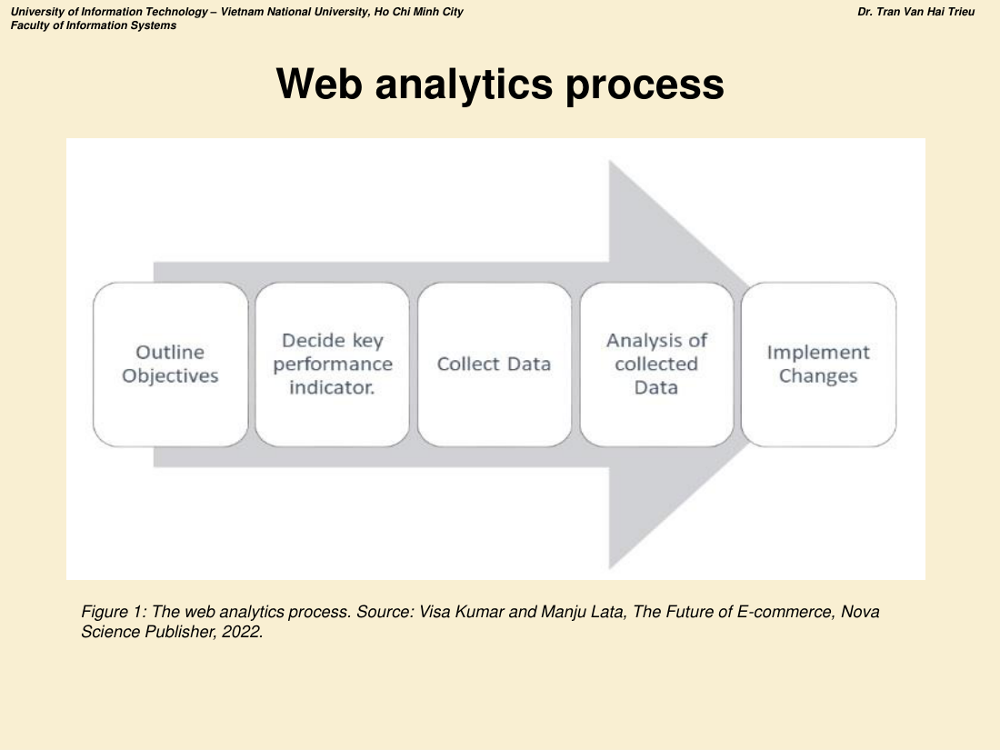
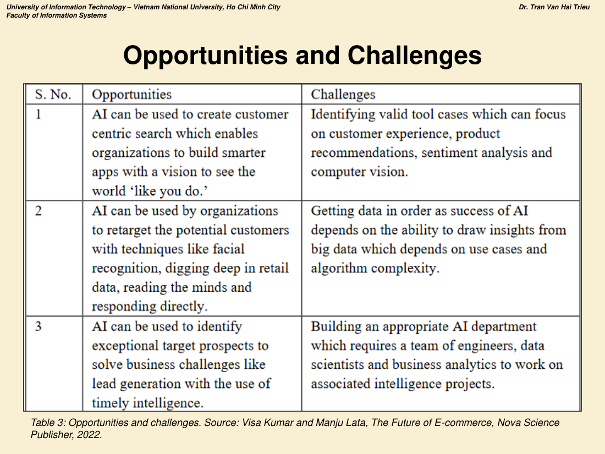
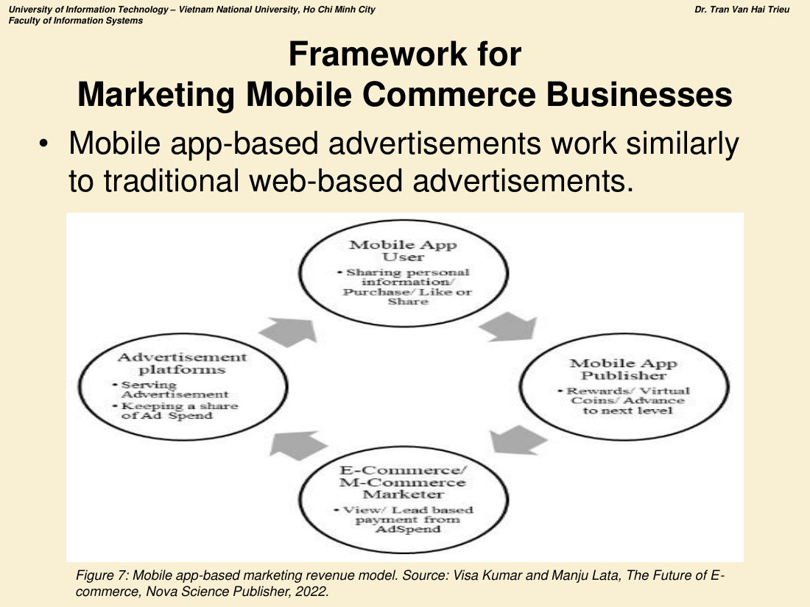

# CHƯƠNG 5 — CÁC NGHIÊN CỨU ĐƯƠNG ĐẠI VỀ E-BUSINESS

> **Nội dung chương (6 phần):**
> 1. Tương lai của E-business
> 2. Web Analytics: Hiện tại và tương lai của E-business
> 3. Social Media Analytics cho E-business
> 4. Trí tuệ nhân tạo (AI) và E-business
> 5. Ứng dụng Machine Learning trong TMĐT
> 6. Phân tích cơ hội cho Thương mại di động (M-commerce)

---

# PHẦN 1. TƯƠNG LAI CỦA E-BUSINESS

## 1.1. Sự phát triển của công nghệ mới

- Ngành e-business và e-commerce **được dẫn dắt bởi sự phát triển và ứng dụng công nghệ**.
- **Tương lai của e-business sẽ được đặc trưng bởi cạnh tranh giữa các tổ chức xoay quanh KHẢ NĂNG TỐI ĐA HÓA HIỆU QUẢ THÔNG QUA TÍCH HỢP HẠ TẦNG CNTT.**

## 1.2. Thay đổi của ngành (Industry changes) ⭐

- Các ngành như **truyền thông – giải trí, bán lẻ, sản xuất và viễn thông** đã chịu **thay đổi triệt để (radical change)** do phát triển của CNTT, công nghệ số và Internet.
- **Cấu trúc ngành sẽ tập hợp quanh những sản phẩm, dịch vụ tận dụng công nghệ mới để gia tăng giá trị rõ ràng cho khách hàng.**
- **Một số ngành ở vị thế thuận lợi** do bản chất sản phẩm/dịch vụ. Ví dụ: **ngân hàng và trò chơi** — kinh doanh **sản phẩm dựa trên thông tin**, **chi phí phân phối thấp, biên lợi nhuận cao**.
- **Các ngành khác sẽ vật lộn** để hấp thụ thách thức từ công nghệ mới.
- Ngành truyền thống cũng bị ảnh hưởng: **cửa hàng bricks-and-mortar phải đối phó với minh bạch giá (price transparency) và giá rẻ hơn trên Internet.**
- **Cấu trúc ngành e-business/e-commerce sẽ tiếp tục bị thống trị bởi một vài công ty lớn.**
- **Các doanh nghiệp nhỏ sẽ tìm lợi thế cạnh tranh ở các thị trường ngách** — đặc trưng bởi nhiều đối thủ cạnh tranh với sản phẩm/dịch vụ khác biệt hóa.

## 1.3. Sản phẩm và dịch vụ

- Internet và các công nghệ khác đã giúp doanh nghiệp **tạo ra nhiều sản phẩm, dịch vụ mới** và **tuyên bố cái chết của những sản phẩm khác**.
- **Công nghệ số** đã **biến đổi triệt để ngành truyền thông và giải trí** cùng nhiều ngành khác.
- **Sự hội tụ công nghệ (convergence of technology)** nghĩa là người tiêu dùng có thể mua sản phẩm/dịch vụ qua **nhiều hình thức phương tiện: Internet, truyền hình, điện thoại di động**.
- Công nghệ **làm lỗi thời một số sản phẩm nhưng cũng báo hiệu sự ra đời của nhiều sản phẩm mới**.
- **Lợi thế cạnh tranh nhiều khả năng thuộc về tổ chức có thể kết hợp: (1) ứng dụng công nghệ KHÁC BIỆT HÓA, (2) marketing được ở QUY MÔ TOÀN CẦU, (3) phân phối với CHI PHÍ THẤP.**
- **Ngành tài chính** cũng ở vị thế tốt để tận dụng công nghệ truyền thông mới nhằm **mở rộng thị trường và điều phối hoạt động toàn cầu**.

## 1.4. Mở rộng thị trường (The extension of markets)

- Tăng trưởng mua sắm trực tuyến rất ấn tượng, **nhưng còn một chặng đường dài trước khi thực sự thách thức mua sắm offline.**
- Phụ thuộc nhiều vào **mô hình tăng trưởng kết nối và truy cập băng rộng** cũng như **giáo dục người tiêu dùng về lợi ích của Internet**.
- **Tổ chức phải sáng tạo trong cách tiếp cận những người KHÔNG THỂ hoặc KHÔNG MUỐN truy cập và dùng Internet.**
- **Tương lai của nhiều doanh nghiệp nằm ở khả năng MỞ RỘNG THỊ TRƯỜNG.**
- Phần lớn **khu vực dịch vụ theo truyền thống né tránh Internet** như một phương thức kinh doanh hoặc thậm chí quảng cáo.
- **Doanh nghiệp nhỏ trong nghề mộc, ống nước và điện** ít quan tâm dùng Internet quảng cáo dịch vụ, **ưa dùng truyền miệng hoặc tờ rơi/danh bạ địa phương miễn phí**.

## 1.5. Hành vi người mua trực tuyến ⭐

- Người tiêu dùng trực tuyến có thể **hành xử hoàn toàn "vị kỷ" (selfish)** khi mua online, vì **cạnh tranh rất lớn** và họ **không chịu áp lực từ nhân viên bán hàng**.
- **Người mua trực tuyến tìm kiếm: (1) dễ truy cập, (2) dễ điều hướng website, (3) giá thấp, (4) dịch vụ và giao hàng xuất sắc.**
- **Internet đã nâng cao kỳ vọng của khách hàng** và doanh nghiệp sẽ tiếp tục chịu áp lực phải đáp ứng.
- **Doanh nghiệp truyền thống cũng bị ảnh hưởng** bởi thay đổi hành vi tiêu dùng do Internet.
- **Mức độ tinh vi của người tiêu dùng trong cách dùng Internet chỉ có thể tăng lên**, và **cả doanh nghiệp online lẫn truyền thống đều phải đối phó với hệ quả đó.**

## 1.6. Ứng dụng kinh doanh mới

- Các tổ chức sẽ tiếp tục tìm kiếm **"killer application"** của Internet mang lại **lợi thế cạnh tranh bền vững**.
- **Các tổ chức dẫn đầu e-business đã biết khách hàng muốn gì** và có thể tập trung **gia tăng giá trị cho họ bằng cách phát triển ứng dụng Internet hiện tại**.
- Hầu hết tổ chức sẽ tiếp tục **tìm cách mới để áp dụng Internet trong lĩnh vực kinh doanh của mình** nhằm thu hút nhiều khách hàng hơn.
- ⚠️ **Vấn đề:** **sự thống trị thị trường của một vài công ty đã đạt lợi thế cạnh tranh bền vững nhờ là NGƯỜI ĐI ĐẦU (first-mover) trong việc áp dụng Internet cho một ngành cụ thể.**
  - **Mô hình kinh doanh của Amazon.com, eBay đã bị sao chép, nhưng lợi thế người đi đầu đảm bảo sự thống trị thị trường liên tục cho các công ty dẫn đầu này.**

## 1.7. Ứng dụng nội bộ (Internal Application)

- **Những thay đổi năng động nhất trong môi trường e-business tập trung vào phát triển công nghệ.**
- **Hiệu quả nội bộ của tổ chức sẽ trở thành khía cạnh cạnh tranh ngày càng quan trọng trong nhiều ngành.**
- Nhân viên sẽ có thể **giao tiếp với đồng nghiệp, nhà cung cấp, đối tác và khách hàng bằng nhiều cách khác nhau** qua các công nghệ như **video-conferencing, e-mail, Internet telephony, điện thoại di động**.

## 1.8. An ninh (Security) ⭐

- **Vấn đề an ninh sẽ quyết định liệu tốc độ tăng trưởng sử dụng Internet có tiếp tục trong tương lai hay không.**
- **Hạ tầng và thị trường đã sẵn sàng** cho tổ chức hoặc cá nhân bước vào đấu trường cạnh tranh e-business.
- **Niềm tin của người tiêu dùng vào Internet như một kênh bán hàng đã tăng lên** khi họ hiểu hơn về mua sắm trực tuyến.
- Một số ứng dụng kinh doanh hiện đại **đòi hỏi mức độ tin tưởng cao của người tiêu dùng về an ninh**.
  - **Ví dụ:** dịch vụ **cá nhân hóa** sẽ ngày càng tinh vi, cho phép e-tailer **gợi ý sản phẩm cụ thể dựa trên chiều sâu tri thức thu thập được từ từng khách hàng**.
- **Tổ chức sẽ tiếp tục nỗ lực rất lớn để đi trước tội phạm một bước nhằm duy trì mức độ tin tưởng đủ cao của người tiêu dùng.**

---

# PHẦN 2. WEB ANALYTICS

## 2.1. Web Analytics là gì? ⭐⭐

> **Web analytics** là **nghệ thuật và khoa học cải thiện website nhằm nâng cao năng suất của chúng bằng cách cải thiện trải nghiệm website của khách hàng.**

- Web analytics trên một website **chỉ áp dụng cho tập dữ liệu hiện có trên trang đó**.
- Dùng để **đo lường nhiều khía cạnh của tiếp xúc trực tiếp giữa tài khoản người tiêu dùng và máy chủ**: **số lượt truy cập, thời lượng ở lại trên site, số lần click theo lộ trình**…

## 2.2. QUY TRÌNH WEB ANALYTICS (5 BƯỚC) ⭐⭐⭐

*Hình 1 — The web analytics process (Visa Kumar & Manju Lata, The Future of E-commerce, 2022).*

| Bước | Tên | Nội dung |
|---|---|---|
| **1** | **Outline Objectives** | **Phác thảo mục tiêu** — xác định muốn đạt được gì |
| **2** | **Decide key performance indicator** | **Quyết định chỉ số hiệu quả then chốt (KPI)** |
| **3** | **Collect Data** | **Thu thập dữ liệu** |
| **4** | **Analysis of collected Data** | **Phân tích dữ liệu đã thu thập** |
| **5** | **Implement Changes** | **Triển khai các thay đổi** |

> 📌 **Đây là quy trình rất dễ được hỏi dạng "mô tả quy trình web analytics và áp dụng cho một doanh nghiệp cụ thể".**

## 2.3. Web Analytics và E-business

- **Mọi tổ chức đều có thể hưởng lợi từ công cụ web analytics, không chỉ ngành tài chính.**
- Có thể xem các chỉ số TMĐT cần thiết bằng **Google Analytics (GA4)**. Có thể **định lượng và định nghĩa hiệu quả website bằng đo lường (metering)**.
- Ví dụ: **Google Analytics, mạng xã hội, gian hàng trực tuyến, trang sản phẩm, trang chủ, thanh toán (checkout) và giỏ hàng** — đều có thể được **diễn giải và giám sát theo thời gian**.

## 2.4. Tích hợp Web Analytics với TMĐT ⭐

- Web analytics **ngày càng trở thành một phần của kiến trúc thông tin tình báo (intelligence architecture) của các nhà marketing trực tuyến**.
- **Chiến thuật marketing trực tuyến ngày càng được xây dựng trên nền tảng web analytics.**
- Các phương pháp này cũng **giúp cải thiện chính website về mặt hiệu năng**.
- Web analytics **cung cấp nhiều dữ kiện làm cơ sở ra quyết định** về chiến thuật marketing trực tuyến.

**Tám ứng dụng của Web Analytics trong bán lẻ trực tuyến:**

| # | Ứng dụng |
|---|---|
| 1 | **Forecasting Demand and Profitability** — Dự báo nhu cầu và khả năng sinh lời |
| 2 | **Heatmaps** — Bản đồ nhiệt |
| 3 | **Identify Trends to Drive the Promotion Plan** — Xác định xu hướng để dẫn dắt kế hoạch khuyến mãi |
| 4 | **Pricing Price Elasticity** — Định giá theo độ co giãn giá |
| 5 | **Personalisation** — Cá nhân hóa |
| 6 | **Detection and Prevention of Financial Crimes** — Phát hiện và ngăn ngừa tội phạm tài chính |
| 7 | **Analytical Prediction** — Dự báo phân tích |
| 8 | **Innovations in New Products, Markets and Business Models** — Đổi mới về sản phẩm, thị trường và mô hình kinh doanh mới |

## 2.5. Các chỉ số (Metrics) Web Analytics ⭐⭐

- **Metrics** được công cụ phân tích trực tuyến dùng để **định nghĩa và quản lý thông tin sử dụng web một cách dễ dàng**.
- **Analytics KPI** là công cụ tuyệt vời để **xác định mục tiêu website đã đạt hay chưa**.
- **Tỷ lệ khách quay lại cao (repeat visitors) cho thấy website vừa giàu thông tin vừa hấp dẫn về mặt thị giác.**

| Nhóm chỉ số | Các chỉ số cụ thể |
|---|---|
| **Visit metrics** (Chỉ số lượt truy cập) | **Front page** (trang chủ), **Landing page** (trang đích), **Exit pages** (trang thoát), **Click-through rate** (tỷ lệ nhấp), **Page of exit**, **The length of time spent by visitors** (thời lượng khách ở lại), **Visits per visitor** (số lượt truy cập/khách), **Money spent** (số tiền chi tiêu) |
| **Conversion metrics** (Chỉ số chuyển đổi) | **Conversion rate** (tỷ lệ chuyển đổi), **Average Order Value — AOV** (giá trị đơn hàng trung bình), **Cost per Acquisition — CPA** (chi phí thu hút một khách hàng), **Customer Retention Rate** (tỷ lệ giữ chân khách hàng) |

---

# PHẦN 3. SOCIAL MEDIA ANALYTICS CHO E-BUSINESS

## 3.1. Định nghĩa ⭐⭐

> **Social media analytics** sử dụng các công cụ để **thu thập dữ liệu từ các tương tác khác nhau trên nền tảng mạng xã hội và chuyển đổi chúng thành thông tin có giá trị.**

- Điều này dẫn tới **các quyết định kinh doanh dựa trên thông tin (information-driven)** và **cảm nhận của khách hàng doanh nghiệp mạnh hơn**.
- **Ba tác vụ chính của công cụ social media analytics: EXTRACTING (trích xuất) · ANALYZING (phân tích) · REPORTING (báo cáo).**

**Các ứng dụng phổ biến nhất của social media analytics:**
**Promotion** (khuyến mãi) · **After-sales service** (dịch vụ sau bán) · **Reputation management** (quản trị danh tiếng) · **Risk handling** (xử lý rủi ro) · **Supply chain tracking** (theo dõi chuỗi cung ứng) · **Sales** · **Decision-making** (ra quyết định).

## 3.2. Ba chức năng kinh doanh chính ⭐⭐⭐

| Chức năng | Nội dung ứng dụng |
|---|---|
| **1. MARKETING** | • Doanh nghiệp hưởng lợi từ social media marketing vì nó **giảm chi phí, tăng nhận biết thương hiệu và tăng doanh thu**. • Sử dụng chiến lược social media analytics tác động tích cực tới: **hoạt động marketing, tương tác khách hàng (customer engagement), phân tích rủi ro, đánh giá thiết kế sản phẩm/dịch vụ, xếp hạng tín dụng hồ sơ khách hàng, giáo dục khách hàng và phân tích cạnh tranh** |
| **2. FINANCE** | • Công nghệ mạng xã hội không chỉ cung cấp nền tảng mới cho doanh nhân đổi mới mà còn **mở ra nhiều hướng mới cho chuyên gia TMĐT khám phá**. • Ứng dụng gồm: **hiểu biết thị trường chứng khoán theo thời gian thực**, **phát hiện gian lận**, **ngăn ngừa rò rỉ thông tin thẻ tín dụng**. • Doanh nghiệp tài chính có thể dùng dữ liệu social media analytics để: **tạo nguồn doanh thu mới thông qua sản phẩm dựa trên dữ liệu**, **cung cấp gợi ý cá nhân hóa cho khách hàng**, **tăng hiệu quả để giành lợi thế cạnh tranh**, **cải thiện an ninh và dịch vụ khách hàng**. • Khách hàng nay dùng **mobile banking, internet banking và social media banking** để thực hiện giao dịch |
| **3. OPERATIONS** | • Mạng xã hội có thể giúp doanh nghiệp **cải thiện chuỗi cung ứng theo nhiều cách**. • Người trong chuỗi cung ứng hưởng lợi vì mạng xã hội đã trở thành **một trong những công cụ mạnh mẽ và đơn giản nhất để phát triển quan hệ**. • Doanh nghiệp có thể dùng social media analytics để **xem người khác nhìn nhận dịch vụ của mình thế nào** cũng như **theo dõi khó khăn của nhà cung cấp (vendor and supplier difficulties)** |

## 3.3. Các công cụ Social Media Analytics nổi bật

- Các công cụ này **cung cấp hiểu biết về hành vi con người trên nền tảng mạng xã hội**.
- **Social media analytics là các diễn giải về dữ liệu hoặc chỉ số định lượng được**, cho biết thông tin về **hoạt động, sự kiện hoặc các cuộc hội thoại**.

**Ba công cụ quan trọng được nêu tên:** **Brand24 · Facebook Ads Manager · Analytic Edge**

**Bảng 1 — Các công cụ SMA khác:**

| Cột 1 | Cột 2 |
|---|---|
| Supermetrics | Keyhole |
| NapoleonCat | Brandwatch |
| TapInfluence | Intellestra |
| Snaplytics | KPMG Spectrum |
| SproutSocial | PeopleSoft |
| HubSpot | Infor Birst |
| BuzzSumo | HaloBI |

---

# PHẦN 4. TRÍ TUỆ NHÂN TẠO VÀ E-BUSINESS

## 4.1. AI trong E-business ⭐⭐

- **AI đóng vai trò quan trọng trong việc nâng chuẩn mực marketing.**
- **AI trong E-business mang lại trải nghiệm mua sắm CÁ NHÂN HÓA và TƯƠNG TÁC.**
- Với hệ thống dựa trên AI, tổ chức có thể **xem sở thích của khách hàng theo thời gian thực** và cung cấp cho họ **trải nghiệm mua sắm chuyên biệt và đáng tin cậy**.
- **Tích hợp AI giúp nhà bán lẻ nhận diện các mẫu hình (patterns) và tập dữ liệu để tạo trải nghiệm độc đáo cho khách hàng.**
- **AI đóng vai trò quan trọng trong TOÀN BỘ VÒNG ĐỜI KHÁCH HÀNG (customer life cycle).**

> 📌 **Vòng đời khách hàng gồm 3 giai đoạn mà AI can thiệp: ACQUISITION (thu hút) → ENHANCEMENT (nâng cao trải nghiệm) → RETENTION (giữ chân).**

## 4.2. AI cho THU HÚT khách hàng (Customer Acquisition) ⭐⭐

- **Customer acquisition** nghĩa là **cách tổ chức thu hút lưu lượng truy cập (traffic) tới website của mình**.
- Có nhiều nguồn traffic: **truy cập trực tiếp bằng tên miền, qua tìm kiếm tự nhiên (organic search), qua mạng xã hội**…
- Để biết chính xác tỷ trọng traffic từ từng nguồn, **Google Analytics cung cấp thông tin đó**.
- **Google Analytics Intelligence** là **công cụ machine learning của Google giúp người dùng hiểu phân tích dữ liệu**.
- **Google Analytics theo dõi thông tin thu thập từ website hoặc ứng dụng di động và trình bày rất có cấu trúc cho quản trị viên hoặc người dùng.**

**Bốn giai đoạn của kiến trúc Google Analytics** *(Hình 3)* — thu thập → xử lý → cấu hình → báo cáo.

**Ví dụ: AMAZON ⭐**
- Trong Amazon, **thuật toán AI được dùng từ lúc khách hàng tìm kiếm một sản phẩm cho tới khi sản phẩm tới cửa nhà khách hàng.**
- **Các thuật toán AI của Amazon dùng để:**
  1. **Gợi ý sản phẩm cho khách hàng** (recommend products)
  2. **Dự báo nhu cầu tương lai của khách hàng** (forecast future demands)
  3. **Cải thiện chất lượng catalogue sản phẩm**
  4. **Phân loại sản phẩm** (classify products)
  5. **Sửa các truy vấn viết sai chính tả** (correct misspelled queries)
  6. **Loại bỏ sản phẩm trùng lặp** (eliminate duplicating products)

## 4.3. AI cho NÂNG CAO trải nghiệm khách hàng (Customer Enhancement) ⭐⭐

- AI cải thiện customer enhancement thông qua **hiểu ý định của khách hàng (customer intentions)** và **củng cố trải nghiệm khách hàng**.
- Ứng dụng AI giúp **nâng cao trải nghiệm khách hàng bằng cách tạo ra quảng cáo số CỰC KỲ LIÊN QUAN (super-relevant) về sản phẩm**.
- **AI giúp khách hàng thực hiện tìm kiếm cá nhân hóa mạnh mẽ** và **tìm được mức giá tốt nhất của sản phẩm**.
- AI giúp tổ chức trở thành **nền tảng sẵn sàng cho tương lai** với **NLP (Natural Language Processing)** hoặc **phân tích cảm xúc (sentiment analysis) trên dữ liệu văn bản**, **hỗ trợ nhân viên ưu tiên xử lý các truy vấn của khách hàng**.
- Có **chatbot dựa trên AI cho mọi chức năng kinh doanh**, đặc biệt cho customer enhancement.

## 4.4. AI cho GIỮ CHÂN khách hàng (Customer Retention) ⭐⭐

**Sáu ứng dụng AI cho customer retention:**

| # | Ứng dụng |
|---|---|
| 1 | **Customer engagement** — Tương tác khách hàng |
| 2 | **Loyalty program design** — Thiết kế chương trình khách hàng thân thiết |
| 3 | **Personalization** — Cá nhân hóa |
| 4 | **Reward management** — Quản lý phần thưởng |
| 5 | **Reporting** — Báo cáo |
| 6 | **Analytics** — Phân tích |

- **AI rất quan trọng trong giữ chân khách hàng vì nó cung cấp PHÂN TÍCH DỰ BÁO (predictive analytics) để giữ khách hàng được thông tin đầy đủ, bằng cách dùng dữ liệu lớn (big data) để dự đoán kết quả và sự kiện tương lai.**
- AI cũng giúp **đưa ra các gợi ý cá nhân hóa — yếu tố quan trọng cho lòng trung thành của khách hàng.**

## 4.5. Cơ hội và thách thức của AI trong E-business ⭐⭐⭐

*Bảng 3 — Opportunities and challenges (Visa Kumar & Manju Lata, 2022).*

| # | **OPPORTUNITIES (Cơ hội)** | **CHALLENGES (Thách thức)** |
|---|---|---|
| **1** | **AI có thể được dùng để tạo ra tìm kiếm lấy khách hàng làm trung tâm (customer-centric search)**, cho phép tổ chức **xây dựng các ứng dụng thông minh hơn với tầm nhìn "nhìn thế giới giống như bạn nhìn"** | **Xác định các trường hợp sử dụng công cụ hợp lệ (valid tool cases)** có thể tập trung vào **trải nghiệm khách hàng, gợi ý sản phẩm, phân tích cảm xúc và thị giác máy tính (computer vision)** |
| **2** | **AI có thể được tổ chức dùng để retarget (nhắm lại) khách hàng tiềm năng** bằng các kỹ thuật như **nhận diện khuôn mặt (facial recognition), đào sâu dữ liệu bán lẻ, đọc suy nghĩ và phản hồi trực tiếp** | **Sắp xếp dữ liệu cho có trật tự** — vì thành công của AI phụ thuộc vào **khả năng rút ra hiểu biết từ big data**, mà điều này lại phụ thuộc vào **use case và độ phức tạp của thuật toán** |
| **3** | **AI có thể được dùng để nhận diện các khách hàng tiềm năng mục tiêu đặc biệt** nhằm giải quyết các thách thức kinh doanh như **tạo khách hàng tiềm năng (lead generation) bằng thông tin tình báo kịp thời** | **Xây dựng một bộ phận AI phù hợp** — đòi hỏi một đội **kỹ sư, nhà khoa học dữ liệu (data scientists) và phân tích kinh doanh (business analytics)** để làm việc trên các dự án trí tuệ liên quan |

---

# PHẦN 5. ỨNG DỤNG MACHINE LEARNING TRONG TMĐT

## 5.1. Giới thiệu ⭐

- **Thuật toán machine learning có tiềm năng tạo ra kết quả tìm kiếm thông minh hơn.**
- Chúng có thể **hiểu được nội dung nhập vào thanh tìm kiếm bằng NLP (natural language processing).**
- **Gợi ý sản phẩm dựa trên machine learning cũng thông minh hơn.**
- **Nhiều doanh nghiệp trên thế giới đã thích nghi với machine learning và AI, đưa họ đi trước một bước trong TMĐT.**

**Sáu ứng dụng machine learning cho gần như mọi khía cạnh vận hành TMĐT:**

| # | Ứng dụng |
|---|---|
| 1 | **Product Recommendation** — Gợi ý sản phẩm |
| 2 | **Efficiencies in Operations** — Hiệu quả trong vận hành |
| 3 | **Chatbots** |
| 4 | **Inventory Management** — Quản lý tồn kho |
| 5 | **Trend Analysis** — Phân tích xu hướng |
| 6 | **Automate Pricing Management** — Tự động hóa quản lý giá |

## 5.2. Machine Learning là gì?

- **Machine learning là một tập con của lĩnh vực rộng hơn là trí tuệ nhân tạo.**
- Nó bao gồm việc **phát triển các thuật toán hoặc chương trình có thể truy cập và HỌC từ dữ liệu**.
- Thuật toán **cuối cùng trở nên đủ "thông minh" để áp dụng những gì đã học vào các tập dữ liệu mới**.
- **Nhận dạng mẫu (pattern recognition) là phương pháp chính mà các thuật toán "học".**
- **Bạn huấn luyện một thuật toán machine learning bằng cách cho nó ăn càng nhiều dữ liệu càng tốt.**

## 5.3. Phân loại thuật toán Machine Learning ⭐⭐⭐

| Loại | Nhóm bài toán | Thuật toán |
|---|---|---|
| **1. SUPERVISED LEARNING** (Học có giám sát) | **Classification** (Phân loại) | **Linear Classifiers; Support Vector Machines (SVM); Decision Trees; K-Nearest Neighbor (KNN); Random Forest** |
| | **Regression** (Hồi quy) | **Linear Regression; Logistic Regression; Polynomial Regression** |
| **2. UNSUPERVISED LEARNING** (Học không giám sát) | **Clustering** (Phân cụm) | **Exclusive; Overlapping; Hierarchical; Probabilistic** |
| | **Association Rule** (Luật kết hợp) | **Apriori; Eclat; FP-Growth** |
| | **Dimensionality reduction** (Giảm chiều dữ liệu) | — |
| **3. REINFORCEMENT LEARNING** (Học tăng cường) | — | — |

## 5.4. Vai trò của Machine Learning trong TMĐT ⭐⭐

| Vai trò | Nội dung |
|---|---|
| **Kết quả tìm kiếm tốt hơn** | Các tính toán dựa trên AI có thể **cung cấp danh sách kết quả toàn diện hơn** |
| **Hiểu thông tin khách hàng** | AI giúp **xử lý thông tin khách hàng để các quy trình quảng bá được tùy chỉnh tốt hơn** |
| **Retargeting** | Thuật toán có thể **phân tích hành vi khách hàng và gợi ý các quảng cáo retargeting cực kỳ tập trung** |
| **Phân tích chi phí** | Phần mềm có thể **nhận diện doanh số TMĐT, chi phí kho bãi, kết quả về phí và các biến số khác** |
| **Dynamic pricing** (Định giá động) | **Đã cho thấy là một thành công lớn cho các tổ chức kinh doanh trực tuyến.** AI có thể **điều chỉnh giá bằng cách xem xét NHIỀU khía cạnh CÙNG LÚC** |
| **Phát hiện gian lận thẻ** | Các kết quả chính xác nhất từ tập dữ liệu giao dịch TMĐT được so sánh bằng kỹ thuật Machine Learning để **phát hiện việc sử dụng trái phép dữ liệu thẻ tín dụng (gian lận Mastercard/Visa)**. Chủ thẻ thường **cung cấp số thẻ, ngày hết hạn và mã kiểm tra thẻ qua điện thoại hoặc trên web** ⇒ tạo ra rủi ro |

### 5.4bis. CHUYÊN ĐỀ: PHÁT HIỆN GIAN LẬN BẰNG CÂY QUYẾT ĐỊNH ⭐⭐⭐

> ⚠️ **CHỦ ĐỀ ĐÃ RA TRONG ĐỀ THI THẬT HK2/2024–2025 (Câu 2 — 3 điểm, câu nặng điểm nhất).** Xem bài giải mẫu đầy đủ tại **TL3 – Câu 2**.

**Cây quyết định cho phát hiện gian lận (Decision tree for fraud detection)** *(Hình 6)* dùng cấu trúc cây phân nhánh theo các thuộc tính giao dịch để phân loại giao dịch là **gian lận (Fraud)** hay **hợp lệ (Non-Fraud)**.

**Nguyên lý:** cây quyết định **chia nhỏ tập dữ liệu theo từng đặc trưng sao cho các nhóm con càng thuần nhất càng tốt**. Một đặc trưng có giá trị khi nó (1) **có sức phân biệt** — phân phối giá trị ở nhóm gian lận khác rõ nhóm bình thường, và (2) **phản ánh hành vi mà kẻ gian khó che giấu**.

#### a) Ý nghĩa của từng đặc trưng trong mô hình phát hiện gian lận

| Đặc trưng | Vì sao giúp phát hiện gian lận | Dấu hiệu bất thường | Ví dụ thực tế |
|---|---|---|---|
| **Sign Up Time** (Thời gian đăng ký) | Kẻ gian dùng **tài khoản dùng một lần (throwaway)** tạo bằng script; người thật có khoảng cách hợp lý giữa đăng ký và mua vì còn duyệt, so sánh | Sign-up → purchase chỉ vài giây; hàng loạt tài khoản tạo cùng khung giờ bất thường (2–4h sáng); tài khoản tăng đột biến trước khuyến mãi | 500 tài khoản tạo trong 10 phút lúc 3h sáng, **tất cả đặt hàng trong 60 giây sau khi đăng ký** → bot săn mã giảm giá |
| **Purchase Value** (Giá trị đơn hàng) | Gian lận thẻ có 2 mô thức: **card testing** (giao dịch cực nhỏ thử thẻ ăn cắp) và **cash-out** (đơn rất lớn tận dụng thẻ trước khi bị khóa) | Giá trị lệch xa trung bình ngành hàng; chuỗi giao dịch nhỏ rồi một giao dịch rất lớn; đơn lớn nhưng chọn giao nhanh nhất bất chấp phí | 12 giao dịch 10.000đ liên tiếp, sau đó **một đơn 45 triệu toàn hàng dễ thanh khoản** + giao hỏa tốc |
| **Source** (Nguồn truy cập) | Kênh dẫn người dùng phản ánh **ý định mua**. Khách thật đến từ quảng cáo/SEO/email và có hành trình duyệt; gian lận thường đi thẳng vào checkout | Direct traffic cao bất thường ở tài khoản mới; referral từ diễn đàn chia sẻ thẻ; nguồn không khớp chiến dịch nào đang chạy | Cụm đơn hàng đều **Source = Direct**, vào thẳng URL checkout mà **không có lượt xem trang sản phẩm nào** → script tự động |
| **IP** (Địa chỉ IP) | Cho biết **vị trí, nhà mạng, loại hạ tầng**; khó che giấu hoàn toàn và cho phép **liên kết nhiều tài khoản với nhau** | Lệch vị trí (geolocation mismatch); IP thuộc VPN/proxy/Tor/datacenter; nhiều tài khoản chung 1 IP; một tài khoản đổi IP qua nhiều quốc gia trong vài phút | IP từ Đông Âu + thẻ phát hành tại Mỹ + giao hàng quận 7 TP.HCM → **ba tín hiệu địa lý mâu thuẫn** |
| **Browser** (Trình duyệt) | Chuỗi User-Agent bất thường hoặc trùng lặp hàng loạt là dấu hiệu công cụ tự động | User-Agent hiếm gặp/đã lỗi thời; hàng trăm tài khoản dùng đúng một chuỗi User-Agent | Toàn bộ cụm đơn nghi vấn dùng chung một phiên bản trình duyệt cũ 5 năm |
| **Age** (Tuổi) | Hồ sơ khai báo không khớp hành vi mua; tuổi khai giả hàng loạt để vượt kiểm tra | Tuổi khai báo tập trung bất thường vào một vài giá trị; tuổi không khớp ngành hàng | Hàng trăm tài khoản đều khai đúng 25 tuổi và mua cùng một mặt hàng giá trị cao |

#### b) Vì sao User ID KHÔNG được dùng làm đặc trưng học ⭐

Nếu đưa **User ID** vào làm biến đầu vào, cây quyết định sẽ **"học thuộc" từng ID cụ thể** thay vì học quy luật hành vi → **overfitting**: mô hình chính xác rất cao trên dữ liệu huấn luyện nhưng **vô dụng với người dùng mới** chưa từng xuất hiện. User ID chỉ là **định danh bản ghi**, không mang thông tin hành vi tổng quát hóa được.

#### c) Sức mạnh nằm ở SỰ KẾT HỢP, không ở đặc trưng đơn lẻ

Riêng "giá trị đơn hàng lớn" là bình thường với khách VIP. Nhưng **"giá trị lớn" + "tài khoản vừa đăng ký 2 phút trước" + "IP từ datacenter nước ngoài"** thì xác suất gian lận tăng vọt. Đây chính là lý do cây quyết định đi theo **đường dẫn nhiều tầng**: `Source → IP → Browser → Fraud/Non-Fraud`.

#### d) Các đặc trưng có thể MỞ RỘNG để cải thiện mô hình ⭐⭐

| Nhóm | Đặc trưng đề xuất | Vì sao cải thiện |
|---|---|---|
| **1. Thiết bị** | **Device fingerprint / Device ID**, hệ điều hành, độ phân giải màn hình, **múi giờ thiết bị** | Đổi IP bằng VPN thì dễ, **thay dấu vân tay thiết bị thì khó**; phát hiện một thiết bị tạo hàng chục tài khoản; **múi giờ lệch với vị trí IP** là tín hiệu rất mạnh |
| **2. Thanh toán** | **Phương thức thanh toán**, **BIN thẻ** (6 số đầu — biết ngân hàng & quốc gia phát hành), **số lần đổi thẻ**, tỷ lệ giao dịch bị từ chối | Kiểm tra **quốc gia phát hành thẻ có khớp IP và địa chỉ giao hàng**; tài khoản **thử 5 thẻ trong 10 phút** gần như chắc chắn gian lận |
| **3. Giao hàng** | **Địa chỉ giao hàng**, **độ lệch billing vs shipping address**, số lần đổi địa chỉ, địa chỉ có phải kho trung chuyển/tủ đồ công cộng | Hàng gian lận thường giao tới **địa chỉ trung gian**; **lệch billing–shipping** là chỉ báo kinh điển của ngành thanh toán |
| **4. Tốc độ hành vi** *(velocity features)* | Số giao dịch/giờ của tài khoản, số tài khoản/IP/ngày, **thời gian ở lại trang trước khi đặt hàng**, số lần thử mã giảm giá thất bại | **Nhóm mạnh nhất nhưng vắng mặt trong Hình 1**; chuyển mô hình từ xét **một giao dịch riêng lẻ** sang xét **chuỗi hành vi theo thời gian** |
| **5. Quan hệ mạng lưới** *(graph features)* | Số tài khoản dùng chung IP/thiết bị/số điện thoại/địa chỉ; khoảng cách đồ thị tới tài khoản đã bị gắn cờ | Gian lận hiện đại hoạt động **theo tổ chức**; đặc trưng đồ thị cho phép **phát hiện cả cụm (fraud ring)** khi mới bắt được một mắt xích |

#### e) Ba ràng buộc khi mở rộng đặc trưng *(ý phản biện làm bài có chiều sâu)*

1. **Tuân thủ pháp lý về quyền riêng tư** — thu thập device fingerprint và vị trí phải tuân thủ **GDPR** (châu Âu), **Luật An ninh mạng** và **Luật Thương mại điện tử 122/2025/QH15** (Việt Nam).
2. **Cân bằng false positive** — mô hình quá nhạy **chặn nhầm khách thật**, gây thiệt hại doanh thu lớn hơn chính khoản gian lận ngăn được.
3. **Chi phí tính toán và độ trễ** — hệ thống phải quyết định trong **vài trăm mili-giây** tại thời điểm thanh toán.

#### f) Đánh đổi giữa độ chính xác và khả năng giải thích

**Random Forest** thường chính xác hơn một cây đơn lẻ (giảm phương sai), nhưng **cây quyết định đơn lẻ có ưu thế về explainability** — rất quan trọng khi phải **giải trình lý do từ chối một giao dịch** cho khách hàng và cơ quan quản lý.

## 5.5. Phân loại cảm xúc trong TMĐT (Sentiment Classification) ⭐⭐

> **Sentiment analysis** **thu thập dữ liệu văn bản từ nhiều nguồn khác nhau, xác định các quan điểm và dùng AI để tạo ra kết quả dưới dạng phản hồi TÍCH CỰC, TRUNG TÍNH hoặc TIÊU CỰC đối với một sản phẩm, dịch vụ hoặc thương hiệu.**

**Dữ liệu phi cấu trúc (Unstructured data)** bao gồm: **email, nhật ký cuộc gọi (phone logs), tweet, bài blog và tin nhắn Facebook** — những thứ **không có sẵn trong các CSDL dạng hàng/cột thông thường**.

- **Dữ liệu phi cấu trúc khó hiểu hơn và do đó khó tổng hợp hơn dữ liệu có cấu trúc** trong CSDL thông thường.
- **Sentiment analysis, kết hợp với các thuật toán AI, có thể biến dữ liệu phi cấu trúc thành thông tin hữu ích.**
- **Mỗi mục dữ liệu được các thuật toán "gán nhãn" (labeled) với một nhãn phân loại**, làm cho nó **nhận biết được trong phân tích cảm xúc**.

## 5.6. Gợi ý sản phẩm trong TMĐT bằng Machine Learning ⭐⭐⭐

- **Ngành TMĐT là một trong những ngành đầu tiên tận dụng AI tới mức tối đa.**
- Ứng dụng AI hiện có sẵn cho **gần như mọi phần của kinh doanh trực tuyến** — từ **quản trị tồn kho tới hỗ trợ khách hàng**.
- **Trong ngành kinh doanh trực tuyến, các bộ máy gợi ý (recommendation engines) và AI chuyển hóa TRỰC TIẾP thành doanh thu và cải thiện thị phần của tổ chức thông qua việc thu hút khách hàng lớn hơn.**

**Chín phương pháp tạo gợi ý sản phẩm bằng AI:**

| # | Phương pháp |
|---|---|
| 1 | **Showcasing popular items by sales number** — Trưng bày sản phẩm phổ biến theo số lượng bán |
| 2 | **Recommendations based on browsing history** — Gợi ý dựa trên lịch sử duyệt web |
| 3 | **Recommender systems based on location-based information** — Hệ gợi ý dựa trên thông tin vị trí |
| 4 | **Content-based filtering** — Lọc theo nội dung sản phẩm |
| 5 | **User-to-User collaborative filtering** — Lọc cộng tác người dùng–người dùng |
| 6 | **Recommendations based on ratings** — Gợi ý dựa trên đánh giá |
| 7 | **Item-to-Item Collaborative Filtering** — Lọc cộng tác sản phẩm–sản phẩm |
| 8 | **Hybrid e-commerce product suggestion** — Gợi ý lai (kết hợp nhiều phương pháp) |
| 9 | **Knowledge-based recommender systems** — Hệ gợi ý dựa trên tri thức |

---

# PHẦN 6. PHÂN TÍCH CƠ HỘI CHO THƯƠNG MẠI DI ĐỘNG

## 6.1. M-commerce là gì? ⭐⭐

> **Mobile Commerce (M-commerce)** là **phiên bản mới nhất của thương mại điện tử, trong đó khách hàng dùng các thiết bị di động, cầm tay, không dây để giao tiếp và thực hiện giao dịch qua các mạng công cộng và riêng tư.**

- M-commerce giúp **sử dụng máy bán hàng tự động (vending machines), trả phí đỗ xe hoặc trả tiền nhiên liệu bằng ví di động hoặc số dư điện thoại**.
- **Ứng dụng di động tùy chỉnh cho các sản phẩm khác nhau nay rất dễ phát triển và chia sẻ.**

## 6.2. Sáu đặc trưng của M-commerce hiện đại ⭐⭐⭐

| # | Đặc trưng | Ý nghĩa |
|---|---|---|
| 1 | **Ubiquity** | **Tính phổ biến/ở khắp mọi nơi** |
| 2 | **Multi-way communication** | **Truyền thông đa chiều** |
| 3 | **24x7 Availability** | **Sẵn sàng 24/7** |
| 4 | **Marketing Channels** | **Kênh marketing** |
| 5 | **Personalisation** | **Cá nhân hóa** |
| 6 | **Mobile Payments** | **Thanh toán di động** |

## 6.3. Tám kênh triển khai M-commerce ⭐⭐

| # | Kênh |
|---|---|
| 1 | **Mobile Website** |
| 2 | **Mobile Applications (Apps)** |
| 3 | **Social Media** |
| 4 | **Search Engine Marketing** |
| 5 | **Display Marketing** |
| 6 | **Video Streaming** |
| 7 | **Short Message Services (SMS) Marketing** |
| 8 | **E-mail** |

## 6.4. KHUNG MARKETING CHO DOANH NGHIỆP M-COMMERCE ⭐⭐⭐

*Hình 7 — Mobile app-based marketing revenue model (Visa Kumar & Manju Lata, 2022).*

> **Quảng cáo trên ứng dụng di động hoạt động tương tự quảng cáo trên web truyền thống.**

**Mô hình doanh thu 4 bên — chạy theo vòng tròn:**

| Bên tham gia | Vai trò trong sơ đồ | Chi tiết |
|---|---|---|
| **1. Mobile App User** (Người dùng ứng dụng) | **Sharing personal information / Purchase / Like or Share** | Thái độ của người dùng với quảng cáo luôn là mối quan tâm chính của doanh nghiệp. **Giới trẻ dành nhiều thời gian trên ứng dụng di động (ví dụ game)** ⇒ **cơ hội lớn để tác động tới thái độ của họ với sản phẩm**. Người dùng có thể bị ảnh hưởng bởi **product placement** hoặc thực hiện hành động như **chia sẻ thông tin liên hệ (lead generation), đăng ký thuê bao, hoặc mua hàng** |
| **2. Mobile App Publisher** (Nhà phát hành ứng dụng) | **Rewards / Virtual Coins / Advance to next level** | Nhà phát hành ứng dụng đóng vai trò quan trọng. **Phiên bản đầy đủ của các ứng dụng nội dung giá trị cao thường thu phí** (tin tức, nghiên cứu, game). **Bản dùng thử có thể miễn phí với mục tiêu duy nhất là quảng cáo.** Nhà phát hành có **mô hình doanh thu HAI CHIỀU (two-sided revenue model)**: người dùng **trả tiền trực tiếp để cài app và tiêu thụ nội dung**, đồng thời nhà phát hành **thu thêm doanh thu từ hoạt động marketing của các nhà quảng cáo**. Họ **đăng ký trên nền tảng quảng cáo (ví dụ Google Ads)** để có quảng cáo phù hợp nhất. Họ cũng **thu hút người dùng bằng tiền ảo/công nhận xã hội hoặc cho lên cấp tiếp theo** khi cài app hoặc thực hiện hành động cụ thể |
| **3. E-Commerce / M-Commerce Marketer** (Nhà tiếp thị) | **View / Lead based payment from AdSpend** | Để chiến dịch thành công, ngoài việc **phát triển nội dung hấp dẫn**, việc **tiếp cận đúng đối tượng mục tiêu cũng rất quan trọng**. **Nền tảng quảng cáo cung cấp khả năng nhắm mục tiêu tốt hơn** cho các nhà tiếp thị. **Hoạt động của người dùng (view, click, lead generation…) được tính để thanh toán từ ngân sách marketing của họ** |
| **4. Advertisement Platforms** (Nền tảng quảng cáo) | **Serving Advertisement / Keeping a share of Ad Spend** | Nền tảng quảng cáo **thu thập quảng cáo từ nhiều nhà quảng cáo và phục vụ chúng tới các nhà phát hành ứng dụng đã đăng ký**. **Adspend của nhà quảng cáo được nền tảng quản lý để nhắm mục tiêu tốt hơn và có ROI cao hơn.** Ngoài ra, **nền tảng quảng cáo giữ lại một phần adspend làm doanh thu của mình** |

> 📌 **Đây là một sơ đồ "quy trình/mô hình" rất hay để trả lời câu hỏi về mô hình doanh thu của m-commerce.**

## 6.5. Bảy thách thức của M-commerce ⭐⭐

| # | Thách thức | Ý nghĩa |
|---|---|---|
| 1 | **Risk Assurance** | Bảo đảm rủi ro (an toàn giao dịch, niềm tin) |
| 2 | **Ensuring Utility** (Information, Entertainment & Social) | Đảm bảo tính hữu dụng: thông tin, giải trí và xã hội |
| 3 | **Utilizing Existing Knowledge** | Tận dụng tri thức hiện có |
| 4 | **Visual Aesthetics** | Thẩm mỹ thị giác |
| 5 | **Innovativeness** | Tính đổi mới |
| 6 | **Accessibility** | Khả năng tiếp cận |
| 7 | **Using Ads as Reward** | Dùng quảng cáo như phần thưởng |

---

## ❖ CHECKLIST ÔN CHƯƠNG 5

**Tương lai E-business:**
- [ ] 8 chủ đề: công nghệ mới · thay đổi ngành · sản phẩm & dịch vụ · mở rộng thị trường · hành vi người mua · ứng dụng kinh doanh mới · ứng dụng nội bộ · an ninh
- [ ] **Lợi thế người đi đầu (first-mover)** — Amazon, eBay
- [ ] **Ngành thông tin (ngân hàng, game) có lợi thế: chi phí phân phối thấp, biên lợi nhuận cao**

**Web Analytics:**
- [ ] **Định nghĩa + quy trình 5 bước** ⭐⭐
- [ ] **8 ứng dụng trong bán lẻ trực tuyến**
- [ ] **Visit metrics vs Conversion metrics** (kể đủ tên các chỉ số)

**Social Media Analytics:**
- [ ] Định nghĩa + 3 tác vụ (extracting, analyzing, reporting)
- [ ] **3 chức năng: Marketing / Finance / Operations** ⭐⭐
- [ ] Tên vài công cụ (Brand24, Facebook Ads Manager, Analytic Edge…)

**AI:**
- [ ] **Vòng đời khách hàng: Acquisition → Enhancement → Retention** ⭐⭐
- [ ] 6 ứng dụng AI của Amazon
- [ ] 6 ứng dụng AI cho retention
- [ ] **Bảng Cơ hội – Thách thức (3 dòng)** ⭐

**Machine Learning:**
- [ ] 6 ứng dụng ML trong TMĐT
- [ ] **Phân loại 3 nhóm thuật toán + các thuật toán cụ thể** ⭐⭐
- [ ] **Sentiment analysis + dữ liệu phi cấu trúc**
- [ ] **9 phương pháp gợi ý sản phẩm** ⭐

**M-commerce:**
- [ ] Định nghĩa; **6 đặc trưng**; **8 kênh**
- [ ] **Mô hình doanh thu 4 bên (User – Publisher – Marketer – Ad Platform)** ⭐⭐⭐
- [ ] **7 thách thức**
